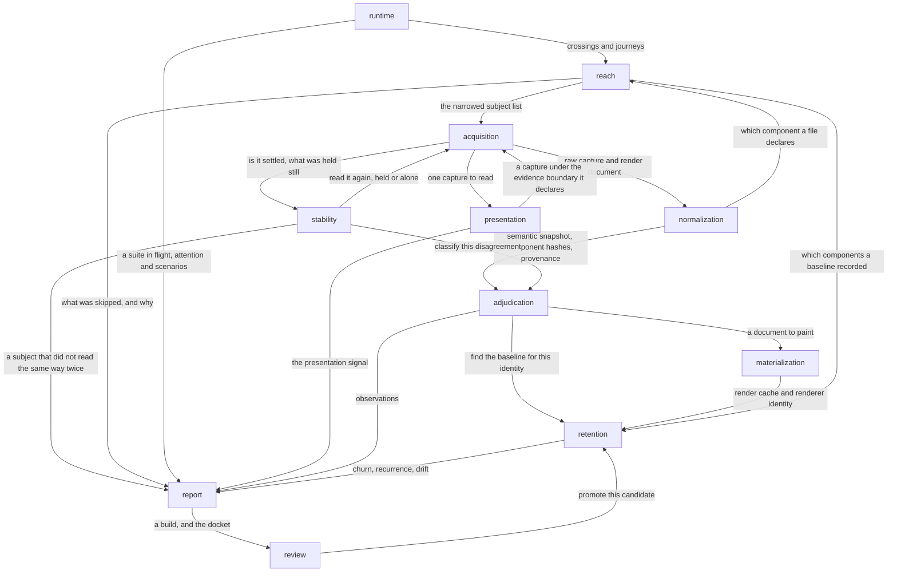

# Blocks — variance-authority

## Decomposition

The seam is the question each block answers, because that is where the blocks
fail differently: reaching a state is not the same failure as painting one, and
neither is the same failure as deciding what a difference means. The
decomposition deliberately does not follow the package graph — the pure
adjudication library is split across three blocks, and one block draws on five
packages — because a package boundary records what a consumer must install and
a block records what a reader must understand.

Two cycles are accepted rather than cut. `acquisition ↔ presentation` and
`acquisition ↔ stability` are request/response loops: each of those blocks owns
a question about a reading and owns no way to take one, so it asks
[acquisition](./acquisition/README.md) and acquisition answers. Re-implementing
collection on either side would produce a reading that differs from the first in
more than the one variable being asked about.

Two blocks have more than five neighbours. [report](./report/README.md) has
seven, which is what it is for — it is the fan-in where every block's evidence
becomes one artifact owned by neither its writer nor any of its readers.
[acquisition](./acquisition/README.md) has six because it is the single
serialized lane every reading goes through, first, second and clean; a second
lane would be a second world.

## Blocks

| Block | Responsibility |
|---|---|
| [acquisition](./acquisition/README.md) | Reaching a named state and keeping material from it |
| [normalization](./normalization/README.md) | Turning raw material into a comparable reading with authorship |
| [materialization](./materialization/README.md) | Turning a reading into pixels under a declared identity |
| [adjudication](./adjudication/README.md) | Turning a difference into a verdict with a cause and a place |
| [stability](./stability/README.md) | Deciding whether a reading may be trusted at all |
| [reach](./reach/README.md) | Deciding which subjects a change could have moved |
| [retention](./retention/README.md) | Keeping readings and decisions across time under an identity |
| [report](./report/README.md) | The artifact a run leaves behind, and every reading of it |
| [review](./review/README.md) | Where a named person decides, and what that decision moves |
| [presentation](./presentation/README.md) | How one interface reads, right now, with nothing to compare against |
| [runtime](./runtime/README.md) | What running software says, and what a test addressed |

## Diagram

