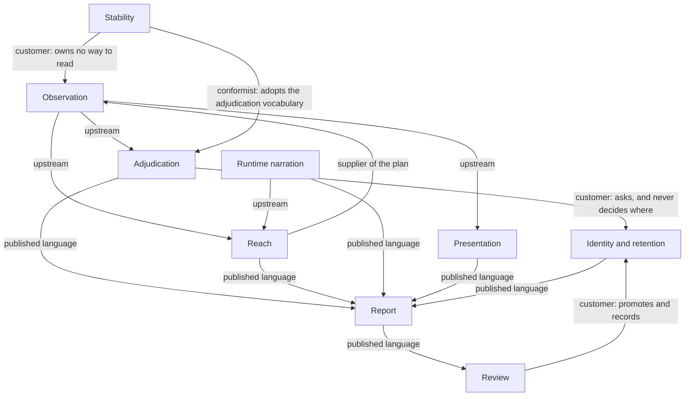

# Domain — variance-authority

## Observation

### What it is

Reading a named piece of software once, recording what was read and what the
reader was capable of reading, so that two readings taken at different times can
be compared without either of them having to remember the other.

### Concepts

#### Subject

##### What it is

The thing observed: a named, stably identified state of an interface, or a
named value. A subject is only ever compared to itself.

##### Invariants

A subject's name is its coordinate; two subjects with one name are one subject.
A subject may declare that it varies another subject, and that declaration is a
tag on the subject rather than part of its identity.

##### Lifecycle

Planned, reached, read, compared, decided. A subject that was planned and not
reached is stated by name, because silence about a subject is indistinguishable
from a pass.

##### Composed of

A name, the material read from it, and the profile of whoever read it.

#### Reading

##### What it is

One act of observation of one subject, producing a capture, a profile, and
whatever provenance the reader could recover.

##### Invariants

A dimension the reader could not observe is absent from the reading, never
present and empty. Two readings taken by observers of different capability are
never compared to each other.

##### Composed of

A capture of the live tree, an accessibility reading, applicable styling, and
the authorship of every node.

#### Profile

##### What it is

A declaration of what a reader was *capable* of observing, recorded
independently of what it did observe.

##### Invariants

A reader that cannot see a band reports it unobserved rather than unchanged. A
false claim of sameness is the one failure this domain does not tolerate.

#### Digest

##### What it is

A hash over one dimension of a subject's reading. The dimensions are structure,
semantics, text, style, geometry and wiring.

##### Invariants

Bands are hashed separately and never blended. A digest names every input that
can reach what it identifies and only those. Addresses are not content and are
not hashed.

#### Component hash

##### What it is

The digest set for one component's own contribution to a reading.

##### Invariants

A node belongs to the nearest enclosing component boundary; a component's
hashes cover only the nodes whose nearest boundary is that component. A nested
component appears in its parent's structure as a named placeholder, and only
when that parent placed it — a container's identity may not depend on what it
was handed. A node stands in every component above it, not only the nearest.

#### Provenance

##### What it is

Who authored a rendered node, and where. Two upward edges that neither derives
the other: enclosure, which is the component whose boundary contains this one,
and authorship, which is the component that wrote the element and therefore
holds its inputs.

##### Invariants

Causality runs one way — code to meaning to pixels — and cause is never
inferred backwards from a pixel. An unreadable authorship chain is a sentinel,
because an empty chain is a claim.

### Relationships

- → [Adjudication](#adjudication) — supplies the readings a difference is taken between
- → [Reach](#reach) — supplies which component a file declares
- → [Presentation](#presentation) — supplies the one capture a presentation graph is derived from

## Adjudication

### What it is

Turning a difference between two readings of one subject into a defensible
sentence: a **verdict**, a **cause**, and a place.

### Concepts

#### Difference

##### What it is

What moved between two readings, classified by band: accessibility, geometry,
token, content, texture — ordered loudest first, because change frequency and
change importance run opposite to each other.

##### Invariants

A difference is isolated into a bounded set of regions with exact boxes;
membership is decided coarsely and coordinates are not. When the region cap is
reached, the cap is reported.

#### Verdict

##### What it is

The judgement for one subject in one run.

##### Invariants

A green verdict is never one word: absorbed is spelled differently from
unchanged, so a suite can answer how much of its green it earned and how much
it declared. Evidence produced under a different identity is incomparable —
never unchanged and never changed. A verdict about the product and a failure of
the machine never share a channel.

##### Lifecycle

Unchanged, changed, new, incomparable, ignored, unstable, order-dependent, not
observed.

#### Cause

##### What it is

The component whose own content moved, as distinct from everything that moved
because of it.

##### Invariants

Ranking by area is backwards: area measures displacement, not cause. An unknown
cause is undefined; an empty cause list is the strongest claim a comparison can
make and a baseline carrying no component hashes has no standing to make it. A
difference that an excluded input could explain is refused rather than reported
with a hedge.

#### Ignore

##### What it is

A declaration that a difference will not be looked at. It names a place — a
subtree — or a shape — a difference fingerprint with its position removed —
and never a rectangle and never a bare band.

##### Invariants

An ignore is not a tolerance: a tolerance is a threshold and an ignore names a
thing. Every ignore carries a reason; an expiry is optional and checked when it
is declared. The collector marks and never deletes. Every rule is accounted for,
including the ones that absorbed nothing.

### Relationships

- ← [Observation](#observation) — receives readings and component hashes
- → [Identity and retention](#identity-and-retention) — asks for the reading to compare against
- → [Review](#review) — supplies what there is to decide

## Identity and retention

### What it is

Keeping readings across time under an identity that says which of them may be
compared, and recording what was decided about them.

### Concepts

#### Renderer identity

##### What it is

The content hash of every input that can reach a pixel: engine, platform,
scale, fonts, the recipe the page was held still with, and the ordered
rasterization arguments.

##### Invariants

A mismatch
[partitions the store structurally](./materialization/renderer-identity/README.md)
rather than being a check somebody must remember to call. Changing the recipe
changes identity instead of presenting font rasterization as a component
regression.

#### Baseline

##### What it is

The retained prior reading of one subject under one identity, together with the
component hashes the document it came from carried.

##### Invariants

Where a baseline is kept decides nothing. A store that cannot answer produces an
operator error and never a verdict, because a subject with no baseline records
whatever is on screen. A baseline carries enough of the document it came from to
separate cause from collateral wherever it is copied.

#### Approval

##### What it is

A person's decision, recorded against a subject and a run, with their name on
it.

##### Invariants

Deciding is not writing: the party that may upload a candidate is not the party
that may promote one. Promotion moves evidence that already exists — nothing in
the review path renders, measures or defaults a field. A decision is an
append-only row; an append-only store cannot flip a flag, so a reversal is a
second row. Promotion precedes the record of it.

#### The record

##### What it is

What the subjects of this system did over time: how often a component changed,
how often a subject read differently twice, how a token's value travelled.

##### Invariants

A rate divides by the occasions that could have produced an observation. A
window with no such occasion has no rate — absent, never zero. A quiet run is
still recorded, because it is the denominator. An absent answer never reads as
a good one.

### Relationships

- ← [Adjudication](#adjudication) — receives observations to keep
- ← [Review](#review) — receives decisions
- → [Report](#report) — supplies churn, recurrence and drift

## Reach

### What it is

Deciding which subjects a change could have moved, and proving what a run
actually executed.

### Concepts

#### Relations

##### What it is

The graph of what a file depends on, derived from source rather than from a
build, with the transpose materialized so *what depends on this* costs what
*what this depends on* costs.

##### Invariants

A file whose imports cannot all be enumerated keeps the edges that were read
and carries the sentence naming the one that was not, and no traversal is
seeded from it. The graph walks only the edges it read; an edge it could not
read is the execution record's to answer, because a module that loads under a
test is recorded however it was named. The graph never rules a subject out on
its own.

#### Closure

##### What it is

A hash over a node and everything it rests on, which proves sameness, beside a
reachability trail, which explains it.

##### Invariants

The two answers do not replace each other. Cycles are condensed, never broken.
A node whose closure cannot be proven is volatile and reports changed.

#### Journey

##### What it is

The path one execution of one subject took through the arrival regions of
instrumented source, across every process the execution touched.

##### Invariants

A journey is bounded by its execution, never by a time window. It is a path and
not a stack: which regions were entered, never how deep. Where it crosses a
process it is carried as one opaque identity, and every participant a run
declares must report at least once; silence does not narrow, it retires every
observation in the run. The subject's name never leaves the driver.

#### Crossing

##### What it is

One step of a journey: one observed entry into an instrumented region of
source, attributed to the test that entered it.

##### Invariants

An edge no execution witnessed is absent rather than impossible. A truncated
recording is dropped from the pool rather than counted as a miss.

### Relationships

- ← [Observation](#observation) — receives which component a file declares
- ← [Runtime narration](#runtime-narration) — receives crossings and journeys
- → [Report](#report) — supplies what was skipped and why

## Stability

### What it is

Deciding whether a reading can be trusted at all, before anything is concluded
from it.

### Concepts

#### Second reading

##### What it is

A deliberate re-observation that varies exactly one thing. One holds the world
and advances time, and answers whether a subject moves on its own. The other
rebuilds the world and holds time, and answers whether some other subject moved
it.

##### Invariants

Both outcomes of both are reported and neither clears
anything. The time-varying reading runs first, because the world-varying
reading's inference is only valid if two readings of one world would have
agreed.

#### Instability

##### What it is

A disagreement between two readings that were supposed to agree. It is the
finding, not the noise that precedes one.

##### Invariants

Never retry to make a problem go away. An instability is named by component,
band and line. When nothing moved semantically and pixels still differ, the
cause is below the box tree and no component is responsible — naming one would
be inventing a location.

#### Flake

##### What it is

A subject that read differently twice, and did so again when asked again. Until
the second disagreement it is only a suspect.

##### Invariants

The denominator is repeated-reading passes, not runs.

#### Stabilization

##### What it is

Everything done to the software to make it readable: an enumerable, named set
of interventions.

##### Invariants

Each intervention is applied from outside the product wherever possible, scoped
to the reader that needs it, and folded into the identity of what it produced —
[before the page is read, not only before it is
painted](./stability/stabilization/README.md). Two interventions governing one
property are reported, never silently resolved.

#### Arrival

##### What it is

Whether a subject has finished appearing.

##### Invariants

A subject still arriving is refused — not captured, not captured with a
warning, not waited on longer — because a skeleton on a slow machine and a
component on a fast one is a baseline every band agrees with and nobody wrote.
Settled, pending and unobserved are three states. Intent to read a mid-flight
state is declared, and the declaration is checked in both directions.

### Relationships

- → [Observation](#observation) — asks for a second reading
- → [Adjudication](#adjudication) — classifies a disagreement

## Presentation

### What it is

How information is grouped, aligned, repeated and emphasized in one live
interface, read now, with nothing to compare against.

### Concepts

#### Presentation graph

##### What it is

Nodes with geometry, spacing, axes, inferred baselines, surfaces, prominence
and repetition, and the relations between them: contains, separates, aligns,
shares a baseline, is a semantic peer.

##### Invariants

Preserve information; expose relationships. The graph derives evidence and never
a design recommendation, a global score, or a threshold verdict — page height,
density and margin width can each be correct at either extreme.

#### Presentation finding

##### What it is

A named relationship defect: a separation collapsing, an instance drifting from
the grammar its peers share, a prominence hierarchy flattening.

##### Invariants

Every finding names the graph node that owns its relationship. Reading defaults
to one owner and its immediate children; folding a subtree or crossing wrappers
is an explicit decision, never an inference. Telemetry alone never fails a
presentation. A drift finding requires a dominant peer grammar and a deviation
that semantic state does not explain.

#### Hierarchy contract

##### What it is

A product-owned, outside-in declaration of what a spacing relationship *means*:
owner boundary, leading to body, body peer, content internal.

##### Invariants

Only product meaning may name a relationship role. A design token is
implementation evidence and can never authorize one, because treating token
validity as relationship authority launders a local defect through the design
system.

#### Presentation signal

##### What it is

The projection of a presentation reading into a general observation: effects
that were introduced, resolved or persisted.

##### Invariants

Consequence, technical impact and verdict are three separate axes. Storing the
signal applies no policy. Absent means unobserved; empty means measured and
clean.

### Relationships

- ← [Observation](#observation) — receives the one capture it reads
- → [Report](#report) — supplies the presentation signal

## Runtime narration

### What it is

What running software says about what it is doing, while it is still doing it.

### Concepts

#### Announcement

##### What it is

Three coordinates emitted by the software itself at the moment it decides
something: a location, a subject, an action.

##### Invariants

An announcement says *when*, never *what*. Nothing a listener does can reach
the code it listens to: an observer that can break its subject is not an
observer. Silent when nobody is listening.

#### Watched run

##### What it is

What a suite is saying, held in a process that outlives any one test, so a
suite in flight is something to look at rather than something to wait for.

##### Invariants

A bounded buffer counts what it dropped, because a reader who cannot tell
*nothing was announced* from *the beginning was forgotten* draws the first
conclusion. Work that was opened and never closed is reported as pending.
Nothing is written down; stop the process and the evidence is gone.

#### Scenario

##### What it is

One witnessed path through named states: a precondition, a sequence of authored
acts, and the state each act arrived at.

##### Invariants

A transition is evidence that a destination followed an act, not proof that it
caused it. Acts align by key and occurrence along their common ordered prefix;
later occurrences are never shifted into a plausible pair. No unwitnessed edge
is inferred. An effect digest is the classified variance across an act, not the
destination's own hash, so a shared token edit moves every state and leaves
every effect stable.

#### Attention

##### What it is

Which elements a test addressed, in the order the test addressed them, with
their authorship captured before the rendered tree moved.

##### Invariants

Initiating an update, performing work, being addressed by a test and being
executed are four distinguishable facts and may not be collapsed. Identity is a
structural path, never a display name.

### Relationships

- → [Reach](#reach) — supplies crossings and journeys
- → [Report](#report) — supplies attention and scenario evidence

## Review

### What it is

Reducing what a run found to the smallest set of decisions a person can
actually make, and recording who made each one.

### Concepts

#### Docket

##### What it is

The reviewer's agenda for a run: causes aggregated across subjects, with
collateral clustered underneath each one.

##### Invariants

One token change is one item with a count, not one line per subject it moved. A report is
a cause, a place and a file. A subject nobody looked at is promoted to a
failure, because it is the one thing sharding introduces that nothing else can
see.

#### Build

##### What it is

One run's evidence, uploaded for decision.

##### Invariants

A machine may write a build and may not decide it. Authentication happens before
routing; capability is checked after. A caller may not choose its own
capability.

#### Decision

##### What it is

One person's answer for one subject: promote this reading, or do not.

##### Invariants

A subject with no uploaded candidate cannot be decided. A subject where
something else also moved is refused by name rather than promoted quietly. An
explanation is frozen as a copy rather than a join, so it outlives the evidence
it describes. Nothing is written for a rejection.

### Relationships

- ← [Report](#report) — receives what there is to decide
- → [Identity and retention](#identity-and-retention) — promotes a reading and records the decision

## Report

### What it is

The shape a run leaves behind, so that a person, a change proposal and an agent
read one format.

### Concepts

#### Run report

##### What it is

The versioned artifact a run writes: every subject, its verdict, its regions,
its causes, what was not observed, what was absorbed, and what the run held
still.

##### Invariants

Declare what you need; declare what you did; absent is not empty; never retry
to make a problem go away; order is the caller's. The format is owned by
neither its writer nor any of its readers.

#### Reading

##### What it is

One rendering of the artifact for one audience: text, a self-contained page, a
comment body, a set of tools an agent can call.

##### Invariants

A reading renders the durable value and never re-derives it. A reading that
cannot be complete refuses to look complete. A tool that exposes evidence never
runs a test, rerenders a subject, or changes a baseline.

### Relationships

- ← [Adjudication](#adjudication), [Identity and
  retention](#identity-and-retention), [Reach](#reach),
  [Presentation](#presentation), [Runtime narration](#runtime-narration) —
  receive evidence
- → [Review](#review) — supplies the agenda

## Context map

