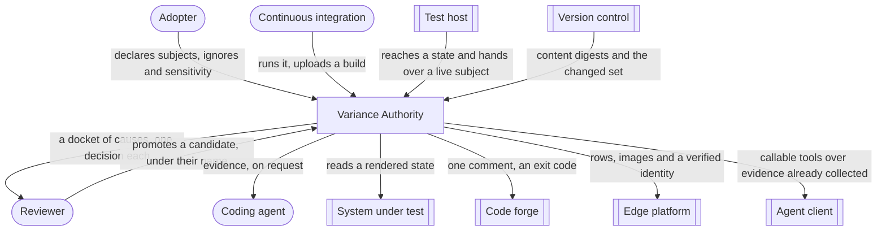

# Variance Authority

## Scope

A set of composable evidence tools for software that changes: they observe a
named **subject** twice, decide whether it moved, and say which component, which
input and which line is responsible.

## Diagram

## Actors

- **Adopter** — the engineer who wires the system to software they already
  have: they name the **subjects**, declare the **ignores** and the
  **sensitivity**, choose where **baselines** live, and own the exit code the
  job returns.
- **Reviewer** — the person who reads the **docket** and answers, per **cause**,
  promote or do not. Their name is written on every **decision** they make.
- **Continuous integration** — a machine party that runs the observation and
  uploads a **build**. It holds the credential that may write evidence and not
  the one that may decide it: it ingests and does not adjudicate.
- **Coding agent** — reads already-collected evidence to decide what to edit
  next: which **cause** moved, which tests reach a line, what a suite is doing
  while it is still running. It never causes an observation to happen.

## External systems

| System | What crosses the boundary |
|---|---|
| [system-under-test](../externals/system-under-test.md) | A live rendered state, handed over rather than fetched |
| [test-host](../externals/test-host.md) | The route to a state, and the stable name of that state |
| [version-control](../externals/version-control.md) | Content digests, the changed file set, and the commit a reading was taken at |
| [code-forge](../externals/code-forge.md) | One comment body updated in place, and an exit code |
| [edge-platform](../externals/edge-platform.md) | **Builds**, **baseline** images, **decisions**, and a signed reviewer identity |
| [agent-client](../externals/agent-client.md) | Tool calls answered from evidence already collected |

## Inside this root

- [Domain](./DOMAIN.md) — bounded contexts and context map
- [Glossary](./GLOSSARY.md) — ubiquitous language
- [Blocks](./CONTAINERS.md) — how the root is decomposed
- [Viewports](./VIEWPORTS.md) — cross-cutting flows
