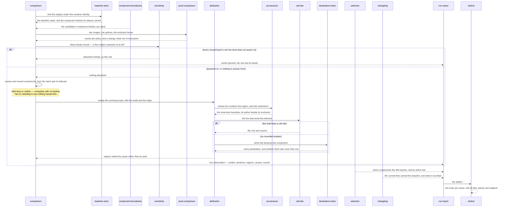
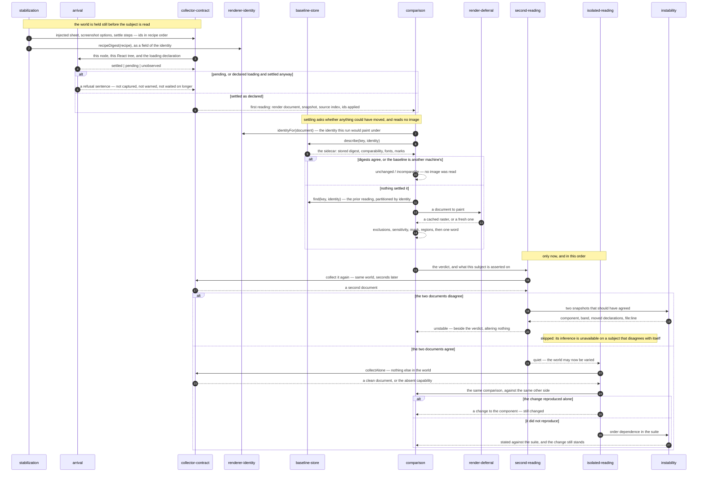
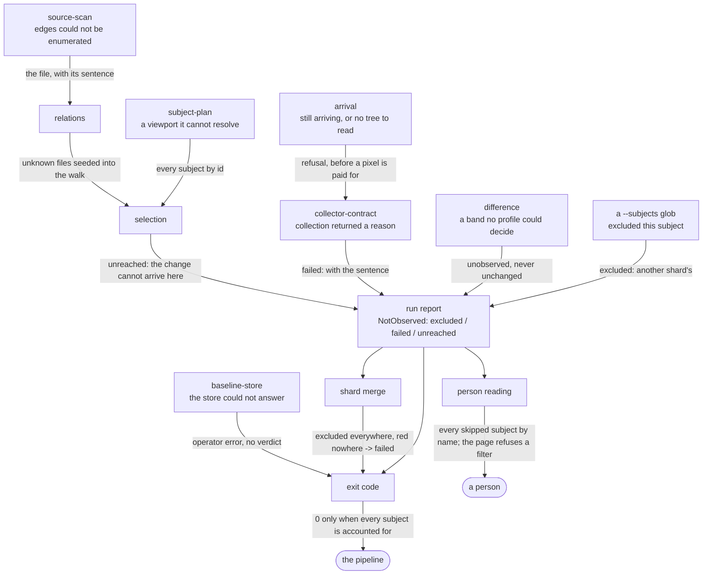
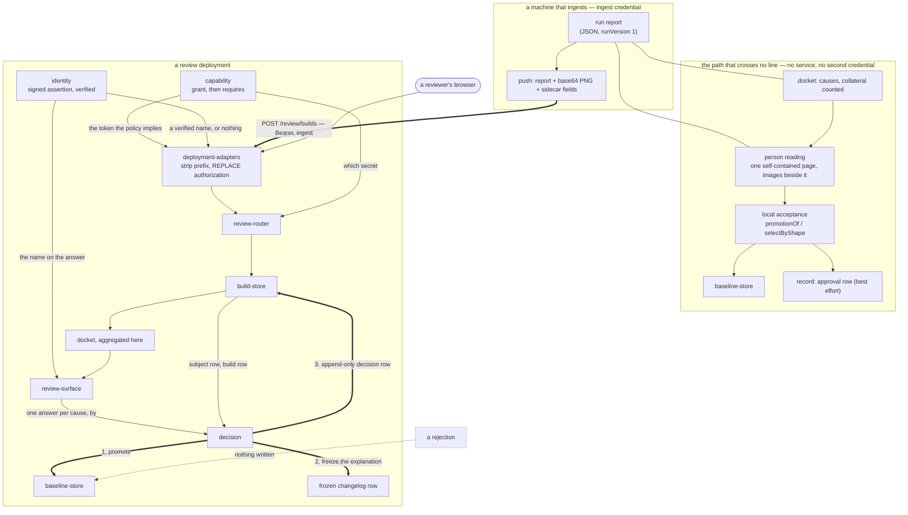

# Viewports — variance-authority

## Which line of code moved this pixel?

Type: lifecycle

### Question

A reviewer is looking at a red **subject** and has one question: which edit did
this. The system holds the whole distance between a changed-pixel count and
*`Toggle` moved, at `src/ds/components.tsx:107`* — and every hop in that distance
fails differently, so the lifecycle is worth tracing as one path rather than
read out of any single component. It is also the path where a confident wrong
answer is more expensive than no answer, so each hop's refusal is part of the
trace.

### Participants

- [`pixel-comparison`](./adjudication/pixel-comparison/README.md) — turns two
  **rasters** into a per-policy changed count and a change mask net of
  exclusions
- [`sensitivity`](./adjudication/sensitivity/README.md) — the cheap exit,
  evaluated against **component hash** bands before anything is isolated
- [`component-boundaries`](./normalization/component-boundaries/README.md) —
  cuts the **semantic snapshot** at component boundaries and hashes each
  boundary's own content per **band**
- [`comparison`](./adjudication/comparison/README.md) — the fixed order, the
  co-arrival invariant, and the word the run commits to
- [`attribution`](./adjudication/attribution/README.md) — isolates regions,
  joins them to the box tree, names the author, orients it, resolves the line,
  and ranks by **cause**
- [`provenance`](./normalization/provenance/README.md) — the enclosure and
  authorship chains already carried on every node, so an author is looked up
  rather than reconstructed
- [`call-site`](./normalization/call-site/README.md) — the file, line and column
  that wrote the element, kept alive to the rendered node
- [`declaration-index`](./normalization/declaration-index/README.md) — the
  coarser last hop: which file declares a component, and whether several do
- [`baseline-store`](./retention/baseline-store/README.md) — the **baseline**
  side, and the component names its sidecar recorded
- [`relations`](./reach/relations/README.md) — the trail from a changed file to
  a component, shortest-path and printable
- [`selection`](./reach/selection/README.md) — joins that walk to what each
  baseline said its subject was made of, or refuses
- [`changelog`](./retention/changelog/README.md) — why the baseline this was
  compared against is what it is, read out of the commits that carried it
- [`run-report`](./report/run-report/README.md) — where the region, its
  component and its `file:line` become durable
- [`docket`](./report/docket/README.md) — one entry per **cause**, with the
  files and places it was named in

### Diagram

### Seams

- Two images → a change mask. `compareRasters` in `packages/png/src/compare.ts`
  returns a `RasterComparison` carrying a count per policy; `maskOf` projects
  the named policy into a `ChangeMask` (`packages/core/src/attribute/mask.ts`) —
  one byte per pixel, row-major, with the changed total carried. The receiving
  entry is `subtractRegions(mask, boxes): Subtraction`, then
  `isolateRegions(mask, IsolationOptions): Isolation`, both in the same file.
  Asking for a mask from a policy that was not run is refused rather than
  approximated.

- Snapshot → component hashes. `hashComponents(snapshot): readonly
  ComponentHash[]` in `packages/core/src/attribute/component-hash.ts` folds the
  boundary set into per-name and per-instance rows of `BandDigests`. Both sides
  travel as `Raster.components`, the **baseline**'s read from its sidecar
  through `Described` in `packages/raster/src/store.ts` — the cheap path that
  answers *what components this image was made of* without decoding the image.

- Hashes → moved bands → the exit. `bandsBetween` and `movedBands` name the
  **band**s that differ; `relaxedVerdict` in `packages/observe/src/decide.ts` is
  the receiving side, calling `absorbsEntirely(level, moved)` from
  `packages/core/src/judge/sensitivity.ts`. A `SensitivityRule` reaches the mask
  half only through `asIgnore(rule): IgnoreRule | null` — one mechanism, not
  two. The exit sits after subtraction and before isolation, and it is where the
  path most often ends: an absorbed **subject** carries `Observation.relaxed`
  and never gets a region.

- The co-arrival invariant. `attributionOf(before.components, after.components)`
  in `packages/observe/src/attribution.ts` returns `{ causes?: readonly
  string[]; moved?: readonly ComponentBands[] }`, computed by `causesBetween`
  and `movedBandsBetween` from one pair of sidecars, and spread into
  `Observation` so an absent comparison omits both keys rather than emptying
  them. `causes: []` and an omitted `causes` are different claims, and only one
  of them is a claim a baseline without hashes may make.

- Regions → names and places. `attributeRegions(regions, snapshot,
  AttributionOptions)` in `packages/core/src/attribute/region.ts` produces
  `AttributedRegion` — `path`, `component`, `where`, `source`, and
  `unattributed` with the nearest node offered in its own field.
  `AttributionOptions.scale` has no default, because a wrong scale produces a
  full, plausible report about the wrong components. `rankRegions` then takes
  the ordering from `causes`, matching under either the author or the enclosure
  namespace, and falls back to area only when no causes were supplied.

- Node → author. `resolveProvenance` in `packages/react/src/resolve.ts` reads
  the framework's own record into `Provenance`/`OwnerFrame`
  (`packages/core/src/format/provenance.ts`), enclosure innermost-first with a
  props digest at each rung, and the author beside it. Where no chain can be
  read the result is `NO_FIBER` or `UNMOUNTED` — named refusals, not an empty
  chain.

- Element → line. `JSX_SOURCE` and `jsxSourceOf` recover a `SourceLocation`
  written onto the element by `packages/jsx-source/src/record.ts`. Where nothing
  was installed, `parseStackFrames` and `writerLocationOf`
  (`packages/core/src/attribute/stack.ts`) pick the first frame that maps back
  to project code, and `createCallSiteResolver(fetchModule)` / `locateSites` in
  `packages/core/src/attribute/call-site.ts` decode it through the build's map.
  The fetch is injected; a map whose version is unrecognized returns nothing
  rather than a plausible position. Frames never reach a **digest** or a
  **baseline**.

- Component → declaring file. `indexSource(file, contents): SourceIndex` and
  `resolveSource(name, index): Resolution | null` in
  `packages/core/src/attribute/source.ts`, formatted by `formatSource`. A name
  declared in several files carries the ambiguity into the answer rather than
  picking one.

- Region → record. `regionRecordOf(region, source)` in
  `packages/cli/src/commands/record.ts` is the one place the two location
  answers are ordered: the element's own line first, the component's declaration
  second, emitted as `RegionRecord.file` in `packages/report/src/format.ts`. The
  same choice is made for findings in `findingsOf`. A region with no containing
  box does not put its nearest node in `component`; it goes into the landmark
  phrase instead.

- Declaring file → the commit. `changedSince` in
  `packages/cli/src/commands/since.ts` names the files a diff against a ref
  touched, in the run's own coordinates; `trailOf` in
  `packages/core/src/relate/reach.ts` walks the graph backwards;
  `reachOf(ReachInput): ReachReport` in `packages/cli/src/commands/reach.ts`
  joins that walk to `ReachInput.baselines`, the component names each stored
  **baseline** recorded. It lands as `RunReport.reach` beside
  `RunReport.run.commit`. Where the walk cannot answer it returns a
  `GraphRefusal` — a changed file the graph does not hold, a diff no part of
  which is in the graph, and a diff reaching no component are three separate
  sentences.

- Baseline → its own commit. `readChangelog(options): ChangelogAnswer` in
  `packages/store/src/changelog.ts`, narrowed by `wasRead`, yields
  `ChangelogCommit` with the sha, the date and the record parsed from the
  trailer. `Unreadable.because` is a sentence naming what could not be asked,
  and `ChangelogHistory.bounded` is a list rather than a flag, because a shallow
  clone, an unrecognized trailer and a filled limit compose.

- Artifact → agenda. `docketOf(report): Docket` in
  `packages/cli/src/commands/docket.ts` folds `RunReport.observations` into
  `CauseEntry` keyed by component — `files`, `wheres`, `subjects`, and
  `namedIn`, the count of subjects where the semantic tier actually named it a
  **cause** rather than area picking it. Collateral is counted and listed
  nowhere, including the regions the run itself found and dropped, which ride as
  `ObservationRecord.truncated`.

- Where the path refuses. A **baseline** whose sidecar carries no component
  hashes: `causes` and `moved` are both omitted, ranking falls back to area, and
  the ordering is honest about being displacement rather than cause. A
  **profile** with no layout engine: no rect was observed, so every region comes
  back `unattributed` and no name is inferred from proximity. An unreadable
  authorship chain: the boundary degrades to the coarser enclosure answer, and a
  broken chain is a sentinel rather than a filler category. Nothing moved
  semantically and pixels still differ: the moved band set is empty, an empty
  set absorbs nothing, and the subject is reported in full — a hash comparison
  is blind exactly there. And a store that could not answer is an operator
  error, never a **verdict** — [absent is not
  empty](./DOMAIN.md#identity-and-retention).

## What must a reading survive before it is allowed to disagree?

Type: runtime

### Question

A run's whole output is a set of claims that one **subject** changed, and every
one of those claims rests on the assumption that a subject read twice under
identical conditions reads the same way. That assumption is the one thing the
system may not simply take: a spinner photographed on a slow machine, a leak
left by the subject that ran three before, a clock that ticks between two reads,
and a genuine regression all arrive as *the pixels moved*. This viewport traces,
for one subject in one execution, the ordered gauntlet that separates those four
— what is held still, what is refused before it is read at all, what the reading
is compared against, and which of its two second readings may run when.

### Participants

- [`stabilization`](./stability/stabilization/README.md) — holds the world still
  through named interventions, and folds the recipe they compose into the
  identity of what they produced
- [`arrival`](./stability/arrival/README.md) — decides whether the subject has
  finished appearing, and refuses one that has not — in both directions
- [`collector-contract`](./acquisition/collector-contract/README.md) — the one
  serialized lane every reading of this subject goes through, first, second and
  clean
- [`renderer-identity`](./materialization/renderer-identity/README.md) — names
  every input that can reach a pixel, including the stabilization recipe, as the
  value the store is partitioned by
- [`baseline-store`](./retention/baseline-store/README.md) — answers the cheap
  settlement question from a sidecar, and the full lookup when it did not answer
- [`comparison`](./adjudication/comparison/README.md) — the fixed sequence of
  exits that turns two readings into one word
- [`sensitivity`](./adjudication/sensitivity/README.md) — the predicate saying
  which **band**s this subject is asserted on, consulted by the verdict and by
  the second reading alike
- [`render-deferral`](./materialization/render-deferral/README.md) — paints only
  what settling did not answer, and only what no image already exists for
- [`render-cache`](./retention/render-cache/README.md) — images already painted
  under this identity, addressed by the document **digest**
- [`second-reading`](./stability/second-reading/README.md) — reads the subject
  again in the world it is already in: time advances, the world is held
- [`isolated-reading`](./stability/isolated-reading/README.md) — reads it again
  with nothing else in the world: the world is rebuilt, time is held
- [`standing-world`](./stability/standing-world/README.md) — the never-torn-down
  world whose saving the rebuilt reading exists to audit
- [`instability`](./stability/instability/README.md) — turns a disagreement
  between two readings that should have agreed into a component, a band and a
  line

### Diagram

### Seams

- Recipe to identity. `Intervention` and `Recipe` in
  `packages/core/src/format/intervention.ts` and
  `packages/core/src/format/stabilize.ts` cross into a machine fact through
  `recipeDigest(recipe): Digest`, which is sorted so composition order does not
  change identity; it is consumed as the `stabilization` field of
  `RenderIdentity` (`packages/core/src/format/document.ts`), assembled in
  `packages/playwright/src/renderer.ts` alongside the engine, platform, declared
  fonts and the ordered launch arguments. A subject read untouched and one read
  held still therefore land in different partitions rather than in one
  comparison.
- Recipe to page. `recipeCss`, `recipeScreenshot` and `settleRecipe` split the
  same value three ways; `stabilizeForObservation` and `STABILIZE_ATTRIBUTE` in
  `packages/dom/src/stabilize.ts` write one idempotent sheet that marks itself
  so the collector skips it, and the ids actually applied come back as
  `Collected.stabilization: readonly string[]` in
  `packages/cli/src/commands/collector.ts`.
- Arrival to refusal. `awaitSuspense` in `packages/react/src/arrival.ts` reads
  the committed fiber tree through `boundariesUnder`
  (`packages/react/src/suspense.ts`) and returns a `SuspenseSettlement` with
  three outcomes, never two — `settled`, `pending`, `unobserved`.
  `suspenseRefusal(settlement, declaration: LoadingDeclaration): string |
  undefined` is the bridging shape, owned by
  [`arrival`](./stability/arrival/README.md). It is checked symmetrically — a
  subject declared a loading capture that then settles is refused too. The
  receiving entry points are `packages/route-collector/src/index.ts`,
  `packages/storybook-collector/src/index.ts` and
  `packages/playwright-test/src/fixture.ts`.
- Collector to run. `Collector.collect(subject: PlannedSubject):
  Promise<Collected>` in `packages/cli/src/commands/collector.ts`; `Collected`
  is a discriminated union whose failure arm is `{ ok: false, because }` — a
  value, not an exception, so one unreachable subject costs the other subjects
  nothing and is still named. Every collection in this trace, including both
  second readings, is funnelled through `serial` in
  `packages/cli/src/commands/schedule.ts`, because the world is a single
  standing page. The receiving entry point is `observeOne` in
  `packages/cli/src/commands/observe-one.ts`.
- Settlement. `documentDigest(document): Digest`
  (`packages/core/src/format/document.ts`) meets `RasterStore.describe(key:
  BaselineKey, identity: RenderIdentity): Promise<Described | null>`
  (`packages/raster/src/store.ts`) in `settle(digest, described, identity)`
  returning a `Settlement` (`packages/raster/src/settle.ts`). `Described` is the
  deliberately cheap shape — the stored document digest, comparability, the
  fonts the renderer lacked, retained accessibility evidence and inspection
  marks — read from a sidecar rather than a base64 PNG. It can say whether
  anything could have moved and never what moved: a subject that does not settle
  pays for the full `find` as well.
- Identity as partition. `Renderer.identityFor(document)` in
  `packages/raster/src/renderer.ts`, never `Renderer.identity`: the two differ
  by exactly the document's scale factor, and `identityAtScale` is shared so the
  local and remote renderers cannot answer it differently. `identityFrom` in
  `packages/raster/src/codec.ts` is the field-by-field rebuild every sidecar,
  wire response and cache read-back passes through — a field silently dropped
  there produces a write key and a lookup key that differ, and the run then
  reports **incomparable** naming the same machine on both sides. This is what
  decides which **baseline** the comparison is allowed to reach at all; a store
  that cannot answer raises `RasterStoreError` with `REFUSAL` and never an
  absence.
- Render only if settling did not answer. `renderOnce` in
  `packages/observe/src/observe.ts` is the cache-or-paint loop: it asks
  `RenderCache` for an image addressed by the document digest under the
  identity, and falls back to `Renderer.render(document): Promise<Raster>`.
  `neverFails` in `packages/raster/src/store.ts` wraps every cache backend so a
  miss, an outage, a permission error and a corrupt entry are one instruction —
  paint it — which is why a broken cache makes a run slow and never red.
  `withEvidence` stamps this run's **component hashes** onto the raster and
  strips anyone else's.
- Comparison. `observeAgainstBaseline(document, key, options):
  Promise<Observation>` (`packages/observe/src/observe.ts`) hands both sides to
  `decide` (`packages/observe/src/decide.ts`), whose order is its whole content:
  exclusions subtracted, **sensitivity** consulted, mask isolated, shapes
  absorbed, regions attributed, and only then a word. `causes` and the
  moved-component list arrive together or are both omitted, because `causes: []`
  would read as *nothing caused this difference*.
- The held-world second reading. `again(planned, collected, verdict,
  sensitivity, context, collecting)` in `packages/cli/src/commands/again.ts`
  compares `documentDigest(collected.document)` against
  `documentDigest(second.document)` and never rasterizes — two documents with
  one digest cannot paint differently. Its output is
  `CliObservationRecord['unstable']`, a field that sits *beside* the verdict and
  does not alter it; `movedBetween` reuses the comparison path's own attribution
  rather than growing a second one. A collector that produced the subject once
  and then could not produce it again answers this pass in its loudest form.
  Absence of the field means *this run's two readings agreed*, and may never be
  presented as stability; the denominator of any rate is **sweep**s, which is
  why the record half lives in `packages/history/src/flakiness.ts` and not here.
- The rebuilt-world second reading. `collectAlone?(subject)` is optional on
  `Collector`, and `undefined` is an answer the run states rather than reads as
  *nothing leaked*. `alone(planned, observation, key, context, collecting)` in
  `packages/cli/src/commands/alone.ts` re-enters `observeAgainstBaseline` or
  `observePair` against the same other side, so the clean-world answer inherits
  attribution, font reporting and the identity partition instead of acquiring
  its own versions of all three. Its result is `CliObservationRecord['alone']`,
  and absent capability, exhausted budget, a failed clean collection and a
  comparison that was neither changed nor unchanged are four distinct sentences
  — each of which leaves the change standing.
- Order between the two. `investigate` in
  `packages/cli/src/commands/observe-one.ts` runs `again` first and returns
  early when it found something, so `alone` is never asked about a subject that
  disagreed with itself. That is not an optimization: the rebuilt-world reading
  concludes *the clean reading differs from the shared one, therefore the world
  moved it*, and that inference is only evidence when two readings of one world
  would have agreed. Asked in the other order, a subject with a clock in it
  yields a confident sentence about suite pollution aimed at a bisection that
  will never converge. What it audits is exactly the corner
  [`standing-world`](./stability/standing-world/README.md) cuts.
- Naming the disagreement. `locateInstability(before, after): Instability` and
  `summarizeInstability` in `packages/core/src/attribute/instability.ts` take
  the two snapshots and return the loudest **band**, the locations ordered by
  how many deltas landed in each, the moved declarations and a `file:line`.
  `InstabilityBand` includes `sub-semantic` and `none`: when nothing moved
  semantically and pixels still differ, the cause is below the box tree and no
  component is responsible — naming one would be inventing a location. The
  recorded shape in `packages/history/src/instability.ts` keeps component and
  band optional, and keeps the **sensitivity** rule that absorbed an occurrence
  rather than dropping it.
- What both readings settle. Both are reached only after a verdict exists, both
  report both of their outcomes, and neither clears anything: a subject that
  agrees with itself has not been cleared of its difference against its
  **baseline**, and one that reproduces alone is still changed.

## How does a subject that was never looked at avoid being reported as fine?

Type: domain

### Question

A **subject** that was excluded, one whose collection threw, one whose store
could not be reached and one that genuinely did not move all produce the same
thing at a terminal: no line. Every block in the path can fail to look, and each
failure has a different owner — a selector's decision, a parser's hole, a
component still arriving, an unreachable endpoint, a shard glob that covered
nothing. The question this viewport answers is where each of those absences is
turned into a carried value rather than a silence, and what stops the final
integer from claiming a clean run over a surface nobody observed.

### Participants

- [`source-scan`](./reach/source-scan/README.md) — reads a file's outgoing
  edges, and when it cannot, keeps the sentence saying why instead of an empty
  edge list
- [`relations`](./reach/relations/README.md) — folds those records into the
  graph and seeds every traversal with the files whose edges are unknown, so an
  unreadable file widens the run rather than narrowing it
- [`selection`](./reach/selection/README.md) — narrows from the structural and
  execution grounds, refuses to narrow at all when either ground cannot answer,
  and names every **subject** it removed with the reason
- [`subject-plan`](./acquisition/subject-plan/README.md) — the enumeration
  exclusion subtracts from: every **subject** by id before anything is reached,
  plus the refusals planning itself makes
- [`collector-contract`](./acquisition/collector-contract/README.md) — makes a
  failure to collect one **subject** a value with a sentence rather than an
  exception that costs the other subjects their observations
- [`arrival`](./stability/arrival/README.md) — refuses a **subject** that has
  not finished appearing, and keeps *nobody could look* as a third state beside
  settled and pending
- [`baseline-store`](./retention/baseline-store/README.md) — a store that could
  not answer raises an operator error, never an absent **baseline** — [absent is
  not empty](./DOMAIN.md#identity-and-retention)
- [`difference`](./adjudication/difference/README.md) — a **band** neither
  side's **profile** could decide is `unobserved`, taken as a union and never
  folded into `unchanged`
- [`run report`](./report/run-report/README.md) — the artifact where each
  absence lands as a typed entry with its own kind and its own sentence
- [`shard merge`](./report/shard-merge/README.md) — folds N partial runs, and
  promotes a **subject** every shard excluded from a decision into a failure
- [`exit code`](./report/exit-code/README.md) — keeps *nothing needs review*,
  *the product needs a decision* and *the run did not happen as configured* on
  three integers, and treats an absent coverage list as an open question
- [`person reading`](./report/person-reading/README.md) — prints every skipped
  **subject** by name, and refuses to narrow the single self-contained page to
  one **subject**

### Diagram

### Seams

- Unreadable file to graph — `FileRecord.unknown` in
  `packages/core/src/relate/records.ts` carries the reason as a string rather
  than a flag; `relationsOfFiles` folds it into `Relations.reasons`, and
  `movedBy` seeds the breadth-first walk with the changed files *and* every node
  marked unknown, returning them as `Reached.opaque` (`Hole[]`) counted apart
  from `Reached.files`. `packages/sense/src/scan.ts` (`scanRelations`) is the
  only producer.
- Two grounds to one narrowing — `affectedSubjects` in
  `packages/cli/src/commands/affected.ts` returns `Affected` with `skipped: {
  subject, because }[]` and a `whole` sentence when it declined to narrow;
  `unenteredSubjects` in `packages/cli/src/commands/journey.ts` returns
  `Journeyed` with the same shape from the execution ground.
  `packages/cli/src/commands/run-select.ts` joins them into `skipped:
  ReadonlyMap<string, string>` plus `notes`, so the reason a **subject** was
  removed and the reason printed are one value.
- Narrowing to plan — `run.ts` reads `selected.skipped.get(id)` per planned
  **subject** and writes `{ kind: 'unreached', because }`, never `excluded`: the
  run derived the exclusion, so filing it as a decision would report one nobody
  made. The plan it subtracts from is `Plan` from
  `packages/cli/src/commands/collector.ts`, built by `toSubjects` in
  `packages/storybook/src/subjects.ts` and the route equivalents.
- Collection refusal — `Collected` in `packages/cli/src/commands/collector.ts`
  is a union whose failure arm is `{ ok: false, because: string }`, restated
  structurally in `packages/route-collector/src/contract.ts` and
  `packages/storybook-collector/src/contract.ts` so a surface package does not
  pull the binary in. `run.ts` maps `!collected.ok` to `{ kind: 'failed',
  because }`.
- Arrival to that refusal — `awaitSuspense` in `packages/react/src/arrival.ts`
  answers `settled | pending | unobserved`; `suspenseRefusal` reduces a
  settlement to `string | undefined`. `packages/route-collector/src/index.ts`
  and `packages/playwright-test/src/fixture.ts` turn that string straight into
  `{ ok: false, because }`.
- Store failure to operator channel — `RasterStoreError` and the appended
  `REFUSAL` sentence in `packages/raster/src/store.ts` cross into `run.ts`,
  which catches the class, wraps it once as `OperatorError` and stops the run;
  every other throw becomes a per-subject `{ kind: 'failed' }`. `RenderCache`
  deliberately never throws, so a cache outage cannot enter this path.
- Non-verdict beside the verdicts — `UNOBSERVED` in
  `packages/core/src/judge/verdict.ts` widens `Verdict` to `BandOutcome` for
  exactly one purpose: a **band** the acting **profile** could not observe. It
  has no entry in `SEVERITY` and `blocks()` never sees it, so it cannot be
  ordered against a **verdict** or silently absorbed into `unchanged`.
- Artifact shape — `NotObserved` in `packages/report/src/format.ts` is `{
  subject, kind: 'excluded' | 'failed' | 'unreached', because }`, reachable as
  `RunReport.notObserved`. `packages/cli/src/commands/run-report.ts` refuses any
  fourth kind by name rather than guessing, and `shardFilterBecause` /
  `isShardFilter` mark an `excluded` entry as another shard's **subject** rather
  than an operator's decision.
- Shard fold — `coverageOf` in `packages/cli/src/commands/merge.ts` returns `{}`
  — absent, not empty — when any shard omitted its coverage list; a **subject**
  carrying only shard-filter exclusions and no observation anywhere is rewritten
  to `{ kind: 'failed' }`, and a **subject** both observed and reported not
  observed raises `OperatorError` naming both shards.
- Artifact to integer — `ReviewableReport` in `packages/cli/src/exit.ts`
  restates the fields structurally rather than importing `RunReport`, so the
  module deciding the code has no dependency at all. `exitFor` returns
  `EXIT_REVIEW` when `notObserved` is `undefined` and when any entry is
  `failed`; `EXIT_OPERATOR` arrives only through `isOperatorError`, keyed on the
  bare property `OPERATOR_ERROR_MARKER` because `instanceof` across two copies
  of a class loaded from the operator's own dependencies is false.
- Artifact to a person — `formatReport` in `packages/cli/src/commands/report.ts`
  prints one `[not observed] <subject>` line per entry; `asHtml` throws
  `OperatorError` when `--subject` is set, because a page narrowed to one
  **subject** says nothing about coverage while looking like a complete run.
  `packages/mcp/src/tools/summary.ts` answers `coverage: unknown` on the same
  absent-list condition rather than reporting a clean run.

## What crosses the line between a machine that ingests and a person who decides?

Type: boundary

### Question

A run is a machine and a promotion is a commitment, so the moment evidence
leaves the machine that produced it and arrives where somebody can press yes, it
crosses a line drawn by credential rather than by network: one secret uploads a
**build**, another decides it, and construction refuses a deployment where those
are one value. The question is what actually travels across that line — in what
serialized shape, under which credential, checked in what order — and what comes
back the other way as a **baseline** and a frozen explanation. And beside it,
the second path: the run report a person can review on their own machine, where
nothing crosses at all.

### Participants

- [`run report`](./report/run-report/README.md) — the versioned artifact that is
  the payload; nothing else of the run travels
- [`person reading`](./report/person-reading/README.md) — the self-contained
  page, the review path that crosses no line
- [`docket`](./report/docket/README.md) — the local fold of causes, for a page and a change proposal
- [`deployment-adapters`](./review/deployment-adapters/README.md) — the mount
  that strips a prefix and replaces the incoming authorization with the token
  the policy implies
- [`capability`](./review/capability/README.md) — which of the two secrets was
  presented, and whether it may do what the route requires
- [`identity`](./review/identity/README.md) — the verified name a decision has
  to carry, which no credential can supply
- [`review-router`](./review/review-router/README.md) — authentication before
  parsing, capability after routing, refusals as typed statuses
- [`build-store`](./review/build-store/README.md) — the uploaded evidence, and
  the **docket** aggregated from the **cause**s the artifact already attributed
- [`review-surface`](./review/review-surface/README.md) — causes first, one
  answer per cause, the reviewer's name on it
- [`decision`](./review/decision/README.md) — promotion first, then the frozen
  explanation, then the append-only row; nothing for a rejection
- [`baseline-store`](./retention/baseline-store/README.md) — the contract a
  promoted **candidate** is written through, under a **renderer identity**
- [`promotion`](./retention/promotion/README.md) — the same promotion when it is
  a command rather than a click
- [`record`](./retention/record/README.md) — the append-only record local
  acceptance writes an **approval** into
- [`changelog`](./retention/changelog/README.md) — why the baselines are what
  they are, read back afterwards

### Diagram

### Seams

- Run to wire. `push` in `packages/cli/src/commands/push.ts` encodes
  `CliRunReport` plus, per **subject**, base64 image bytes and the sidecar's
  `documentDigest`, `width`, `height`, `missingFonts` and `accessibility`, and
  POSTs it to `{endpoint}/review/builds` with `authorization: Bearer
  ${options.review.token()}` — the ingest credential, from `ReviewConfig`; the
  deciding one is never in a config a run reads. A candidate whose sidecar
  cannot be read is sent as no candidate rather than as bytes under an invented
  key, and the subject arrives without a button. Reaching the service is a
  separate command from the run, so an unreachable deployment is an
  `OperatorError` and never a **verdict**.
- Wire to stored shape. `asBuildIngest` in
  `packages/tribunal/src/worker-input.ts` is the entry point, producing
  `BuildIngest` (`packages/tribunal/src/review-types.ts`). It pins
  `report.runVersion === 1` and refuses anything else rather than storing a
  shape it would then misread; the report body itself is handed to
  `createReviewStore().ingest` unrebuilt, on the argument that a misread request
  is a 4xx while a misread response becomes a verdict.
  `packages/tribunal/src/review-ingest.ts` writes objects before rows and clears
  the build's rows before rewriting them — except `decisions`, which a person
  put their name on.
- Session to capability. `TribunalRouteOptions.authorize` in
  `packages/tribunal/src/next.ts` is the operator's own function, with no
  default, and `createTribunalRoutes` **replaces** the `authorization` header
  with the token that answer implies rather than adding it — a caller may not
  choose its own capability, and the policy is binding rather than advisory. The
  two shipped policies are `authorize` in
  `tribunal-cloudflare/app/api/[[...path]]/route.ts` (a bearer is a machine, an
  `identify` result is a person) and `authorizeFor` in
  `packages/tribunal/src/node/bin.ts` (a token gets what the token is for; on a
  loopback bind, no token reviews; on a network bind, no token is no capability
  and the surface is not served).
- Assertion to name. `identify`, `tokenOf`, `verify` and `published` in
  `tribunal-cloudflare/app/access.ts` turn a signed token — from the header or
  the browser's cookie — into an `Identity`, with `alg` pinned to RS256, `aud`
  compared against this application's own tag, `exp` checked, `iss` checked and
  the signature verified against the team's published keys. A settable header is
  never trusted. Absent configuration returns `null`, which means the surface is
  not drawn; there is no anonymous view to fall back to.
- Credential to `Granted`. `grant` in `packages/tribunal/src/worker-auth.ts`
  digests the presented bearer and both secrets to a fixed 32 bytes and always
  compares both, so *which token is this* costs the same either way; the answer
  is `'ingest' | 'review' | null`. `refuseWeakTokens` refuses at construction
  under sixteen characters or two equal values. `createTribunal` in
  `packages/tribunal/src/worker.ts` calls `grant` before the URL is even parsed,
  and `UNAUTHENTICATED` is one identical sentence for a wrong token, a missing
  token and a path that does not exist.
- Route to permission. `route` in `packages/tribunal/src/worker.ts` chooses the
  path first and then calls `requires(granted, needed, path)`; `POST
  /review/builds` is the one review path the ingest capability owns, and the
  build list, one build, the image bytes, the changelog, the sweep and the
  decision path all require the deciding one. `readable` is the named exception
  for the five history questions that write nothing, so a reviewer can ask
  whether this difference is the third this week without holding the ingest
  secret. Refusals are `BadRequest`, `Forbidden`, `MethodNotAllowed`,
  `HistoryWriteConflict` and `ReviewError` in `worker-http.ts`, mapped to
  400/403/405/409/422 — none of them a value.
- Rows to agenda. `docket(subjects: readonly SubjectView[]): readonly Cause[]`
  in `packages/tribunal/src/review-read.ts` aggregates one entry per **cause**
  component from the attribution already inside the artifact, ranked by cause
  pixels rather than area, with collateral summed as a build-level total rather
  than split between causes. `toSubjectView` and `latestDecisions` supply its
  input, the current decision being the highest sequence rather than the newest
  timestamp.
- Answer to decision. The body reaches `asDecision` in `worker-input.ts`
  (`'approved' | 'rejected'`, nothing else) and `string(body, 'by', …)`, then
  `decide` in `packages/tribunal/src/review.ts`. A subject the build never
  reported is a `ReviewError` rather than a recorded approval. On yes, the order
  is fixed: `promote`, then `recordApproval`, then the `decisions` insert — the
  other order can leave an approval on the page whose baseline was never
  written. On no, only the decision row.
- Build row to `Raster`. `promote` in `packages/tribunal/src/review-write.ts`
  assembles a `Raster` entirely from what the run uploaded — bytes from the
  object store at `after_key`, `documentDigest`, `candidate_width`,
  `candidate_height`, `candidate_missing_fonts` — reads the **renderer
  identity** off the build row through `identityFrom`, and calls
  `baselines.put({ subject }, raster)` against `RasterStore` from
  `@variance-authority/raster`. A missing candidate or an unreadable identity
  refuses; nothing is rendered, measured or defaulted.
- Approval to frozen explanation. `recordApproval` in
  `packages/tribunal/src/changelog.ts`, with `buildContext` in `review.ts`
  reading `commit` and `intent` at approval time. The regions, the commit, the
  intent and the reviewer are copied into the `changelog` row rather than
  joined, because `build_subjects` expires under `sweep` and the explanation of
  a baseline has to last exactly as long as the baseline. `readChangelog` groups
  by shape when somebody reads, and returns approvals nothing could attribute
  rather than dropping them. The append-only property is enforced by triggers in
  `packages/tribunal/src/migration-steps.ts`, so a reversal must be a second
  row.
- The local path, where no shape crosses anything. `reportHtml` in
  `packages/cli/src/commands/report-html.ts` renders one file with its
  stylesheet and script inline and the images beside it, fetching nothing;
  `docketOf` in `packages/cli/src/commands/docket.ts` is the fold behind it.
  `accept` in `packages/cli/src/commands/accept.ts` applies `promotionOf`,
  `selectByShape` and `whyNotWhole` from `packages/report/src/promotion.ts` —
  the same rules a preview reads, so a preview and the acceptance it previews
  cannot disagree — and writes through the same `RasterStore`, with an
  `approvals` row into `HistoryStore` when one is configured and a stated
  `because` when none could be written. No service, no account, no second
  credential, and a shape that also moved something else is refused by name.
