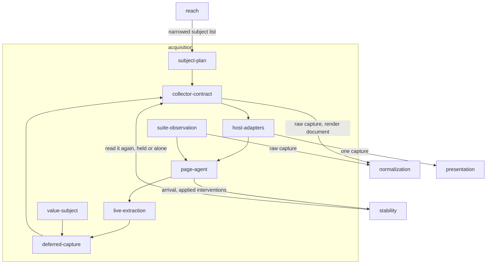

# Acquisition

## Responsibility

Keeps material from a named state that a host already knows how to reach — a
live element read now, or a resource-closed document written for a later process
to paint.

## Logical role

The first half of an observation: the point where a piece of running software
stops being an application and becomes material that can be carried, stored and
compared. Everything downstream reasons about a value; this is where that value
is taken, and where a subject that could not be reached is stated by name rather
than omitted.

## Boundary

It never mounts anything: a subject arrives already on screen, and the knowledge
of how to put it there stays with whoever already had it. It owns no policy —
not the normalization ruleset, not what an **ignore** means, not the
**stabilization recipe**, not **arrival**, not which subjects a change could have
moved — and it does not paint, does not compare, and holds no baseline.

## Technology

TypeScript on Node for planning and driving; a second half compiled to a browser
IIFE and installed on the page, which is where every line that touches a DOM
lives. Both **profile**s of live DOM are hosts: jsdom in a test process,
Chromium behind Playwright. Nothing in the extraction names either.

## Implementation coordinates

- `packages/cli/src/commands/collector.ts` — the plan, the contract, the module load
- `packages/cli/src/commands/schedule.ts` and the collection lane in `run.ts`
- `packages/storybook/` and `packages/storybook-collector/`
- `packages/route-collector/`
- `packages/dom/`
- `packages/unit-test/`
- `packages/playwright-test/src/{page-agent,acquire,bundle,fixture}.ts`
- `packages/playwright/src/{agent,acquire}.ts`
- `packages/package/`

## Communicates with

- → [`normalization`](../normalization/README.md) — the raw capture and the
  render document, for turning into a comparable reading
- → [`presentation`](../presentation/README.md) — one capture, when a
  presentation reading was asked for
- → [`stability`](../stability/README.md) — whether the subject has arrived, and
  which interventions were applied to hold it still
- ← [`reach`](../reach/README.md) — the narrowed subject list
- ← [`presentation`](../presentation/README.md) — a request for one capture,
  taken under the evidence boundary that block declares
- ← [`stability`](../stability/README.md) — a request for a second reading, with
  the world held or rebuilt

## Uses

### [Normalization](../normalization/README.md)

#### Why

Extraction and comparability are versioned by different things. What a page says
changes when the page changes; what counts as *the same* changes when the rules
change. Keeping the ruleset out of here means a collector can be rewritten, a new
host can be added, and every reading already taken stays comparable to the ones
taken after — which would not survive each collector cleaning up in its own way.

#### What I need from it

A **semantic snapshot** built from the raw capture, with **provenance** and
**call site**s resolved into an addressable tree, and the **component hash**es
that come with it. The **digest** functions that let a reading be identified
without painting it.

#### What would make me leave

Nothing short of comparability ceasing to be a separate concern. If a reading
were only ever consumed by the process that took it, extraction and
normalization would be one step and the split would be cost with no return.

### [Presentation](../presentation/README.md)

#### Why

A presentation reading needs exactly what a comparison reading needs — one
subject, reached, held still, and read once — and taking it twice would mean two
mounts and two chances to disagree about what was on screen. One acquisition
serves both, and the presentation consequence rides back with the collected
subject.

#### What I need from it

A reading of one live interface, already reduced to a signal a run can carry
without holding the graph.

#### What would make me leave

A presentation reading that needed a state no comparison ever visits — a
scrolled position, a hovered element, a mid-transition frame — would be a second
acquisition with its own plan, not a passenger on this one.

### [Stability](../stability/README.md)

#### Why

Because a subject that has not finished appearing is worse than a subject that
was skipped: a skeleton on a slow machine and a component on a fast one is a
baseline every **band** agrees with and nobody wrote. Deciding **arrival** and
enumerating interventions are policy questions with one owner, and the page is
merely where the policy is executed.

#### What I need from it

The named interventions to apply before reading, resolved in-page from ids; the
refusal that stops a
still-arriving subject from being captured at all; and the vocabulary a run uses
to state what it did to somebody else's application.

#### What would make me leave

Nothing. A reader that decided for itself what "still enough" meant would be a
reader whose recipe is not in the identity of what it produced.

## Components

| Component | Responsibility |
|---|---|
| [subject-plan](./subject-plan/README.md) | Enumerates the subjects a run intends to observe, in a stable order, and name the ones the plan itself refuses |
| [collector-contract](./collector-contract/README.md) | The three-method seam through which a foreign module supplies material, and the single-world lifecycle it is called under |
| [host-adapters](./host-adapters/README.md) | Reaches a named state through a host that already knows how — a story preview, a served route |
| [page-agent](./page-agent/README.md) | Moves a request into a page and a serialized capture back out, over an asset set the page has stopped changing |
| [live-extraction](./live-extraction/README.md) | Reads a live element into a raw capture and an applicable stylesheet, under the profile the host can support |
| [deferred-capture](./deferred-capture/README.md) | Writes a resource-closed render document a later process can paint, and refuses one that is not portable |
| [suite-observation](./suite-observation/README.md) | Acquires a subject from a locator inside a suite the adopter already owns |
| [value-subject](./value-subject/README.md) | Takes a named value that was never rendered as a subject |
| `packages/*/src/operator.ts` | L5 — marking an error as the operator's to fix, by property rather than by class, across a dynamic-import boundary |
| `packages/{storybook-collector,route-collector}/src/serve.ts` | L5 — a static file server for a built directory |
| `packages/dom/src/dom-list.ts` | L5 — iteration over live DOM collections |
| `packages/playwright-test/src/bundle.ts` | L5 — reading the built page bundle off disk |

## Diagram

