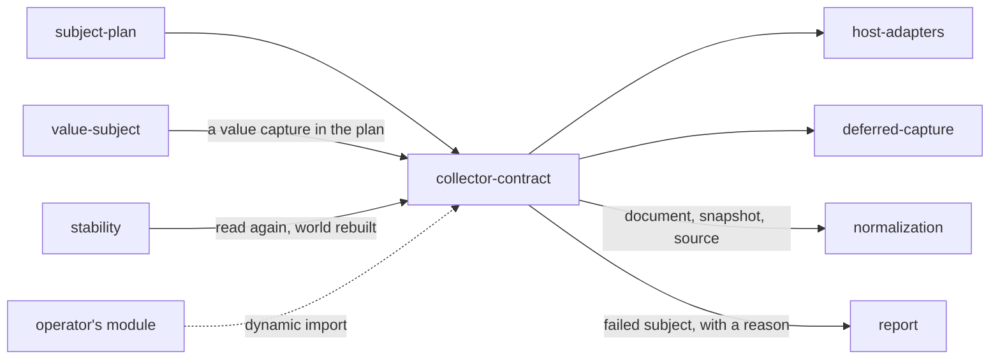

# Collector contract

«gateway»

## Responsibility

Defines the seam through which material for one **subject** arrives from a
module this system did not write, and holds the lifecycle that seam is called
under.

## Bounded context

[Observation](../../DOMAIN.md#observation)

## Inputs and outputs

In: the path of a module in the operator's own repository, and a context holding
the run's configuration and the generic half of the plan.

Out: three methods and two optional ones. `plan` returns the subjects and the
refusals; `collect` returns, for one subject, either a **render document** with
whatever else the cheap tiers produced beside it — a **semantic snapshot**, the
source index behind `file:line`, the interventions applied, the presentation
consequence — or the sentence saying why there is nothing. `close` ends the
world. A **call site** resolver is present when the collector drives a page and
absent otherwise. A second collection with the world rebuilt is offered or it is
not, and not offering it is an answer.

## Depends on

- [`subject-plan`](../subject-plan/README.md) — the plan handed in, so a
  collector returns it rather than writing its own
- [`value-subject`](../value-subject/README.md) — a value capture in an archive
  plan, which a run comparing documents names and refuses

## Used by

- [`host-adapters`](../host-adapters/README.md) — the shape they satisfy
- [`deferred-capture`](../deferred-capture/README.md) — an archive of written
  documents read back as a collector

## Boundary

A failure to collect one subject is a value, not an exception. One subject that
cannot be reached must not cost the other two hundred and ninety-nine their
observations, and must not be silently absent either, so it travels with a
sentence attached and lands in the report by name.

An absent capability is announced, never defaulted. A collector holding a single
open page has no clean world to offer, and the run says so rather than reading
silence as *nothing leaked*.

Collection is a queue of one, and that is not a tuning choice. The world is not
rebuilt between subjects — one browser, one page, one preview
for the length of a run — so two collections in flight would mount two subjects
into one document and let each decide the other's verdict. Everything downstream
of collection may go as wide as the operator asked for, because that is where the
time is; this lane may not.

The contract does not know what a subject is, what a component is, or what
"settled" means for anyone's application. Nothing is discovered and nothing is
downloaded: the module is named in configuration and lives in the operator's
repository.

## Implementation coordinates

- `packages/cli/src/commands/collector.ts` — `Collector`, `Plan`, `Collected`,
  `CollectorContext`, `loadCollector`
- `packages/cli/src/commands/schedule.ts` — `serial`, `pool`, `concurrencyOf`
- `packages/cli/src/commands/run.ts` — the collection lane and per-subject refusal handling
- `packages/unit-test/src/contract.ts` and
  `packages/{storybook-collector,route-collector}/src/contract.ts` — structural
  restatements, so a surface package does not pull the binary into an adopter's
  install
- `packages/cli/src/commands/alone.ts` — the caller of the rebuilt-world collection

## Diagram

