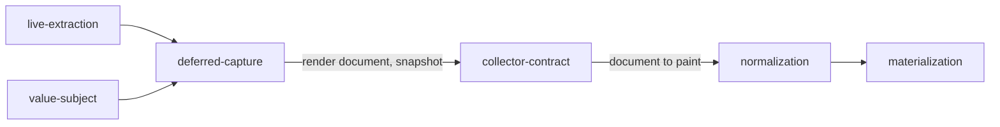

# Deferred capture

«factory»

## Responsibility

Writes a **render document** that closes over everything it needs, so a process
with no browser can hand a subject to one that has a pinned machine.

## Bounded context

[Observation](../../DOMAIN.md#observation)

## Inputs and outputs

In: a mounted tree in a host with no rasterizer, a viewport, the declared fonts,
and a resolver that turns a URL into bytes and a content type.

Out: an artifact holding the markup, the pruned stylesheet, the reconstructed
ancestor frame, the inherited floor, the viewport, the declared fonts, and every
referenced resource inlined with its **digest** — beside the **semantic
snapshot** of the same read. Read back later, the same archive presents itself as
a collector: a plan built from what is on disk, and one document per subject.

## Depends on

- [`live-extraction`](../live-extraction/README.md) — the same read, aimed at
  repainting rather than comparing
- [`collector-contract`](../collector-contract/README.md) — the shape the
  archive is read back through

## Used by

- [`value-subject`](../value-subject/README.md) — the same archive, holding a
  value instead of a document

## Boundary

A document built to be repainted and a capture built to be compared are the same
extraction aimed at two targets, and they diverge exactly where a selector is
concerned: a comparison throws away ids and classes, and a rule cannot match a
class that was normalized away. So this keeps what the other discards.

It refuses rather than writes when it cannot close. A resource with no resolver,
a resource the resolver could not fetch, an unresolvable reference, or a blob URL
whose bytes are process-local — each is an error naming what was missing, because
a document that is portable only on the machine that wrote it is a document that
paints differently somewhere else and says nothing about it.

It resolves the ancestor cascade. Design tokens are declared above every
subject's root, so pruning correctly drops the rule that defines them; shipping
the pruned sheet without the inherited floor renders the design system with its
colours removed, which looks exactly like a catastrophic regression.

It does not compare and it does not fail a test. The baseline is not present in
the process that writes the artifact, and a comparison written there would be a
weaker second copy of the run — one that cannot see the other subjects, cannot
reach the store, and cannot be approved.

It does not paint. What it produces is a payload for the one machine that is
pinned.

## Implementation coordinates

- `packages/dom/src/document.ts` — `acquireDocument`, `PATH_ATTRIBUTE`
- `packages/unit-test/src/capture.ts` — `capture`, `resourceUrls`, `closeResources`
- `packages/unit-test/src/archive.ts` — `writeCapture`, `readCapture`,
  `captureFiles`, `resetCaptures`
- `packages/unit-test/src/collector.ts` — `captureCollector`, the archive read
  back as a subject source

## Diagram

