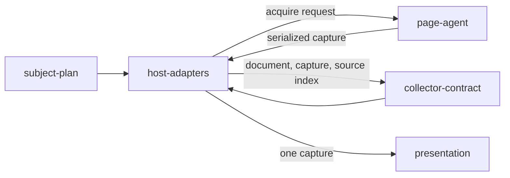

# Host adapters

«adapter»

## Responsibility

Reaches a named state through a host that already solved mounting — a story
preview, a page the application serves — and hands back what was read.

## Bounded context

[Observation](../../DOMAIN.md#observation)

## Inputs and outputs

In: a planned **subject** and the run's configuration — viewport, declared fonts,
the selectors an **ignore** rule names and the subjects it is scoped to.

Out: a **render document** and a raw capture from one mount, the source index
that turns a component name into `file:line`, the interventions applied, and a
**call site** resolver held open for the run. A subject the host could not show
— a story that threw, a route that answered 404, a root selector that matched
nothing — comes back as a refusal carrying the host's own reason, and the
remaining subjects are still observed.

## Depends on

- [`subject-plan`](../subject-plan/README.md) — the list to walk and the ids to key on
- [`collector-contract`](../collector-contract/README.md) — the shape it
  satisfies and the single-world lifetime it is called under
- [`page-agent`](../page-agent/README.md) — the only way it reaches a document

## Used by

- [`presentation`](../../presentation/README.md) — one capture, when a
  presentation reading was asked for

## Boundary

It does not mount. A preview owns its own mount and exposes a channel for
switching states; an application that served a page has already run its bundle,
its providers and its own definition of ready. What stays with the adopter is the
per-subject readiness selector and the directories that hold their components —
because a host's "rendered" event fires when a render function returns, which for
a component that defers work is not the same moment.

It does not reload per subject. One navigation, then states are switched over the
host's own channel, because a reload re-parses the design system, re-boots the
runtime and re-runs every decorator on every subject. The corner that cuts —
subjects sharing one document — is paid for by detecting what one left behind for
the next, not by preventing it.

It is not a crawler. Nothing followed is decided by what a fetched page points
at, because a subject list that grows when someone adds a link is a list nobody
wrote.

It prunes no host chrome. A subject mounts into a root the host owns, so the
preview reset, the addon layout and the error overlay fall outside the subtree
and are dropped by ordinary CSS applicability pruning. A host-specific denylist
would be a second normalization ruleset owned by nobody.

The two adapters duplicate a directory walk rather than import each
other, because the rule that turns a file into a source index has exactly one
owner elsewhere and what is copied is a walk — the alternative puts a collector
an adopter did not ask for into their dependency tree.

## Implementation coordinates

- `packages/storybook/src/preview.ts`, `show-story.ts`, `preview-url.ts`,
  `preview-protocol.ts` — driving a preview over its own channel
- `packages/storybook-collector/src/index.ts` — the collector, `execution.ts`, `page-agent.ts`
- `packages/route-collector/src/index.ts` — the collector, `options.ts`, `page-agent.ts`
- `packages/{storybook-collector,route-collector}/src/source.ts` — the component-to-`file:line` scan
- `packages/playwright/src/harness.ts` — the standing page the adapters are handed

## Diagram

