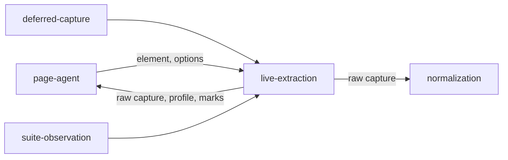

# Live extraction

«service»

## Responsibility

Reads a live element into a raw capture and the styling that can actually reach
it, under the **profile** the host declares it is capable of.

## Bounded context

[Observation](../../DOMAIN.md#observation)

## Inputs and outputs

In: an element, a viewport, an engine identity, and three optional framework
readers — the owner chain, the wiring, and the held state — injected rather than
imported, so extraction carries no framework dependency.

Out: a raw capture — the tree, its accessible meanings, the rules that apply to
each node, its geometry where a layout engine existed, and the **provenance** of
every node — plus the resolved marks for every **ignore** selector, the URLs the
subtree actually references, and the **profile** that says what could have been
seen.

## Depends on

Nothing inside this block. It is handed an element and asks the document
questions.

## Used by

- [`page-agent`](../page-agent/README.md) — the work performed on the far side of the crossing
- [`deferred-capture`](../deferred-capture/README.md) — the same extraction
  aimed at a document that will be repainted
- [`suite-observation`](../suite-observation/README.md) — the same extraction
  from a resolved locator

## Boundary

It extracts and does not clean up. Generated ids stay, hashed class names stay,
shorthands stay unexpanded, cascade losers are retained — because every
normalization rule must be versioned by the ruleset rather than by whoever
happened to read the page.

The one exception cannot be anywhere else: deciding whether a rule applies means
asking a live DOM. That pruning is a correctness result for comparison and a
transport result for anything sent elsewhere — a subject carrying a preview
reset, a design system and a CSS-in-JS tag that has been accreting since page
load ships as the rules that touch it.

One implementation serves both profiles. A separate reader per host would be two
extraction paths kept in agreement by discipline; here the only difference is
which dimensions the profile declares observable, and the code reads that
declaration rather than branching on the host. The profile itself is measured
rather than sniffed — a probe element is laid out and asked its width, because
the question is whether this host can observe geometry.

An **ignore** produces a mark and never a deletion. Dropping the excluded
elements would produce a capture in which nothing was ever ignored: every count
correct, every one of them zero. A selector that matched nothing in this subject
is reported here as evidence, because only a whole run can tell an ordinary
miss from a rule that has stopped matching anywhere.

A URL nothing requested is absent, never invented. An asset served from cache
before observation began has bytes nobody saw, and a placeholder would be a claim
about content.

## Implementation coordinates

- `packages/dom/src/collect.ts` — `collect`, `conditionsFor`
- `packages/dom/src/profile.ts` — `detectProfile`
- `packages/dom/src/css.ts`, `css-index.ts`, `css-match.ts`, `specificity.ts`,
  `selector-parts.ts`, `media.ts` — applicability pruning
- `packages/dom/src/inherit.ts` — the ancestor cascade at the subject root
- `packages/dom/src/aria.ts`, `attributed.ts` — accessible meaning and attribute authorship
- `packages/dom/src/ignore.ts` — `resolveIgnores`, `IGNORE_ATTRIBUTE`, `MARKED_RULE`
- `packages/dom/src/assets.ts` — `referencedAssets`, `assetsFor`

## Diagram

