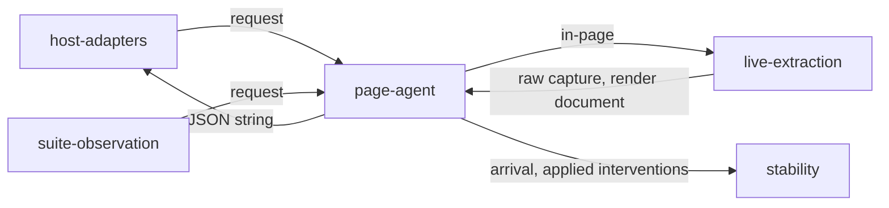

# Page agent

«gateway»

## Responsibility

Carries a request into the page's own context and a serialized capture back out,
over an asset set the page has stopped changing.

## Bounded context

[Observation](../../DOMAIN.md#observation)

## Inputs and outputs

In: two plain values. A request naming the subject id, the viewport, the engine
identity, the declared font hashes, the interventions to apply by id, and the
assets the driver watched arrive on the wire.

Out: a JSON **string**, unparsed by the crossing, because each caller has its own
shape and a shared parse would need a shared one. Serializing inside the page is
what makes the transport constraint load-bearing: a capture that acquired a map,
a DOM handle or a cycle fails here rather than three hops later.

Also out, toward [`stability`](../../stability/README.md): whether the subject
had finished appearing, and the named interventions that were applied to hold it
still.

## Depends on

- [`live-extraction`](../live-extraction/README.md) — everything on the far side that touches a DOM

## Used by

- [`host-adapters`](../host-adapters/README.md) — both shipped adapters reach a
  document through this and nothing else
- [`suite-observation`](../suite-observation/README.md) — the same crossing,
  with the root arriving as a resolved element

## Boundary

Nothing that crosses is a live object, so the same seam sits equally behind a
worker, a pipe or a device farm rather than a call into a page. The driver's side
knows nothing about subjects, components, or any framework; everything that must
touch a DOM is on the other side, in a bundle the caller supplies.

An intervention crosses as an id, never as a function. The page holds the same
registry and resolves the id itself.

It waits for the wire before it trusts the key it built. Holding a page still is
itself a fetch — asking for every image the browser deliberately deferred — so a
first reading is keyed on a strict subset of the page's own assets while claiming
to describe all of them, and reading the same standing page again would then
differ for no reason but the fold. So the driver lets the wire settle and reads
once more only when the asset map actually moved. A third disagreement would be
an application fetching on a timer, which is a fact about the application and
what an unstable verdict is for.

The global it installs is long and unmistakable, because it shares a namespace
with whatever the page already loaded and a collision would surface as a
confusing capture rather than as an error.

## Implementation coordinates

- `packages/playwright/src/agent.ts` — `AGENT_GLOBAL`, `CaptureRequest`, `PageAgent`
- `packages/playwright/src/acquire.ts` — `acquireFromAgent` and the settle-and-reread rule
- `packages/playwright/src/network.ts` — the observed asset map
- `packages/{storybook-collector,route-collector}/src/page-agent.ts` and
  `page-agent-entry.ts` — the browser halves
- `packages/playwright-test/src/page-agent.ts` and `acquire.ts` — the suite's crossing

## Diagram

