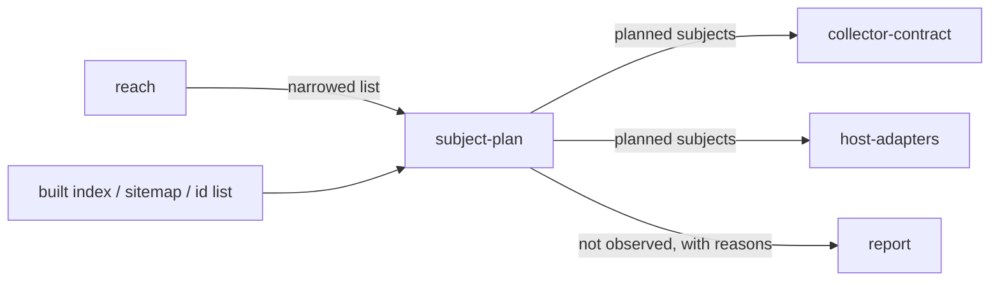

# Subject plan

«policy»

## Responsibility

Enumerates the **subject**s a run intends to observe, in an order that does not
depend on the machine, and names every subject the plan itself refuses.

## Bounded context

[Observation](../../DOMAIN.md#observation)

## Inputs and outputs

In: a declared artifact that already lists states — a built story index, an
operator's explicit id list, a sitemap, a directory of served pages — plus the
run's viewport, the exclusion tags, and the width list.

Out: a plan holding one entry per subject, each carrying its id, the viewport it
overrides the run's with, and the tags it wears; a list of **Not observed**
entries with the reason each carries; and warnings about the artifact itself.

A subject observed at two sizes is two subjects with two ids, because one
observation is keyed by one id and two records sharing an id make every later
question — which image is being described, which one an approval promotes —
ambiguous.

## Depends on

Nothing inside this block. Planning happens before a pixel is paid for, and it
reads files rather than pages.

## Used by

- [`collector-contract`](../collector-contract/README.md) — the generic half of
  planning, handed to a foreign collector so it writes none of its own
- [`host-adapters`](../host-adapters/README.md) — the list a driver walks

## Boundary

It does not decide which subjects a change could have moved — that narrowing
arrives from [`reach`](../../reach/README.md) and is applied to a plan that
already exists. It does not evaluate a story module, so it sees only what a
built index declares: type, title, name, import path and tags, never parameters.
A viewport it cannot resolve is refused rather than converted, because an
invented size renders a subject nobody asked for and reports success.

It defines no vocabulary. A tag is a word a subject wears; what the word means
is written down once elsewhere, where a typo can be refused by name.

Ordering is not left to the source. Key order in a
built index is whatever a filesystem walk produced, and a pollution finding is
directional — so subjects are sorted by codepoint, not by locale, or the same
leak is attributed to different subjects on different machines.

## Implementation coordinates

- `packages/storybook/src/subjects.ts` — `toSubjects`, exclusion policy,
  viewport resolution, ordering
- `packages/storybook/src/index-file.ts` and `packages/storybook/src/read.ts` —
  parsing what a built index declares
- `packages/cli/src/commands/collector.ts` — `planStorybook`, `planList`, `matchesGlob`
- `packages/route-collector/src/sitemap.ts` — `locationsIn`, `discover`, `routesFromFiles`
- `packages/route-collector/src/widths.ts` — `widthsOf`, the plan once per declared width
- `packages/route-collector/src/serve.ts` — `pagesIn`, a served directory as a subject list

## Diagram

