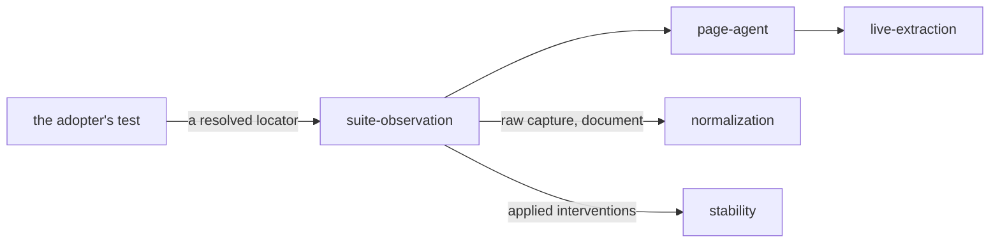

# Suite observation

«adapter»

## Responsibility

Acquires a **subject** from a locator inside a suite that has already navigated,
mounted and waited.

## Bounded context

[Observation](../../DOMAIN.md#observation)

## Inputs and outputs

In: a resolved element handed across by the test's own driver, plus the subject
id, the viewport, the engine identity and the declared fonts.

Out: the raw capture and the **render document** of one mount, the browser's own
accessibility reading of the subject root and of every portal the subject
projected into, and the interventions applied.

## Depends on

- [`page-agent`](../page-agent/README.md) — the crossing, with the root arriving
  as an element rather than a selector
- [`live-extraction`](../live-extraction/README.md) — the read performed on the far side

## Used by

- [`normalization`](../../normalization/README.md) — the capture, for turning
  into a comparable reading

## Boundary

There is no plan and no collector here, because the adopter's test body already
is one. What is left is the half this system owns: acquire, attribute, and hand
on. Nothing searches for the subject — the driver resolved the locator — so the
fallback chain a host adapter needs does not exist.

Portal markers are stamped so the accessibility reading can find content the
subject rendered outside its own subtree, and every marker is put back exactly as
it was found, including removing one that was not there before.

Where the suite asks for its own pixels rather than a deferred paint, the launch
that produced them is declared, because nothing else in the process can say which
machine, which flags and which scale — and the animation hold installed during
acquisition is left standing, so one owner defines both the semantic and the
pixel state rather than two interventions contradicting each other.

The page half is built during this repository's build and read off disk rather
than bundled at call time, so no bundler enters an adopter's install. It is
installed as an init script rather than appended as a tag, because a module
evaluates asynchronously — the check for a broken bundle would race it — and an
init script survives the navigations a real test performs.

Where the suite's test body already runs in the subject's own realm — a
browser-mode component test — there is no crossing to make and no locator to
resolve on the far side: the read happens in the tab and only the artifact
leaves it, over whatever protocol the runner gives its test body. The judging
half stays outside, because a baseline and a paint are the two things that realm
does not have.

## Implementation coordinates

- `packages/playwright-test/src/acquire.ts` — `acquireFrom`, portal accessibility roots
- `packages/playwright-test/src/page-agent.ts` — `AGENT`, `acquire`, `ACCESSIBILITY_ROOT_ATTRIBUTE`
- `packages/playwright-test/src/fixture.ts` — `observeLocator` and the fixture surface
- `packages/playwright-test/src/direct.ts` — a session held across several observations
- `packages/playwright-test/src/in-place.ts` — the suite's own browser as the source of pixels
- `packages/vitest-browser/src/observe.ts` — `observeSubject`, the read performed in the subject's own realm
- `packages/vitest-browser/src/node.ts` — `varianceCommands`, the judging half on the runner's side

## Diagram

