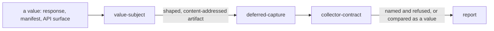

# Value subject

«service»

## Responsibility

Takes a named value that was never rendered — an API response, a generated
manifest, a route table, a workspace's published surface — as a **subject**.

## Bounded context

[Observation](../../DOMAIN.md#observation)

## Inputs and outputs

In: any value that can be text, the subject id, the dialect it should be read
back in, and the declarations that make it stable — pointers whose values are
volatile, pointers whose values become a token of the author's choosing, and the
member that identifies a row in an array of records.

Out: a shaped, content-addressed artifact written where a later run reads it,
alongside the documents. What emitted the value is recorded when something did.

## Depends on

- [`deferred-capture`](../deferred-capture/README.md) — the same archive,
  holding a value rather than a document

## Used by

- [`collector-contract`](../collector-contract/README.md) — a subject in the
  plan built from the archive

## Boundary

It needs no browser, no DOM and no dialect reader, which is why it is the floor
of the subject list and why every richer reading degrades to it.

A volatile pointer is recorded as present and never compared, rather than
removed — [absent is not empty](../../DOMAIN.md#run-report).

A value that cannot be one is refused by pointer — a function, a date, a bigint,
a non-finite number — because dropping it silently produces the same reading as
deleting it.

It does not compare and does not fail the process that wrote it, for the same
reason nothing else in this block does: the baseline is not there.

A value capture in the archive is named and refused by a run that compares
rendered documents, rather than being skipped, because a subject that vanishes
without a word is indistinguishable from one that passed.

A source that reads a value returns plain data and never a shaped capture.
Deciding which comparison is allowed to run against a value is not a reader's
call — a workspace's published surface is a manifest's declarations beside what
each entrypoint reaches through the barrels, and it is handed to whatever wants
to shape it.

## Implementation coordinates

- `packages/unit-test/src/value.ts` — `snapshotValue`
- `packages/unit-test/src/shape.ts` — the shaping options
- `packages/unit-test/src/collector.ts` — the refusal of a value capture by a document run
- `packages/package/src/surface.ts` — `readSurface`, a workspace API surface as a value
- `packages/package/src/manifest.ts`, `reach.ts`, `declare.ts` — what a manifest
  offers and what each entrypoint reaches

## Diagram

