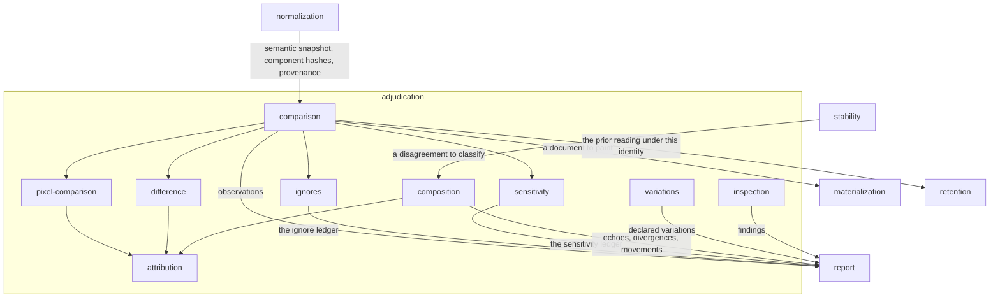

# Adjudication

## Responsibility

Turns a difference between two readings of one **subject** into a defensible
sentence: a **verdict**, a **cause**, and a place.

## Logical role

This block is where the system stops describing and starts asserting. It holds
the whole distance between *5482 pixels moved* and *`Toggle` moved, at
`src/ds/components.tsx:107`, in `main → region "Todos" → item 2 of 3`* — the
arithmetic that says what differs, the exclusions the adopter declared, the join
that gives a difference a name and a location, the ordering that separates a
**cause** from its collateral, and the single word the run commits to. Every one
of its answers is constructed so that *nobody looked* and *nothing moved* cannot
be spelled the same way.

It runs two axes. One is a **subject** against its **baseline** — two revisions
of one thing. The other has no baseline in it at all: one run's **subjects**
joined to each other at one commit, on the components they share and on the axes
their names declare.

## Boundary

It does not observe, does not decide when to re-read, does not choose or keep
**baselines**, and does not aggregate for a person: it receives readings
[normalization](../normalization/README.md) already made comparable, and emits
per-subject observations and per-rule ledgers, in plan order, owning neither the
format nor its readings. It never infers cause from a pixel — causality runs
code → meaning → pixels in one direction, so an author is looked up rather than
reconstructed.

## Technology

TypeScript. The comparison and policy core is pure data in, pure data out — no
DOM, no React, no I/O, no async, enforced by a `lib: ES2022` compiler
configuration rather than by convention — so a PNG decoder, a module fetcher and
a source map loader are all injected by the caller.

## Implementation coordinates

- `packages/core/src/compare/` — deltas, bands, impact, the parting
- `packages/core/src/attribute/` — masks, regions, provenance, call sites, the
  suite-to-itself fold
- `packages/core/src/judge/` — verdicts, ignores, sensitivity, fingerprints,
  inspection
- `packages/observe/src/` — the composition: `observe.ts`, `decide.ts`,
  `attribution.ts`
- `packages/png/` and `packages/png-sharp/` — pixel comparison and the decoder
  behind it
- `packages/cli/src/commands/` — `ignores.ts`, `sensitivities.ts`, `compose.ts`,
  `variations.ts`, `observe-one.ts`

## Communicates with

- → [`materialization`](../materialization/README.md) — a document to paint,
  when settling did not answer
- → [`retention`](../retention/README.md) — the lookup for the prior reading
  under this identity, and the component hashes it recorded
- → [`report`](../report/README.md) — observations, ledgers, composition and declared variations
- ← [`normalization`](../normalization/README.md) — the semantic snapshot,
  component hashes and provenance
- ← [`stability`](../stability/README.md) — a disagreement between two readings
  that were supposed to agree, to classify

## Uses

### [Materialization](../materialization/README.md)

#### Why

**Digests** answer *nothing moved* without painting anything, and that is the
cheap and common case. When they do not settle it, the difference has to be
shown, and this block will not carry a renderer to show it: pixels are made under
a declared **renderer identity**, and folding that identity into a comparison
library would put font rasterization inside the thing that decides whether a
component regressed.

#### What I need from it

An image of a **render document** produced under a stated identity, at a stated
scale, so that a change mask can be taken over two images that are comparable by
construction; and the identity itself, so a mismatch is reported as
`incomparable` rather than compared anyway.

#### What would make me leave

A path where every **subject** is settled semantically — every reading carrying
enough of what the document said that no image is needed to name what moved.
Where that holds, this edge is unused and the block's answers are unchanged.

### [Retention](../retention/README.md)

#### Why

A comparison needs the other side, and the other side is not this block's to
keep. Delegating it means the lookup can be partitioned by **renderer identity**,
so the wrong prior reading is not where the lookup looks rather than being a check
somebody must remember to call.

#### What I need from it

The **baseline** for one **subject** under one identity, and the **component
hashes** the document that painted it carried. The second is not optional
decoration: without them a comparison can name a region but has no standing to
say which component originated the change, and `causes: []` becomes a claim it
cannot make.

#### What would make me leave

Nothing short of comparisons that carry both sides in one run. The
suite-to-itself axis already does — it reads no store at all — and it is the
proof that the coupling is per-axis rather than structural.

### [Report](../report/README.md)

#### Why

The answers this block produces are useless where they are computed. A person, a
change proposal and an agent read one format, and the format is owned by neither
its writer nor any of its readers — so this block writes values and hands them
over rather than rendering anything.

#### What I need from it

Somewhere durable to put a **verdict** and its sentence, the regions and their
**causes**, the per-rule ledgers for **ignores** and **sensitivity**, the
composition section, and the declared **variations** — with plan order preserved,
because a report has to be a function of the plan and not of which worker finished
first.

#### What would make me leave

Nothing. A block that decides and does not record has decided nothing.

## Components

| Component | Responsibility |
|---|---|
| [comparison](./comparison/README.md) | Runs one subject's two readings through a hard-wired sequence and commits to the word and sentence that name the outcome |
| [difference](./difference/README.md) | Turns two semantic readings into banded deltas, an impact, and a statement of where the two readings parted |
| [pixel-comparison](./pixel-comparison/README.md) | Turns two images into a change count net of exclusions, a change mask, a difference image and a shape fingerprint |
| [attribution](./attribution/README.md) | Turns changed area into bounded regions and each region into a component, a phrase and a `file:line`, ordered by cause rather than by area |
| [ignores](./ignores/README.md) | Resolves declared exclusions against a subject and accounts for every rule, including the ones that absorbed nothing |
| [sensitivity](./sensitivity/README.md) | Decides which bands a subject is asserted on at all, before anything expensive happens |
| [composition](./composition/README.md) | Joins one run's subjects to each other at one commit on the components they share, and says what echoes, what disagrees and what explains each movement |
| [variations](./variations/README.md) | Compares a subject to the subject it declares itself a variation of, and gives that difference an identity |
| [inspection](./inspection/README.md) | Decides what is wrong with one stored reading, with nothing to compare it against |
| `packages/png-sharp/` | L5 — a PNG decoder adapter behind the injected decoding seam |
| `packages/core/src/format/hash.ts` | L5 — the digest primitive every band and fingerprint is built on |
| `packages/core/src/judge/scope.ts` | L5 — glob, subtree and expiry predicates shared by the declaration components |

## Diagram

