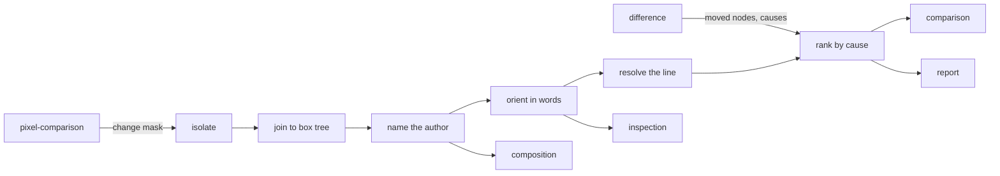

# Attribution

«service»

## Responsibility

Turns changed area into a bounded set of regions and each region into a
component, a spoken location and a `file:line`, ordered so that the **cause**
outranks what it displaced.

## Bounded context

[Adjudication](../../DOMAIN.md#adjudication)

## Inputs and outputs

In: a change mask from [`pixel-comparison`](../pixel-comparison/README.md), or a
set of changed nodes from [`difference`](../difference/README.md); a **semantic
snapshot** carrying rects and **provenance**; the scale the raster was taken at,
the page-space origin of its corner, and a containment fraction; optionally a
source index and a fetcher for source maps.

Out: regions with exact boxes, pixel counts and densities; per region a component
name, the enclosure beside it when it says something the author does not, a
landmark phrase, and a **call site**; a ranking; and, where nothing contains a
region, `unattributed` with the nearest overlapping node offered separately.

## Depends on

- [`pixel-comparison`](../pixel-comparison/README.md) — the change mask, and the
  exclusion boxes already subtracted from it
- [`difference`](../difference/README.md) — the nodes a semantic comparison
  found moved, and the **causes** it named

## Used by

- [`comparison`](../comparison/README.md) — the place a **verdict** puts on a region
- [`composition`](../composition/README.md) — the component names a movement is walked from
- [`inspection`](../inspection/README.md) — the component a finding is
  attributed to, and the phrase that places it
- [`report`](../../report/README.md) — a region a reader can act on

## Boundary

The chain is five hops that fail differently and are separated where they fail:
isolate a mask, join it to the box tree, name the author, orient it in words,
resolve the line. Each refuses on its own terms rather than borrowing the next
hop's confidence.

Membership is decided coarsely and coordinates are not. Connected components run
on an eight-pixel grid, because at pixel scale a paragraph of restyled text is
four hundred regions and that is the same unreadable answer as a single number,
only longer; boxes are then tightened back onto the actual changed pixels, so a
region's box is exact. The region cap is reported — the count of regions
dropped and the change inside them ride beside the list, because a capped list
that does not say it was capped reads as complete coverage.

The join needs a **profile** with a layout engine. A rect that was never observed
is never inferred: without geometry every region comes back unattributed, which
is the correct answer. The scale has no default, because a wrong scale does not
look like a failure — every region lands in one quadrant, every one attributes to
something, and the report comes out full, plausible and about the wrong
components.

A region no box contains is not attributed to the nearest one. Paint escapes its
box routinely, and resolving that by proximity produces exactly the confident
wrong answers an agent then acts on. The nearest node is offered as orientation,
in its own field, and nothing promotes it.

Ties go to the innermost box. A wrapper that shrink-wraps its only child carries a
byte-identical rect, and keeping the first equal box would name a component
nobody edited and send a reviewer to its file.

[Ranking by area is backwards](../../DOMAIN.md#cause), so the ordering is taken
from the tier that has **provenance** and props digests, and a region matches a
**cause** under either namespace — author or enclosure — because a one-sided test
finds nothing and silently reverts to area. With no **causes** supplied the order
is by area.

Call sites are resolved only for the regions a report will name. Frames ride
the snapshot and no hash projects them, so a page whose only change is one button
resolves one call site and a page that did not change resolves none. A frame holds
an absolute URL with a build hash in it, so it never reaches a document, a
**digest** or a **baseline**.

It names where an element is written, which is not a cause. What caused the
movement is [`composition`](../composition/README.md)'s ladder.

## Implementation coordinates

- `packages/core/src/attribute/mask.ts` — `isolateRegions`, `subtractRegions`,
  `excludedBoxes`; the coarse grid, the exact boxes, the cap and its report
- `packages/core/src/attribute/region.ts` — `attributeRegions`, `rankRegions`;
  scale, origin, containment, the innermost-box rule
- `packages/core/src/attribute/locate.ts` — `locate`; landmark, region, list
  position
- `packages/core/src/attribute/call-site.ts`, `stack.ts`, `source-map.ts`,
  `source.ts` — `locateSites`, `parseStackFrames`, `resolveSource`,
  `indexSource`
- `packages/core/src/format/provenance.ts` — author before enclosure
- `packages/observe/src/attribution.ts` — the composition of the hops in one run

## Diagram

