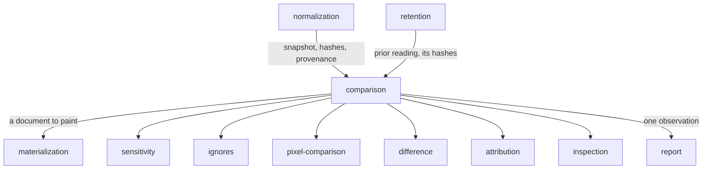

# Comparison

«service»

## Responsibility

Runs one **subject**'s two readings through a hard-wired sequence of exclusions,
comparisons and attributions, and commits to the single word and the sentence
that name the outcome.

## Bounded context

[Adjudication](../../DOMAIN.md#adjudication)

## Inputs and outputs

In: two readings of one **subject** — a **baseline** side and a **candidate**
side — each carrying its **renderer identity**, its **component hashes** where the
document that produced it recorded any, and its **semantic snapshot** where one
was taken; the declared **ignores** and **sensitivity** already scoped to this
subject; a decoder.

Out: one observation — a **verdict**, the sentence behind it, the changed pixel
count net of exclusions, the regions with their **causes**, the per-rule
absorption map, and the diagnostics — spread so that a dimension nobody could
answer is omitted rather than present and empty.

## Depends on

- [`sensitivity`](../sensitivity/README.md) — whether this subject is asserted
  on at all, evaluated against **component hash** bands
- [`ignores`](../ignores/README.md) — the subtrees to subtract and the shapes to absorb
- [`pixel-comparison`](../pixel-comparison/README.md) — the change mask and the per-policy counts
- [`difference`](../difference/README.md) — what moved semantically, and which
  components' own content moved
- [`attribution`](../attribution/README.md) — regions, names and places for the change that survived
- [`inspection`](../inspection/README.md) — findings that need no other side, reported on every exit
- [`materialization`](../../materialization/README.md) — pixels, when the digests did not settle it
- [`retention`](../../retention/README.md) — the prior reading under this
  identity, and the hashes it carried

## Used by

- [`report`](../../report/README.md) — one observation per subject, in plan order

## Boundary

Order is the whole content of this component. It is named for the sequence it
fixes, and that sequence is assembled from the same public operations any caller
could assemble: exclusions are subtracted, then **sensitivity** is consulted,
then the surviving mask is isolated, then shape rules absorb, then regions are
attributed, and only then a word is chosen. Nothing beneath it imports it, so a
team that disagrees with the
order replaces this and keeps everything else.

The cheap exits come first and each of them is a different word. Two **digests**
that agree settle the subject with no image read at all. An identity mismatch
answers `incomparable` — never red, never green. A missing **baseline** answers
`new`. A mask with nothing left in it answers `unchanged` when nothing was
absorbed and `ignored` when something was, and the two are never spelled the same
way: a suite has to be able to say how much of its green it earned and how much
it declared.

The changed count is
[net of exclusions](../pixel-comparison/README.md): the raw count is carried for
the record and never compared against zero, and the working number is what
survives subtraction and then shape absorption. A subject with a mask over half
of it is not a subject that moved half of itself.

The two attribution answers arrive together or not at all. `causes` and the
moved-component list come from the same pair of sidecars under the same absence
condition, and when either side carries no **component hashes** both keys are
omitted rather than emptied — a baseline with no hashes has no standing to make
[the claim an empty cause list makes](../../DOMAIN.md#cause).

A **verdict** about the product and a failure of the machine never share a
channel: a subject that could not be reached, a frame that diverged from the
document, a font that never loaded are diagnostics beside the answer, not the
answer.

It does not aggregate. One subject, one word; grouping words into a run's shape
belongs to [`report`](../../report/README.md).

## Implementation coordinates

- `packages/observe/src/index.ts` — the statement that this is the ordered layer
- `packages/observe/src/observe.ts` — `observeRasters`, `observePair`,
  `observeAgainstBaseline`; the identity check and the render cache
- `packages/observe/src/decide.ts` — `decide`, `declaredIgnores`,
  `relaxedVerdict`; the sequence and every exit
- `packages/observe/src/attribution.ts` — `attributionOf`, the co-arrival
  invariant
- `packages/core/src/judge/verdict.ts` — the six per-band words, their severity
  order, and `UNOBSERVED` beside them
- `packages/cli/src/commands/observe-one.ts` — `observeOne`; diagnostics, the
  settlement query, then the pipeline for what settling did not answer

## Diagram

