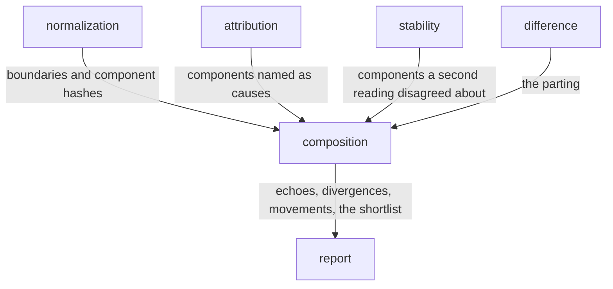

# Composition

«service»

## Responsibility

Joins one run's **subjects** to each other at one commit on the components they
share, to say which of them are watching the same bytes, which of them disagree,
and what explains each thing that moved.

## Bounded context

[Adjudication](../../DOMAIN.md#adjudication)

## Inputs and outputs

In: for every **subject** the run observed, the component boundaries its document
contained and the **component hash** of what each one rendered; the components a
comparison named as **causes**, and the components a **second reading** disagreed
about; and, where the run asked for them, the changed file set, the components
each file declares, and the tokens whose resolved values moved.

Out: **echoes** — one rendering with sites in more than one subject; **divergences**
— one props class rendering more than one way at this commit, kept grouped by
rendering; and one movement per moved component, carrying its rung, the other
subjects it moved in, and the **held** control group beside a count of what that
control was drawn from. Plus two shortlists: the movements a **second reading**
already found unstable, and the ones worth reading twice.

## Depends on

- [`difference`](../difference/README.md) — the parting that says which input
  separated two renderings
- [`attribution`](../attribution/README.md) — the component a region was named for
- [`stability`](../../stability/README.md) — a disagreement between two readings
  that were supposed to agree

## Used by

- [`report`](../../report/README.md) — the composition section, and the
  shortlist of **subjects** worth reading twice

## Boundary

There is no baseline anywhere in it. No second render, no second image, no
store — a fold over digests the run already produced, in plan order, so a slower
machine that finishes subject forty-one before subject three produces the same
bytes.

It decides nothing. Two **subjects** sharing a rendering is not a reason to
delete either; a component can be correct in one context and broken in the next,
which is why the contexts are separate subjects. Nothing here reaches an exit
code, a store or a **baseline**.

A run with no boundaries to join answers with a sentence saying it cannot tell
rather than with an empty graph —
[absent is not empty](../../DOMAIN.md#run-report). The **echo** list is capped and
what the cap left out is counted, because a cap that says nothing reads as
coverage.

A divergence a props digest's excluded children could explain is refused rather
than reported with a hedge. A props digest is not a complete statement of a
component's inputs, so three shapes reach the check and are turned away: two
boundaries of one component inside one subject are different nodes rather than two
renderings of one; instances whose **provenance** did not survive are not known to
have received the same thing; and two sites that mounted different components
below them did not receive one input. The asymmetry is why these are code rather
than prose — a movement wrongly dismissed as explained is unactionable, while the
same movement left unexplained lands on a shortlist where a second reading settles
it.

The ladder is edited, token, upstream, contradicted, unexplained, and it stops at
the first rung that holds. The upstream rung reads authorship before enclosure,
and that is not a tie-break: the component that wrote the element is
the one whose edit changed this component's inputs, while the enclosure is
routinely a layout primitive nobody edited. The enclosure walk is the other half
rather than a fallback, because authorship is gone on a production build. Tokens
are read off a component's own instances rather than off the **subject**, since
every subject on a themed page resolves through every token in the theme.

A run with no change set carries a sentence rather than an accusation. The
first two rungs need a declared change set, and a run that did
not ask has not established that nobody edited anything — so an unexplained
movement there says the run was never asked instead of naming a flake.

`held` is the control group, and empty means there was no control. It is the
sites of the same component under the same props class, in other subjects, that
this run read and found unmoved — a component given different inputs elsewhere is
a different question that happens to share a name. A site is disqualified when it
also moved, and when nobody measured it: unmeasured is not unchanged. What the
control was drawn from is carried beside it, because zero means *nothing to
compare against* and four with an empty list means *four were compared and every
one of them moved too*, and those are opposite findings.

An unexplained movement is not a flake. It is a statement about the evidence
this run assembled, not about the subject, and settling one is
[stability](../../stability/README.md)'s instrument.

## Implementation coordinates

- `packages/core/src/attribute/composition.ts` — `composeSubjects`; the fold,
  pure and plan-ordered
- `packages/core/src/attribute/instances.ts` — the re-aliasing that makes a
  rendering digest comparable across subjects
- `packages/core/src/attribute/divergence.ts` — `divergencesOf`; the three
  refusals
- `packages/core/src/attribute/movement.ts` — `attributeMovement`,
  `attributeOne`, `editedAncestor`; the ladder and the authorship-first climb
- `packages/core/src/attribute/control.ts` — `heldSites`; the control group and
  its denominator
- `packages/core/src/attribute/because.ts` — the sentence an unexplained
  movement carries
- `packages/core/src/attribute/boundary.ts` — where a boundary is placed
- `packages/cli/src/commands/compose.ts` — `compositionOf`; the run-level
  assembly and what reaches the artifact

## Diagram

