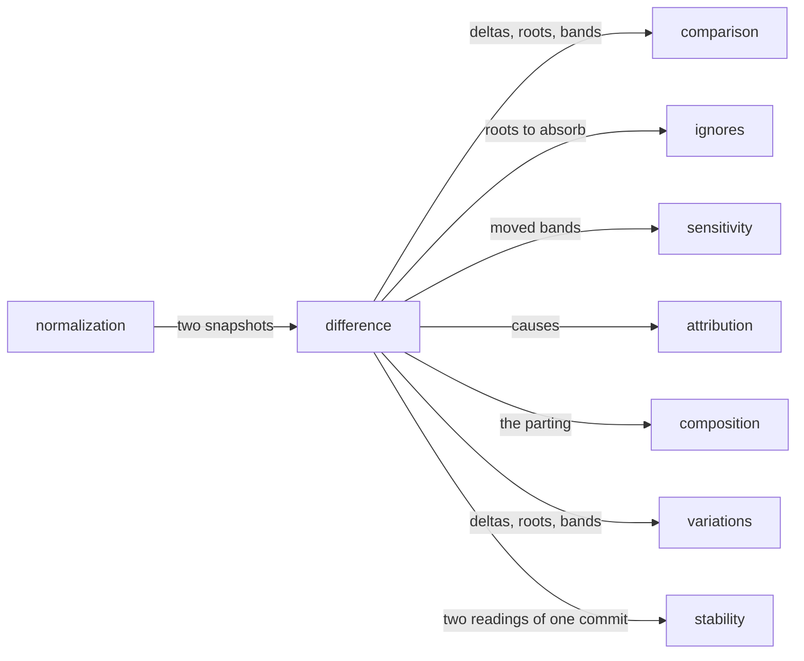

# Difference

«service»

## Responsibility

Turns two **semantic snapshots** of one **subject** into a banded, impacted list
of deltas grouped under the roots that originated them, and — where the readings
carry what each component was handed — a statement of where the two readings
parted.

## Bounded context

[Adjudication](../../DOMAIN.md#adjudication)

## Inputs and outputs

In: two **semantic snapshots**, each with its **profile**, its tree, its
applicable styling with the cascade recorded, its geometry where a layout engine
existed, and the **provenance** of every node.

Out: the deltas, each in exactly one **band** with an **impact**; the roots that
explain them, ordered by how much they explain; which components are roots and
which are collateral; the bands neither side could decide; and, separately, a
parting — a slice, a rung per boundary, and the origins that moved with no
incoming input to explain them.

## Depends on

- [`normalization`](../../normalization/README.md) — the comparable readings and
  the versioned rules that made them comparable

## Used by

- [`comparison`](../comparison/README.md) — what moved, so a word can be chosen
- [`ignores`](../ignores/README.md) — the roots and deltas a declared rule absorbs
- [`sensitivity`](../sensitivity/README.md) — the bands a level is evaluated against
- [`composition`](../composition/README.md) — the parting behind a **divergence**
- [`variations`](../variations/README.md) — the same arithmetic pointed at a pair somebody linked
- [`attribution`](../attribution/README.md) — the **causes** that replace ordering by area
- [`stability`](../../stability/README.md) — the same arithmetic pointed at two
  readings of one commit

## Boundary

It says what moved and refuses to say whether anyone should mind. That split
is load-bearing: a comparison that also decided severity could not be reused by a
caller with a different policy.

Every delta lands in exactly one **band**, and the five are ordered loudest first
— accessibility, geometry, token, content, texture — because change frequency and
change importance run opposite to each other. The order is declared once; one
function is allowed to collapse a set of bands, and nothing else may assume an
order, because three call sites each carrying their own ladder means a new band is
silently demoted in all three. **Impact** is the second axis and is orthogonal:
whether a change can move a box or only repaint one.

Roots are assigned by a fixed precedence — environment, token, prop, component,
unattributed — each level explaining more subjects than the one below. A prop root
names the outermost owner whose props moved, because naming the innermost
would name the messenger. Layout output is not style: a used value that a
descendant's edit moved folds into geometry rather than being reported as a
component whose own style changed.

It refuses two pairs outright: two different **subjects**, and two readings taken
under different **profiles**. The same arithmetic without those refusals is what
explanations use, because two subject ids are the point of a **variation** and of
a parting.

A band neither side's **profile** could decide is `unobserved`, never
`unchanged`, and the union rather than the intersection is taken.

The parting stops one rung short of the source. It names the fork — a
prop, a context value, an inherited cascade value, an external store, a hook cell
— and never the `file:line` of the hook. It gives no **verdict**, and what it
reads are digests rather than values: a prop can be a customer record, so what
travels is enough for an equality test and not reversible into what a person was
looking at. None of it reaches a hash, because a hook's value is precisely the
thing that legitimately differs between two readings of an unchanged page.

Silence is never agreement. A boundary whose inputs could not be read is `unread`,
which outranks *every input agreed and the output moved anyway* — nondeterminism
is an accusation, and it may only be made about inputs somebody read.

## Implementation coordinates

- `packages/core/src/compare/band.ts` — `BANDS`, `bandOf`, `loudestBand`; the
  one declared ordering
- `packages/core/src/compare/impact.ts` — `impactOf`, `canReflow`,
  `aggregateImpact`
- `packages/core/src/compare/diff/` — `diffSnapshots`, `compareTrees`,
  `matchTrees`, `compareNodes`; root precedence in `attribution.ts`, root and
  collateral in `components.ts`
- `packages/core/src/compare/observability.ts` — `observableBands`,
  `decidesBand`
- `packages/core/src/compare/parting.ts`, `slice.ts`, `cascade.ts`,
  `holding-diff.ts`, `instance.ts`, `explain.ts` — `partingOf`, `sliceOf`,
  `boundarySnapshot`, `explainParting`

## Diagram

