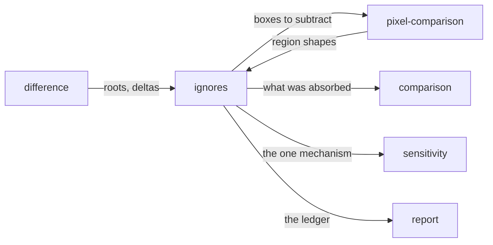

# Ignores

«policy»

## Responsibility

Resolves the adopter's declarations that a difference will not be looked at, and
accounts for every rule in every run — including the ones that absorbed nothing.

## Bounded context

[Adjudication](../../DOMAIN.md#adjudication)

## Inputs and outputs

In: the declared rules; the **subjects** the run planned and the tags they wear;
the resolved sites a **place** rule picked inside each subject; the deltas and
roots of a semantic comparison, or the regions and their **fingerprints** from a
pixel one; the day the run happens on.

Out: the boxes to subtract before counting; the differences absorbed, attributed
to the rule that absorbed them; the **subjects** whose every difference was
absorbed; and a ledger with one line per rule saying which of five things
happened to it.

## Depends on

- [`difference`](../difference/README.md) — the roots and deltas a semantic rule matches against
- [`pixel-comparison`](../pixel-comparison/README.md) — the shape of a region,
  to match a fingerprint rule

## Used by

- [`comparison`](../comparison/README.md) — what comes out before a word is chosen
- [`pixel-comparison`](../pixel-comparison/README.md) — the boxes subtracted
  before pixels are counted
- [`sensitivity`](../sensitivity/README.md) — the one mechanism a level is translated into
- [`report`](../../report/README.md) — the ledger

## Boundary

An ignore is not a tolerance: a tolerance is a threshold, and what a threshold
absorbed cannot be named afterwards. This system has none. An ignore names
a **place** — a subtree, picked by a selector that runs inside each subject — or a
**shape** — a **fingerprint**, which is a difference digested with its position
removed. Never a rectangle: a rectangle stops covering the thing it was drawn
around the first time the layout moves, and silences whatever lands there next.
And never a bare band: a rule scoped only by band is a tolerance wearing a
different word, and a rule naming neither a place nor a shape is refused by name.

A reason is mandatory and a rule without one is refused. It is the field that
decides whether an ignore can ever be removed.

A rule may declare an expiry, and the date is validated when one is there. On the
day after the last day it holds the rule stops absorbing and starts being
reported, and whatever it was hiding comes back with no further action. Expiry is
decided in days, because comparing instants retires a rule most of a day early.

Every rule is accounted for, including the ones that absorbed nothing. There
are two distinct ways to be dead and they need different actions: a rule that
resolved nowhere means something the adopter believes is silenced is being
reported; a rule that resolved and absorbed nothing means the flake may be fixed.
Beside them sit expired, unworn — scoped to a tag no **subject** in this run
carries, offered with the nearest word actually worn — and found-but-never-
compared, which says nothing either way. A mask that outlived its flake is a hole
in a suite that nobody can see, which is why the absorbed-nothing case is a line
rather than a silence.

One declaration excludes on both tiers. Two declarations would let the tiers
disagree about what the **subject** is, and a region excluded semantically but
still compared on pixels reports the loudest **verdict** in the system about
something the adopter already said was not the subject.

Scopes intersect rather than union. An ignore is the one setting that makes a run
less observant, so where two readings exist the narrower one is correct and a
union is two rules.

It never produces `unchanged`. A **subject** whose every difference was
absorbed is `ignored`, which is green, exits zero, and is a different word — the
same treatment a band nobody could observe gets, because an ignore is the second
reason not to have looked.

The collector marks and never deletes: an excluded subtree is annotated in place,
so what was excluded is still in the reading and can still be counted.

## Implementation coordinates

- `packages/core/src/judge/ignore.ts` — `validateIgnoreRule`, `applyIgnores`,
  `summarizeIgnores`; the refusals, the match order, and the rebuild that keeps a
  filtered comparison consistent with an unfiltered one
- `packages/core/src/judge/fingerprint.ts` — `fingerprintOfRoot`,
  `fingerprintOfMask`, `shapeOfDelta`
- `packages/core/src/judge/scope.ts` — `isUnder`, `matchesGlob`,
  `appliesToSubject`, `isExpired`
- `packages/core/src/attribute/mask.ts` — `excludedBoxes`, `subtractRegions`
- `packages/cli/src/commands/ignores.ts` — `scopedTo`, `liveIgnores`,
  `ledgerOf`, `summarizeLedger`
- `packages/cli/src/config-ignore.ts` — the closed declaration shape
- `packages/observe/src/decide.ts` — `declaredIgnores`, so a **subject** that
  never reached a comparison still tells the ledger what resolved

## Diagram

