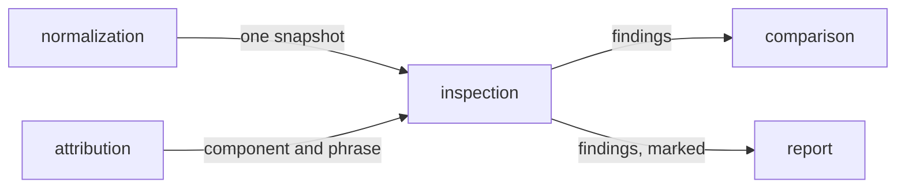

# Inspection

«policy»

## Responsibility

Decides what is wrong with one stored reading of a **subject**, with nothing to
compare it against.

## Bounded context

[Adjudication](../../DOMAIN.md#adjudication)

## Inputs and outputs

In: one **semantic snapshot** — the tree, its accessible meanings, its applicable
styling and the **provenance** of every node.

Out: findings, each naming a rule, a path, the component that authored the node,
and where in words it sits. Every one of them bands accessibility.

## Depends on

- [`attribution`](../attribution/README.md) — the component a finding is
  attributed to, and the phrase that places it

## Used by

- [`comparison`](../comparison/README.md) — findings that ride every exit,
  including the one that read no image
- [`report`](../../report/README.md) — the findings, marked so a decision about one survives

## Boundary

It needs no other side, and that is the blind spot it closes. A defect present
on the *first* run is invisible to a comparison forever — it is written into the
**baseline** and every later run agrees with it. This is the only place such a
thing is ever reported rather than approved by silence.

It decides from one reading and therefore refuses everything a single rendering
cannot know. There is no contrast rule: what a colour is painted on is a stacking
question a document does not answer, and being right most of the time about
accessibility is worse than having no rule. Whether text was translated, and
whether it overflows the box it was given, are questions about two readings and
belong to a comparison of them.

A rule carries no severity. A rule that needs one has a condition too broad to
be a rule.

Each rule is written to have a defensible negative. Decorative markup that says so
is a correct answer rather than a missing name. A heading that starts deep is a
component inside something, not a page with a skipped level, so only a forward
jump is reported. Two landmarks of one role are fine when they are named
differently and are a defect when they are not.

Findings are attributed by authorship before enclosure, because a fix is made
where the markup is written.

It produces findings, not **verdicts**. Whether a finding blocks is policy, and
whether the same finding was already decided about is
[retention](../../retention/README.md)'s question — a finding carries a stable
mark for exactly that, so a decision about one outlives the run that made it.

## Implementation coordinates

- `packages/core/src/judge/inspect.ts` — `inspect`, `findingMark`,
  `summarizeFindings`; the rule set and the two recorded non-rules
- `packages/core/src/judge/locale.ts` — `compareLocales`; the findings that need
  a second reading and are therefore not here
- `packages/cli/src/commands/observe-one.ts` — `findingsOf`, `marksOf`; run
  above every exit, because all of them report findings

## Diagram

