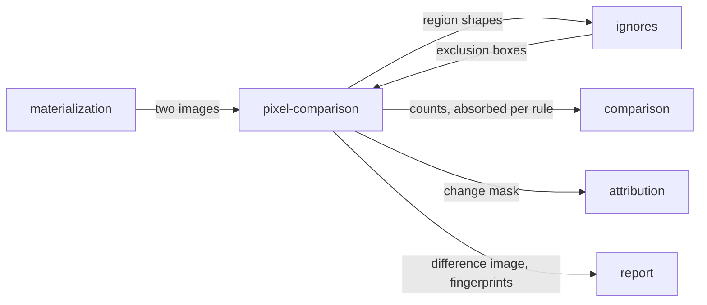

# Pixel comparison

«service»

## Responsibility

Turns two images of one **subject** into a per-policy changed-pixel count, a
change mask, a difference image for a person to look at, and a **fingerprint** of
what changed.

## Bounded context

[Adjudication](../../DOMAIN.md#adjudication)

## Inputs and outputs

In: two encoded images and the decoder to read them with; the comparison policies
to run, and which of them the mask is to be built from; the exclusion boxes a
**place**-shaped **ignore** resolved to.

Out: one changed count per policy; a change mask — one byte per pixel, row-major,
with the changed total carried so nothing has to rescan — net of exclusions, with
the pixels each rule cleared attributed to it and the boxes that covered nothing
named; a difference image, produced by a separate path; and, per region, the
digest of its shape.

## Depends on

- [`materialization`](../../materialization/README.md) — the images, painted
  under a declared **renderer identity**
- [`ignores`](../ignores/README.md) — which boxes come out before anything is counted

## Used by

- [`comparison`](../comparison/README.md) — the count that decides whether there
  is anything left to explain
- [`attribution`](../attribution/README.md) — the mask that becomes regions
- [`ignores`](../ignores/README.md) — the shape of a region, to match a fingerprint rule
- [`report`](../../report/README.md) — the difference image, and the fingerprint
  a reader copies into a rule

## Boundary

A mask is not a picture and the two are never derived from one another. The
mask is for computing and is read off the comparison's own output; the difference
image is red-on-grey, produced by its own path, and carries no counts. An image is
for looking at, and everything downstream of a comparison wants to compute.

Changed pixels are net of exclusions. Exclusion boxes are subtracted before
anything clusters, because a region straddling a box's edge would otherwise be
dropped whole or kept whole and both answers are wrong. Boxes round outward.
Overlapping boxes share their pixels first-come, so what each rule cleared sums
exactly to the total; a box is judged inert against the *original* mask, so the
second of two overlapping rules is not falsely reported dead.

Every comparison is reported under both a forgiving and a strict per-pixel
policy, and neither is quoted alone: *zero pixels changed* and *zero pixels
changed after forgiveness* are different sentences. The mask is built from one
named policy, and asking for a mask from a policy that was not run is refused —
the mask would describe a different comparison from the counts beside it.

It holds no policy of its own. The per-pixel threshold and the antialiasing
rules belong to the plan, because they have to be hashable by a caller who never
opens an image; this component is handed them.

Two images of different sizes are padded to their union rather than refused, and
the decision is separated from decoding so that swapping a decoder cannot change a
**verdict**.

The pixel **fingerprint** knows shape and size and knows nothing about which
component produced it, so two unrelated components whose residue looks alike
collide. It is not scale-free — a rule written for a small flaky
badge must not absorb a large card that has gone solid — and the fingerprint that
does carry a component is the semantic one, which this component does not compute.

It never names anything. A count and a mask are coordinates; a component and a
line come from [`attribution`](../attribution/README.md).

## Implementation coordinates

- `packages/png/src/compare.ts` — `PngDecoder`, `compareRasters`, `comparePngs`,
  `comparePixels`, `maskOf`, `padTo`; the per-policy counts and the mask
- `packages/png/src/difference.ts` — `diffImage`, `observePngDifference`; the
  human artifact, on its own path
- `packages/png/src/size.ts`, `foreign.ts` — dimensions without decoding, and
  ingesting an image this system did not paint
- `packages/core/src/attribute/mask.ts` — `subtractRegions`, `excludedBoxes`;
  the raster half of an ignore
- `packages/core/src/judge/fingerprint.ts` — `fingerprintOfMask`,
  `fingerprintOfRoot`, `shapeOfDelta`
- `packages/png-sharp/` — the second decoder behind the same seam

## Diagram

