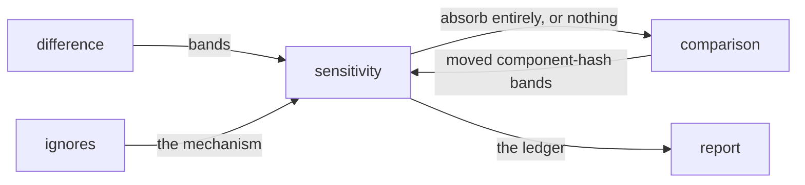

# Sensitivity

«policy»

## Responsibility

Decides which **bands** a **subject** is asserted on at all, answering from
**component hashes** before anything expensive happens.

## Bounded context

[Adjudication](../../DOMAIN.md#adjudication)

## Inputs and outputs

In: the declared levels and the **subjects** and tags each is scoped to; the
planned **subjects**; the bands that moved between two sides' **component
hashes**, or the bands of a semantic comparison.

Out: for one **subject**, either nothing — meaning it is asserted on in full — or
the rule that absorbs it entirely, with the bands it absorbed; and a ledger with
one line per rule, in the positive form the adopter wrote.

## Depends on

- [`ignores`](../ignores/README.md) — the single mechanism a level is translated into
- [`difference`](../difference/README.md) — the band vocabulary, and the moved
  bands where a comparison ran

## Used by

- [`comparison`](../comparison/README.md) — the cheap exit, taken before isolation
- [`report`](../../report/README.md) — the ledger

## Boundary

It is evaluated against component-hash bands before isolation, and that is the
whole point. Clustering a mask, attributing its regions and fingerprinting each
one is the expensive half of a comparison; a level is a comparison of two hash
sets. Forty routes in a token change pay for one hash comparison each instead of
forty isolations. It cannot run before exclusions are subtracted, because a
**subject** may be both relaxed and masked and the **ignore** ledger's numbers are
computed there — so the order is exclusions, then this, then isolation.

Whole subject or nothing. One image gets one word, so a level absorbs only
when every moved band is one it does not assert on; a **subject** where some moved
band is asserted on is reported in full, including the bands that would have been
absorbed. Hiding half a difference is worse than hiding none of it.

Every way of not answering fails toward reporting: no rule, the strict level, a
side carrying no **component hashes**, or a moved set the level does not cover
entirely. An empty moved set absorbs nothing — empty is not everything, and pixels
moving while every hash held is the one band a hash comparison is blind to. A
change in dimensions is never absorbed.

It is not a second mechanism. A level says what a **subject** *is* asserted
on; an **ignore** says what is absorbed. The level is inverted into the second and
folded through the same code, because a parallel implementation would be a second
set of bugs in the half of the system whose whole job is not to silently hide
things. The strict level translates to no rule at all rather than to an empty one,
so it never produces a permanently dead ledger line.

Where **ignores** accumulate, levels do not: two contradictory answers to *how
much of this subject is under test* cannot both hold, so the last matching rule
wins and strict is a real answer spelled as the exception inside a relaxed group.

A rule that matched nothing is a line, not a silence. The ledger is built from
the plan rather than from the observations, so a level scoped to **subjects** the
run never planned says so by name.

It absorbs; it never explains. A **subject** it relaxed is `ignored`, and why the
bands moved is [`composition`](../composition/README.md)'s question.

## Implementation coordinates

- `packages/core/src/judge/sensitivity.ts` — `Level`, `bandsOf`, `asIgnore`,
  `applySensitivity`, `relaxes`, `absorbsEntirely`
- `packages/observe/src/decide.ts` — `relaxedVerdict`; the exit, placed after
  subtraction and before isolation
- `packages/core/src/attribute/component-hash.ts` — `bandsBetween`,
  `movedBands`; the bands a hash comparison can see
- `packages/cli/src/commands/sensitivities.ts` —
  `sensitivityLedgerOf`, `summarizeSensitivities`
- `packages/cli/src/commands/observe-one.ts` — `sensitivityFor`; last match wins

## Diagram

