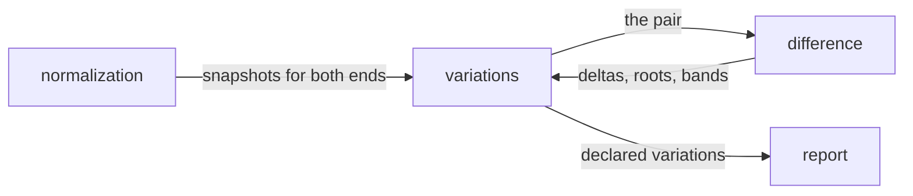

# Variations

«service»

## Responsibility

Compares a **subject** to the **subject** it declares itself a **variation** of,
and gives that difference an identity of its own.

## Bounded context

[Adjudication](../../DOMAIN.md#adjudication)

## Inputs and outputs

In: the planned **subjects** and the tags they carry; the axis vocabulary the
adopter configured, where one exists; the **semantic snapshots** of both ends of
every link.

Out: the links, each saying how it was found; and one record per link — whether
the two render identically, the deltas and the roots that explain them, the
**bands** the difference falls in, the bands either side could not decide, the
render inputs that differ, and a **digest** of the difference itself.

## Depends on

- [`difference`](../difference/README.md) — the same arithmetic a **verdict** is
  made of, pointed at a pair somebody linked

## Used by

- [`report`](../../report/README.md) — the declared variations

## Boundary

It reaches no verdict. A **variation** *is* a difference — that is what the
second arm exists for — so reporting one as a regression would be reporting a
**subject** for existing. Nothing here touches the exit code, the store or a
**baseline**, and a run whose only news is a variation is a green run.

The difference a pair exists for is one that a
[comparison against a **baseline**](../comparison/README.md) never measures,
because that axis reads one **subject**'s two revisions. Linked, the difference
between two subjects becomes a value with an identity, and the identity is the
useful part.

It names no axes. There is no viewport, scheme or flag vocabulary here,
because every collector expresses those differently and the list is open. A
**subject** declares its parent by tag, or the pairing is read off the names — the
longest other **subject** this one extends at a separator, so each link is one
axis and each name has one parent. Ambiguity is refused rather than resolved by
order, and a written declaration that failed to resolve is reported as a mistake
rather than quietly replaced by a guess. Where an axis vocabulary is configured it
replaces the name rule rather than backing it up.

Environment differences are the thing examined, not a refusal. A pair is
frequently a deliberate difference in viewport or colour scheme; the field that
would make a baseline comparison refuse the pair is here the subject of the
report. For the same reason the two subject ids differing is the point, so the
refusals a same-subject comparison carries do not apply.

Every link is emitted, in plan order, including the ones that could not be
computed — a broken declaration and a missing reading are stated by name, the same
way an unobserved **subject** is.

Both ends of every link are kept so the run holds the readings it needs, rather
than holding three hundred **subjects** to compare four.

## Implementation coordinates

- `packages/core/src/compare/derive.ts` — `deriveVariation`, `Variation`; the
  difference and its digest
- `packages/cli/src/commands/variations.ts` — `PARENT_TAG`, `declaredParent`,
  `resolveParents`, `variationsWanted`, `variationsOf`
- `packages/cli/src/commands/names.ts` — `structuralParent`, `namedParent`; the axis
  grammar and the name rule

## Diagram

