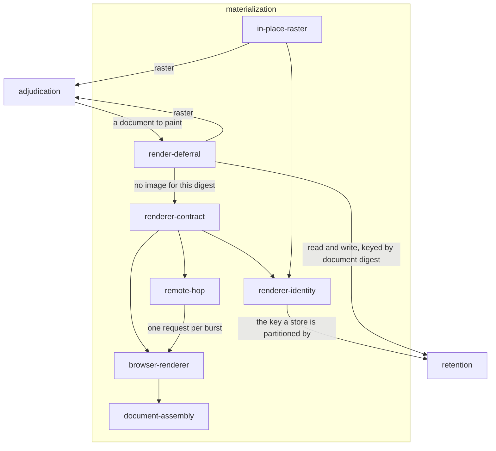

# Materialization

## Responsibility

Turns a reading into pixels under a declared **renderer identity** that names
every input which can reach a pixel, so that two images are only ever compared
when they were produced the same way.

## Logical role

The one phase of the system that is machine-bound, held behind a single contract
so that where it happens — this process, another process, a pinned machine on
another network, or not at all because an identical document was already
painted — is a wiring decision rather than a rewrite. It realizes the pixel half
of retention: a **raster** is an image plus the statement of what produced it,
and that statement is what makes a later comparison legitimate or refuses it.

## Boundary

It does not compare, does not store, and does not decide whether the image was
needed: [`adjudication`](../adjudication/README.md) owns the pixel comparison,
the mask, the regions and every **verdict**, and settling a **subject** against
the prior reading's document **digest** happens before a document is handed here.
It does not choose what to observe, does not drive an application to a state,
does not read a live tree, does not decide where a **baseline** lives and never
promotes one.

## Technology

TypeScript on Node. Playwright driving Chromium, Firefox or WebKit for the local
renderer; `node:http` and JSON for the hop. Nothing here decodes a PNG.

## Implementation coordinates

- `packages/raster/src/renderer.ts` — the contract, `identityAtScale`,
  `describeIdentity`, `familiesOf`
- `packages/raster/src/assemble.ts` — the document as a page
- `packages/raster/src/store.ts` — `RenderCache` and `neverFails`
- `packages/raster/src/codec.ts` — `identityFrom`, `rasterFrom`, `sidecarFrom`
- `packages/playwright/src/renderer.ts`, `capture.ts`, `viewport.ts`
- `packages/remote/src/renderer.ts`, `batch.ts`, `transport.ts`
- `packages/playwright-test/src/in-place.ts`
- `packages/observe/src/observe.ts` — `renderOnce`, the cache-or-paint loop

## Communicates with

- → [`retention`](../retention/README.md) — the renderer identity that
  partitions the store, and the render cache keyed by document digest
- ← [`adjudication`](../adjudication/README.md) — a document to paint, when
  settling against the prior reading did not answer

## Uses

### [Retention](../retention/README.md)

#### Why

Pixels are machine-bound, so an image is worth keeping only beside a statement of
the machine that made it. This block produces that statement and refuses to
produce a lookup key of its own: the value that addresses a stored image and the
value stamped on a new one are one derivation, on the renderer, because two
derivations drift and a drift of one field is invisible at 1x. The coupling is
accepted so that the partition is
[structural](./renderer-identity/README.md) rather than a check somebody has to
remember to call.

#### What I need from it

Somewhere to keep a **raster** under the identity that painted it, addressed by
**subject** and label; and a cache of images already painted, addressed by the
document **digest** under that same identity. The cache is required to answer a
miss for every failure it can have, because losing a cached image costs one
render and can never cost an answer.

#### What would make me leave

A store that answered a lookup keyed on anything but the identity a render will
actually stamp: the block would then be filing images where nothing reads them.

## Components

| Component | Responsibility |
|---|---|
| [renderer-contract](./renderer-contract/README.md) | The one interface anything that turns a document into pixels satisfies |
| [renderer-identity](./renderer-identity/README.md) | The content hash of every input that can reach a pixel, and the scale that belongs to the document rather than the machine |
| [document-assembly](./document-assembly/README.md) | The reading as a page, in cascade order, with no decision left to the renderer |
| [browser-renderer](./browser-renderer/README.md) | One browser for the run, a page per viewport, and the ordered launch recipe that owns the pixels |
| [render-deferral](./render-deferral/README.md) | Paints nothing whose image already exists for this document under this identity |
| [remote-hop](./remote-hop/README.md) | The same renderer on the other side of a wire, with overlapping renders coalesced into one call |
| [in-place-raster](./in-place-raster/README.md) | Pixels taken from the page a suite already pinned, which bypasses the contract and joins the same path |
| `packages/remote/src/transport.ts` | L5 — one fetch with a deadline, for both halves of the hop |

## Diagram

