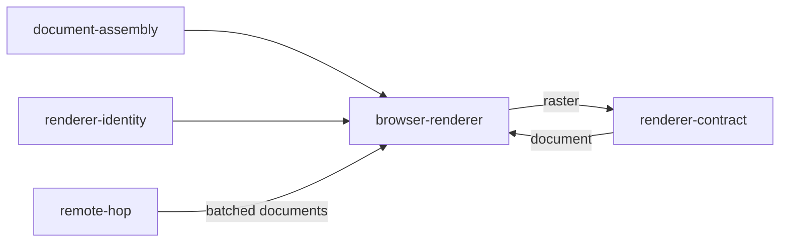

# Browser renderer

«adapter»

## Responsibility

Paints an assembled document in a browser this block launched, under a launch
recipe it declares, and hands back the subject's pixels and their box.

## Bounded context

[Identity and retention](../../DOMAIN.md#identity-and-retention)

## Inputs and outputs

In: a **render document**, plus the launch decisions the caller made once —
engine, headless or not, the ordered launch arguments, the declared fonts, the
**stabilization recipe**, and how many documents may be painted at once. Out: a
**raster** clipped to the subject, in device pixels, carrying the families the
renderer turned out not to have.

## Depends on

- [`document-assembly`](../document-assembly/README.md) — the page it sets on a browser page
- [`renderer-identity`](../renderer-identity/README.md) — the identity it
  stamps, built from the launch it performed
- [`renderer-contract`](../renderer-contract/README.md) — the shape it satisfies

## Used by

- [`remote-hop`](../remote-hop/README.md) — what the serving half wraps, so
  offloaded and local mean the same thing

## Boundary

One browser for the run, not one per image: a launch and a first navigation
dominate the work they enclose by about two orders of magnitude, so a renderer
that launches per image spends the entire saving before it paints anything. The
page is loaded by setting content rather than by navigating, which is what lets
it serve a document that was read without a browser at all — there is no server,
no build and no application to navigate to.

Concurrency is bounded and leases a separate page per render above one, because
setting content replaces a page's whole document. Pages, not browsers: the
isolation a render needs is a document of its own, which every render already
has.

A recipe whose interventions claim the same property is refused at construction
rather than resolved, because one would win by accident of ordering and which one
would be invisible in every image that follows.

A document that declares it closes over its resources is painted with every
network channel intercepted: a request with no matching resource, or one whose
bytes do not digest to what the document said, is aborted and the render is
refused by name. Refused rather than painted around — an image assembled from
whatever the network happened to answer is not an image of the document.

The clipped path and the element path are chosen between on cost, never on
outcome: the clip is taken only when the box is reported, lies wholly inside the
viewport, and reaches the screen without rotation or skew, and it is rounded
outward to the pixels the subject touches so the two paths produce the same
bytes. Being wrong here rewrites every baseline somebody owns, so the check is
conservative.

The page it opens for painting is not the page a run collects from.

## Implementation coordinates

`packages/playwright/src/renderer.ts` — `createPlaywrightRenderer`,
`CHROMIUM_RASTER_ARGS`, the `PagePool`, the resource route and its refusals, and
`probeFonts`, which runs inside the page. `packages/playwright/src/capture.ts` —
`captureSubject` and `outward`, the rounding that makes the two paths
byte-identical. `packages/playwright/src/viewport.ts` — `unresizable`, the
properties a page cannot change without a new browser context.

## Diagram

