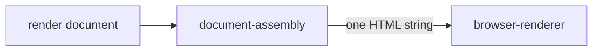

# Document assembly

«factory»

## Responsibility

Turns a **render document** into the page that will be painted, with the cascade
in the order the reading was taken under and nothing left for the renderer to
decide.

## Bounded context

[Observation](../../DOMAIN.md#observation)

## Inputs and outputs

In: a **render document** — markup, the styling that can actually reach the
subject, the reconstructed ancestor frame with its container width, the inherited
floor, the base URL, and any extra styling the caller chose to append. Out: one
string of HTML.

## Depends on

Nothing. A string in, a string out, with no browser anywhere near it.

## Used by

- [`browser-renderer`](../browser-renderer/README.md) — the content it sets on a page

## Boundary

It fetches nothing, waits for nothing, and holds nothing still. It makes exactly
four adjustments to what it was given and each is stated rather than assumed: the
page's own margin is removed, because the subject's position on a page is not
what is compared; the container's used width is reproduced inline on the
innermost ancestor; the inherited floor sits on the root and reaches the subject
only by inheritance; and the caller's extra styling goes last, because defeating
something the document cannot describe is the caller's decision, not this one's.

Purity is the point rather than an aesthetic. This is the step where a mistake
made while acquiring becomes a wrong image, and a wrong image is the most
expensive artifact the system can produce because it looks like evidence — so
*would this document paint what was read?* has to be answerable without a
browser.

## Implementation coordinates

`packages/raster/src/assemble.ts` — `assemble`, its `sheet` helper for cascade
order, and `SUBJECT_PATH`, the attribute value marking the element a screenshot
is clipped to.

## Diagram

