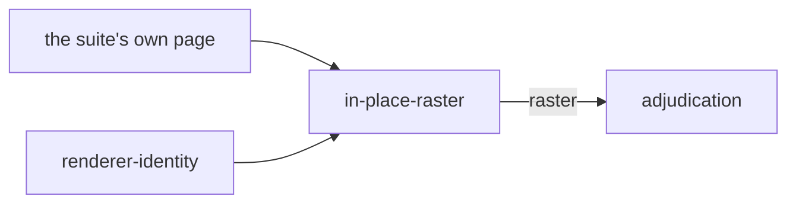

# In-place raster

«adapter»

## Responsibility

Takes a **subject**'s pixels from the browser a suite already pinned, and
declares the launch that produced them.

## Bounded context

[Identity and retention](../../DOMAIN.md#identity-and-retention)

## Inputs and outputs

In: the live page and the element being observed, the document those pixels
correspond to, the declared fonts, the **stabilization recipe** already installed
on the page, and the caller's statement of the launch — headless or not, and the
ordered launch arguments. Out: a **raster** with an identity naming that launch,
or a refusal.

## Depends on

- [`renderer-identity`](../renderer-identity/README.md) — the value it must
  state for pixels this block did not paint

## Used by

- [`adjudication`](../../adjudication/README.md) — a **candidate** that joins
  the same path as one this block painted

## Boundary

It bypasses the [renderer contract](../renderer-contract/README.md), and that is
the honest description rather than an omission: materialization already happened
in the page under test, so there is no document to hand a renderer and no
renderer to hand it to. What it produces joins the same path from there — the
same **raster**, the same identity, the same comparison.

What it buys is the only way to capture a state a document cannot restate. What
it pays is identity discipline it cannot derive: nothing about a page already
open can say which flags launched the browser it belongs to, so the caller
declares them and the declaration is folded into the identity. A caller who
declares a launch other than the one that ran files an image under a key
describing a render that never happened.

It installs no intervention of its own. Acquisition leaves the declared
animation hold in place, and asking the browser to fast-forward here would apply
a conflicting second intervention over one property, so the screenshot is taken
under the hold that is already there and only the caret is hidden.

It never retries to make a subject agree. Independent screenshots are required to
agree with each other and a disagreement is refused by name, because an image of
something that was moving becomes a baseline that never corresponded to a state
of the product.

## Implementation coordinates

`packages/playwright-test/src/in-place.ts` — `stableRaster`, the identity it
composes and the repeated screenshots it requires to agree.
`packages/playwright-test/src/fixture.ts` — `InPlaceCaptureOptions`, the launch
the caller is required to describe, and `MaterializationOptions`, the choice
between this path and a deferred render.

## Diagram

