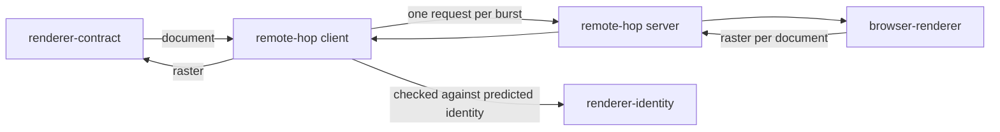

# Remote hop

«gateway»

## Responsibility

Puts a renderer on the other side of a wire without either side of the hop
learning that it is there.

## Bounded context

[Identity and retention](../../DOMAIN.md#identity-and-retention)

## Inputs and outputs

In, on the client: an endpoint, a deadline, a batch size and a collection window,
then **render documents** one at a time. Out: **rasters** one at a time. On the
wire: one request carrying several documents and one answer carrying one outcome
per document, in the order they were sent. On the serving half: a renderer and a
port.

## Depends on

- [`renderer-contract`](../renderer-contract/README.md) — the shape both halves satisfy
- [`renderer-identity`](../renderer-identity/README.md) — the machine half it
  fetches, and the value it predicts locally and then checks
- [`browser-renderer`](../browser-renderer/README.md) — what the serving half wraps

## Used by

Nothing in this block. A run is configured with it in place of the local
renderer, and everything above the hop is written the same way either way.

## Boundary

Only the phase that needs stable pixels crosses. Everything above and below the
hop is written the same way whether the hop is there or not, which is the entire
claim: the deciding tier runs on whatever machine is nearest, and only the
residue that genuinely needs pinned pixels travels.

The identity is fetched at construction, not declared by the caller. A caller
allowed to declare it could let a misconfigured endpoint pass a comparability
check it should fail, which produces a confident difference between two machines.
Per document the identity is predicted locally by the shared derivation rather
than asked for over the wire — a round trip per document to learn a value the far
end computes by a known rule would double the request count of the one phase
being offloaded to make it cheaper — and then checked against what came back. A
far end that stamped something else is a loud failure at the hop that caused it,
not a raster filed where nothing reads.

Overlapping renders coalesce into one call, underneath the interface rather than
in it: nothing upstream learns a new shape, no caller picks a size, and the local
and remote renderers stay interchangeable. The default window is zero — flush
what is already waiting — because a timer taxes the caller it cannot help.

Batching softens neither of two things. The identity check stays per document, so
a raster is never filed under *somewhere in these sixteen*. And one document's
failure is one document's: the server answers per item, so a malformed subject
fails only itself. Only a transport failure, where nothing came back at all,
belongs to everyone. Answers are matched to requests by position, so a length
disagreement is refused rather than zipped.

A broken document is answered as a failure, never as an empty image: a blank
image would produce a comparison saying the whole subject changed and a report
blaming a component.

The client half carries no credential and the serving half checks none. A field
accepting a token that nothing transmits and nothing verifies would read as the
endpoint being protected, which is the one thing it must not read as; the socket
is the gate, and that is the operator's network to decide.

## Implementation coordinates

`packages/remote/src/renderer.ts` — `connectRenderer`, `serveRenderer`, the
identity check on every raster, `renderEach`, and the three paths the protocol
uses. `packages/remote/src/batch.ts` — `batching`, the coalescing and its
per-item outcomes. `packages/remote/src/transport.ts` — one fetch with a
deadline, which never resolves late.

## Diagram

