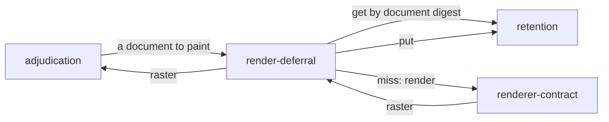

# Render deferral

«service»

## Responsibility

Paints nothing whose image already exists for this document under this
identity.

## Bounded context

[Identity and retention](../../DOMAIN.md#identity-and-retention)

## Inputs and outputs

In: a **render document**, and the identity the next render would stamp on it.
Out: a **raster** — read from the cache when one is addressed by that document's
**digest** under that identity, painted and written back when none is.

## Depends on

- [`renderer-contract`](../renderer-contract/README.md) — the paint it falls
  back to, and `identityFor`, which supplies the key for both halves
- [`retention`](../../retention/README.md) — the cache itself, addressed by
  document digest under an identity

## Used by

- [`adjudication`](../../adjudication/README.md) — the way a document to paint becomes an image

## Boundary

It is an economy and never a correctness argument. An entry is addressed by the
digest of the document that painted it under the identity that painted it, so a
hit is an image of exactly this document on exactly this machine — a wrong
location, a stale entry, or a cache shared between projects can cost a render and
cannot produce a wrong image.

The cache never throws. A miss, an outage, a permission error, a corrupt entry
and an unparseable response are one instruction, because the response to every
one of them is *paint it*, and a cache that inherited a store's paranoia would
fail a build over an optimisation. A failing cache is indistinguishable from a
cold one, so a broken cache makes a run
slow and never makes it red, and an operator watching a run get slower has to go
looking.

Both halves key on the same value. Reading under the machine identity while
writing under the raster's own would differ by exactly the scale factor, which
would turn the lever off above 1x — precisely where images are most expensive.

It holds images and nothing else. **Component hashes** describe a snapshot, which
carries provenance a document does not, so two different snapshots share one
cache key; hashes are stamped onto a raster by this run and anybody else's are
removed, or a warm machine would answer with a previous run's evidence and a
promotion would move a **baseline** whose hashes belong to a document it is not
an image of.

## Implementation coordinates

`packages/observe/src/observe.ts` — `renderOnce`, the cache-or-paint loop a run
actually takes, and `withEvidence`, which stamps this run's hashes and strips
anyone else's. `packages/raster/src/store.ts` — the `RenderCache` contract and
`neverFails`, which makes the never-throws rule a property of the value rather
than a promise in a comment. `packages/observe/src/capture.ts` writes an image
taken outside the loop into the same cache.

Three files here are named by another block as well, and each is shared rather
than misfiled. `packages/observe/src/observe.ts` is the bridge: `renderOnce`
paints, while the exported `observeRasters` and `observePair` compare, which is
what [`adjudication/comparison`](../../adjudication/comparison/README.md) names
it for. `packages/raster/src/store.ts` declares `RenderCache` for this block and
`RasterStore` for [`retention`](../../retention/README.md) in one module, so the
cache and the store cannot drift apart in what an identity means.
`packages/remote/src/transport.ts` is the one deadline-bearing fetch that both
the render hop and the remote baseline store call.

## Diagram

