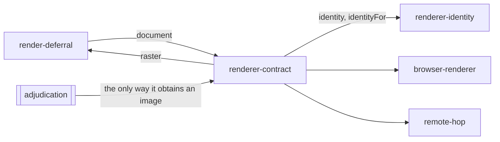

# Renderer contract

«gateway»

## Responsibility

Declares that something turns a **render document** into a **raster**, and says
who it is before it is asked to paint anything.

## Bounded context

[Identity and retention](../../DOMAIN.md#identity-and-retention)

## Inputs and outputs

In: one **render document**. Out: one **raster** — bytes, the dimensions in
device pixels, the **digest** of the document it was painted from, the identity
it was painted under, and the font families the renderer turned out not to have.
Separately and before any render: the identity of the machine, and the identity
this renderer would stamp on a named document.

## Depends on

- [`renderer-identity`](../renderer-identity/README.md) — the two identity
  values every implementation must answer with, derived once rather than per
  implementation

## Used by

- [`render-deferral`](../render-deferral/README.md) — the paint it falls back
  to, and the key it addresses the cache with
- [`browser-renderer`](../browser-renderer/README.md) — the contract it satisfies
- [`remote-hop`](../remote-hop/README.md) — the contract it satisfies on both sides of the wire
- [`adjudication`](../../adjudication/README.md) — the only way it obtains an image

## Boundary

It renders and does not know what a **baseline** is. It does not accept a
difference and it produces no **verdict**. It exposes no way for a client to
shut a renderer down that a client does not own: a lifetime belongs to whoever
started it, or one test run would be able to end another's.

Two identity values, not one, and confusing them is the failure this interface is
shaped around. `identity` describes the machine and is available before the first
render, so a store can decide whether a stored image is even comparable before
paying to produce the image it would compare against; its scale is whatever the
renderer defaults to and nothing may key a store on it. `identityFor(document)`
is what the next render will actually stamp, and it is on the interface rather
than computed by a caller because only the renderer knows how it stamps.

## Implementation coordinates

`packages/raster/src/renderer.ts` — the `Renderer` interface, its four members,
and the shared derivations beside it. Implementations:
`createPlaywrightRenderer` in `packages/playwright/src/renderer.ts` and
`connectRenderer` in `packages/remote/src/renderer.ts`. The package this contract
lives in requires no browser, no codec, no filesystem and no socket, which is
what lets a consumer hold the vocabulary without any of them.

## Diagram

