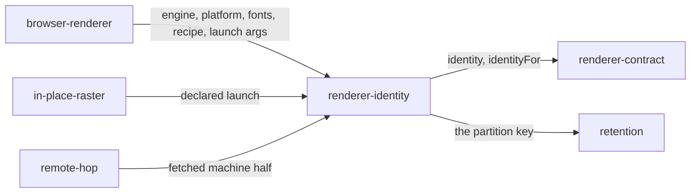

# Renderer identity

«policy»

## Responsibility

Names every input that can reach a pixel, as one value, so that a comparison
across two of them is refused instead of taken.

## Bounded context

[Identity and retention](../../DOMAIN.md#identity-and-retention)

## Inputs and outputs

In: the engine and its build, the platform, the declared fonts, the digest of the
**stabilization recipe** the page is held still with, and the digest of the
ordered rasterization arguments — the launch flags and the screenshot options, in
the order they were given. Out: a **renderer identity**, the sentence that
describes one for a reader of a refusal, and the same identity rebuilt field by
field off a wire or a disk.

## Depends on

Nothing in this block. Its inputs are facts about a machine and a document.

## Used by

- [`renderer-contract`](../renderer-contract/README.md) — the value every
  implementation answers `identity` and `identityFor` with
- [`browser-renderer`](../browser-renderer/README.md) — assembles the machine
  half from the launch it performed
- [`remote-hop`](../remote-hop/README.md) — fetches the machine half rather than
  being told it, and checks every raster against the identity it predicted
- [`in-place-raster`](../in-place-raster/README.md) — states an identity for
  pixels this block did not paint
- [`retention`](../../retention/README.md) — partitions the store by it, so the
  wrong prior image is not where the lookup looks

## Boundary

It is not a check somebody calls. A mismatch partitions storage structurally, so
the wrong image is not found rather than found and rejected. Changing the ordered
launch recipe changes the identity: text rasterization is pinned by flags that
are part of what painted the image, and a run that swapped them and compared
anyway would present font rasterization as a component regression, with a
component and a file attached.

Every field belongs, including the optional ones, and every reconstruction off a
wire must rebuild all of them — a field that is written and silently dropped on
the way back produces a write key and a lookup key that differ, and the run then
reports **incomparable** in a sentence naming the same machine on both sides.
For the same reason a present field of the wrong type is refused rather than
dropped.

The scale is the field that is not a fact about the machine. It belongs to the
document — one renderer serves several viewports in one run — so the machine
identity carries a placeholder and `identityFor(document)` folds in the
document's own. Confusing the two makes a lookup keyed on the machine's
value find a sibling identity above 1x and call every subject incomparable, and
in the other direction compares a 1x image against a 2x one. Scale therefore has
no default anywhere it is consumed — a caller converting device pixels back to
CSS pixels states it, and what a silent 1x does to a report belongs to
[attribution](../../adjudication/attribution/README.md).

Fonts are asserted, never detected. A page can ask whether a family resolves and
cannot read the bytes behind it, so the identity takes caller-supplied content
hashes and only the family is checkable inside a page. A family that measures
identically to every generic is reported missing, which errs toward reporting a
doubt.

## Implementation coordinates

`packages/raster/src/renderer.ts` — `identityAtScale`, `describeIdentity`,
`familiesOf`. `packages/raster/src/codec.ts` — `identityFrom`, the field-by-field
rebuild every sidecar, wire response and cache read-back passes through. The
identity is constructed in `packages/playwright/src/renderer.ts`, fetched in
`packages/remote/src/renderer.ts`, and declared by the caller in
`packages/playwright-test/src/in-place.ts`.

## Diagram

