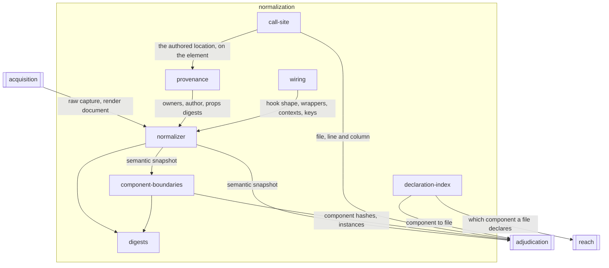

# Normalization

## Responsibility

Turns the raw material read from a live interface into a comparable **semantic
snapshot**.

## Logical role

The half of observation that makes a **reading** comparable to another reading
taken at a different time on a different machine, and that decides — before
anything is compared — who would be answerable for each part of it.

## Boundary

It reaches no state, drives no browser, holds nothing still, paints nothing,
compares nothing and performs no I/O of its own: a raw capture arrives as plain
data, and anything else it needs arrives as an argument. It applies no operator
policy — an **ignore** is a site on the tree and never an absorbed change, a
**sensitivity** is never read here, no **verdict** is spelled, and whether two
readings that disagree are an **instability** is decided elsewhere.

## Technology

TypeScript. The pure core compiles without `lib.dom` and carries no third-party
dependency, so its hashing, canonicalization and source-map decoding are
written out rather than installed, and it runs unchanged inside a page. The
framework readers address React's fiber structurally and import React nowhere,
so they cannot pin or conflict with the application's own copy. The call-site
carrier is a JSX runtime and a build-tool resolution hook.

## Implementation coordinates

- `packages/core/src/rules/` — the versioned opinions and the pipeline
- `packages/core/src/format/` — snapshot, provenance, wiring, holding, hashing,
  canonical form, value shaping
- `packages/core/src/attribute/boundary.ts`, `component-hash.ts`,
  `instances.ts`, `source.ts`, `call-site.ts`, `stack.ts`, `source-map.ts`
- `packages/react/` — the fiber readers
- `packages/jsx-source/` — the JSX runtime that keeps a call site alive

## Communicates with

- → [`adjudication`](../adjudication/README.md) — the semantic snapshot, its
  component hashes, and the provenance a difference is attributed with
- → [`reach`](../reach/README.md) — which component a source file declares
- ← [`acquisition`](../acquisition/README.md) — the raw capture and the render document

## Uses

### [Adjudication](../adjudication/README.md)

#### Why

The **band** vocabulary is one list and belongs to whoever draws conclusions
from it. Normalization projects a boundary's content into those bands and would
otherwise carry a second copy of the names — and two copies of a band list
means a **subject** relaxed to one band absorbs different things depending on
which shape the caller happened to be holding.

#### What I need from it

The enumeration of bands and their order, so that a per-name **component hash**
and a per-instance one are compared by one mapping rather than by two that
agree today.

#### What would make me leave

A band set that varied per run or per subject rather than per release. Bands
are folded into the meaning of a digest, so a caller-supplied list would make
two snapshots incomparable without saying so, and the vocabulary would have to
move into the ruleset that already versions itself.

### [Reach](../reach/README.md)

#### Why

Attribution names components, and the last hop a reader wants is a file. That
hop is a lookup from a name to a declaration and nothing more; the graph of
what a file rests on, and what could therefore have moved, is a different
question with a different cost and a different failure mode — a missed edge
there is a wrong answer, where a missed declaration here degrades a report to
the component name it already had.

#### What I need from it

That the file graph is owned elsewhere, so a component-to-file index stays a
plain record a caller builds by reading source and never becomes a traversal.

#### What would make me leave

Attribution ceasing to name components — a report addressed only by **call
site** would need no index at all, and the declaration lookup would go with it.

## Components

| Component | Responsibility |
|---|---|
| [normalizer](./normalizer/README.md) | Applies one versioned ruleset to a raw capture and produces the semantic snapshot |
| [digests](./digests/README.md) | Canonicalizes a value and hashes it, so identity is content and nothing else |
| [component-boundaries](./component-boundaries/README.md) | Decides where one component's nodes stop and hashes each boundary's own content per band |
| [provenance](./provenance/README.md) | Reads the enclosure and authorship chains for a rendered node off the framework |
| [wiring](./wiring/README.md) | Reads what a component *is* as a band, and what it was holding as evidence |
| [call-site](./call-site/README.md) | Keeps the file, line and column that wrote an element alive as far as the rendered node |
| [declaration-index](./declaration-index/README.md) | Answers which file declares a component, and reports when several do |
| `packages/core/src/format/sha256.ts` | L5 — SHA-256 written out so hashing stays synchronous and runtime-independent |
| `packages/core/src/format/tier.ts` | L5 — the ordered ladder of what a representation can observe |
| `packages/react/src/fiber.ts`, `names.ts`, `traversal.ts` | L5 — structural fiber access, display-name resolution, bounded walks |

## Diagram

