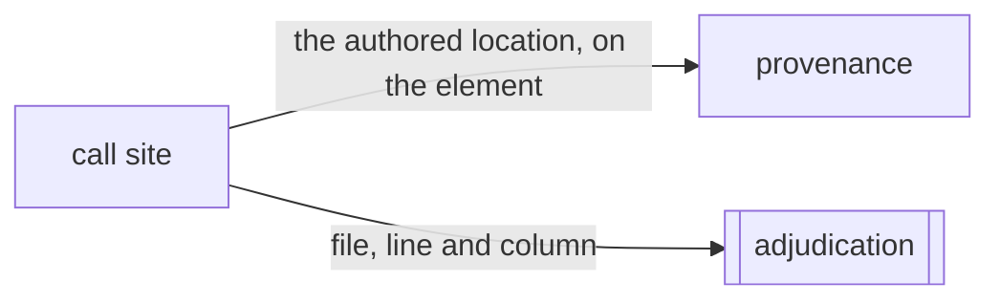

# Call site

«adapter»

## Responsibility

Keeps the file, line and column that wrote an element alive as far as the
rendered node, and turns the positions an engine reports into positions in the
code somebody wrote.

## Bounded context

[Observation](../../DOMAIN.md#observation)

## Inputs and outputs

Two mechanisms answer one question, and which one a project gets depends on
what its build already does.

The first is exact and needs no reading. Every JSX transform in ordinary use
already computes each element's file, line and column and passes them to the
runtime, which throws them away; a runtime standing in front of that one writes
the location onto the element instead, and it arrives at the rendered node
unchanged. It survives minification, which a component name does not.

The second spends what a page already has: the development runtime keeps an
error's frames on every node, and a frame names the module the browser was
*served* rather than the line somebody wrote. The fetch that resolves one is
injected, so the caller fetches from the context where the origin, the cookies
and the module graph are already right.

Out comes a **call site**: a repository-relative file, a line and a column.

## Depends on

Nothing in this block. It is the earliest thing that happens — before a node
exists — and the resolution half is a decoder and a cache.

## Used by

- [`provenance`](../provenance/README.md) — the authored location carried on a node's chain
- [`adjudication`](../../adjudication/README.md) — the `file:line` at the end of
  an attributed finding

## Boundary

It reads no fiber and knows no framework version: a location is data the
compiler emitted rather than a name a bundler might rename.

It does not claim a whole build's runtime setting. That setting is singular, so
a project already compiling against another custom runtime would have to give
it up; the recording runtime is installed *underneath* instead, where every
layered runtime keeps working unmodified and unaware.

Choosing which frame is the author is a policy with a defensible rule rather
than a heuristic: the author is the first frame that maps back to code the
project wrote, so a custom runtime between the framework and the author is
skipped because it resolves into vendored code and not because it is on a list.
Positions inside an evaluated string are not unwrapped, because taking the outer
one would name the line that *called* the evaluation as the line that wrote the
element.

Frames are transient. They ride the reading as **provenance**, no hash projects
provenance, and normalization drops them either way, because a frame holds an
absolute URL with a build hash in it and hashing one would make every stored
reading disagree with the next restart.

Resolution is asked on a signal rather than on every capture, and the work is
per call site rather than per node — a hundred-row table writes two thousand
cells from one line — so a run that settled every subject resolves nothing.

A map whose version is unrecognized returns nothing at all rather than a
plausible position.

## Implementation coordinates

- `packages/jsx-source/src/record.ts` — writing the transform's location onto
  the element
- `packages/jsx-source/src/under.ts`, `vite.ts`, `jsx-dev-runtime.ts` — the two
  ways it is installed
- `packages/core/src/format/provenance.ts` — `JSX_SOURCE`, `jsxSourceOf`,
  `SourceLocation`
- `packages/core/src/attribute/stack.ts` — `parseStackFrames`,
  `writerLocationOf`, `isVendorPath`
- `packages/core/src/attribute/source-map.ts` — the decoder
- `packages/core/src/attribute/call-site.ts` — `createCallSiteResolver`,
  `locateSites`, `FetchModule`

## Diagram

