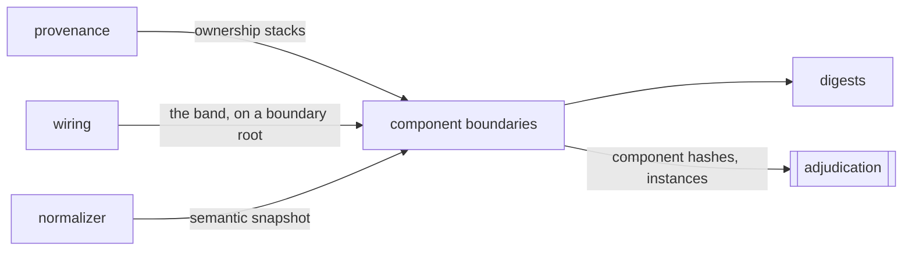

# Component boundaries

«policy»

## Responsibility

Decides where one component's nodes stop and the next component's begin, and
hashes each boundary's own content into a **component hash**.

## Bounded context

[Observation](../../DOMAIN.md#observation)

## Inputs and outputs

A **semantic snapshot** goes in. Out comes the boundary set in document order —
each with its component, its enclosing component, its depth, its rung in the
node's ownership stack, and the digest of the props it received — folded two
ways: one row per component name, which is the unit a history is kept in and
the unit an edit moves, and one row per boundary, which is the unit that lets
the same component in a small example and in a large one be recognized as the
same rendering.

Beside the digests and inside none of them: the box the boundary's root
occupies, the child boundaries it encountered, how many nodes it owns, and the
custom properties its own nodes resolved through — the last so a token that
moved can be joined to the components that read it.

## Depends on

- [`digests`](../digests/README.md) — one hash per band over each projection
- [`normalizer`](../normalizer/README.md) — the tree, and the aliases and resolved styles on it
- [`provenance`](../provenance/README.md) — the ownership stack every boundary is cut from
- [`wiring`](../wiring/README.md) — the band carried on a boundary's root node

## Used by

- [`adjudication`](../../adjudication/README.md) — the hashes that separate a
  **cause** from its collateral, and the per-instance form that joins one
  rendering across **subjects**

## Boundary

Two relations run upward out of a rendered node and they are not the same
relation. The parent decides nesting, because a boundary owns a contiguous
region and what encloses that region is a fact about the tree. The author
decides membership and naming, because a component's own content is what *it*
wrote, and content it was handed is a hole in its output — present, sized and
positioned by it, and authored somewhere else.

A node belongs to its nearest enclosing boundary, and a nested component
appears in its parent only as a named placeholder — named only when that parent
placed it. A container that was handed a child chose nothing, so naming that
child would make the container's digest a function of its callers; a slot is
therefore anonymous and a container renders the same bytes on every page that
uses it. The count of slotted children still reaches the digest.

A node opens a boundary for every component above it that the previous node did
not already have open, so a component that renders only components is entered
at its own rung rather than vanishing. Reading only the head of the ownership
chain would lose every variant wrapper and every page-level assembly.

Paths are not hashed. Under a **profile** with a layout engine, properties whose
computed value is layout output are folded into geometry rather than style,
because a control growing six pixels otherwise reports every ancestor as having
changed — the same failure [ranking by area](../../DOMAIN.md#cause) produces.

A node whose chain broke is a sentinel and never a filler category: an empty
chain would be a claim. Where the framework records no author, both rules
degrade to naming every child, which is the coarser enclosure answer.

## Implementation coordinates

- `packages/core/src/attribute/boundary.ts` — `boundaries`, `shapeOf`, `holds`,
  `UNATTRIBUTED`, `LAYOUT_OUTPUT`
- `packages/core/src/attribute/component-hash.ts` — `hashComponents`,
  `BandDigests`
- `packages/core/src/attribute/instances.ts` — `componentInstances`, and the
  boundary-local alias space that lets a digest cross a subject

## Diagram

