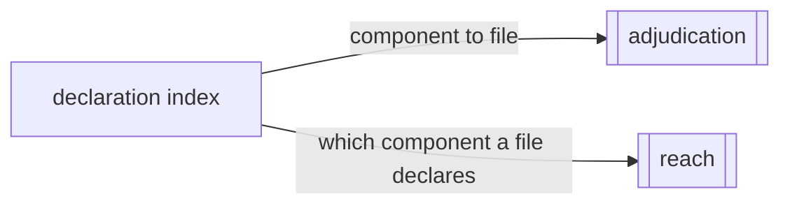

# Declaration index

«repository»

## Responsibility

Answers which file declares a component, and reports rather than resolves the
case where several do.

## Bounded context

[Observation](../../DOMAIN.md#observation)

## Inputs and outputs

One file's text goes in and the component declarations found in it come out,
each with a repository-relative path, a line, and how the declaration was
recognized — so a bad match is debuggable rather than merely wrong. Per-file
records merge into one index. A lookup by component name returns every
declaration of that name and says whether there was more than one.

The index is plain data a caller builds, because reading a repository is I/O and
this block does none.

## Depends on

Nothing in this block. A name goes in and a declaration comes out.

## Used by

- [`adjudication`](../../adjudication/README.md) — the last hop that turns a
  named component into a file somebody opens
- [`reach`](../../reach/README.md) — which component a source file declares

## Boundary

It answers where a component is *declared*, which is coarser than a **call
site** and is what a repository that configured nothing gets. Where the exact
mechanism is in place, a finding names the element's own line and this index is
not consulted at all.

A name mapping to several files is not an error to be resolved by picking one.
Two components genuinely can share a name, and silently choosing the first sends
an agent to edit the wrong file, so ambiguity is carried into the answer and
printed in it.

Its recognition is shallow, and both of its failures are survivable in a way a
wrong path would not be: a component produced by a factory, assigned
dynamically, or re-exported under another name is missed, and the report
degrades to the component name it already had; a capitalized top-level function
that is not a component can be matched, and can only surface if attribution
already named that identifier.

It ranks nothing, opens nothing, and never decides which of several
declarations is the one that moved.

## Implementation coordinates

- `packages/core/src/attribute/source.ts` — `indexSource`,
  `mergeSourceIndexes`, `resolveSource`, `formatSource`, `SourceIndex`

## Diagram

