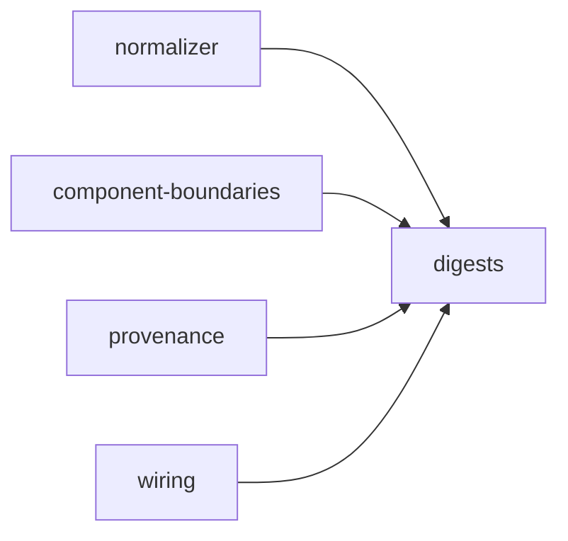

# Digests

«factory»

## Responsibility

Turns a structure into a **digest** — a canonical serialization and a hash over
it — so that identity is content and never an address, a branch or a commit.

## Bounded context

[Observation](../../DOMAIN.md#observation)

## Inputs and outputs

Any value made of strings, numbers, booleans, null, arrays and objects goes in;
a canonical string and a prefixed, truncated hash come out. Bytes go in the
same way, so an asset's identity is its octets. Digests combine under a domain
label, so two hashes built from the same parts in different roles cannot be
equal. Beside the hashing sits the shaping a **subject** that was never rendered
needs: a text, the recipe it was produced under, and the digest taken over
exactly those bytes.

## Depends on

Nothing in this block. The hash function and the canonical form are the floor
everything else stands on.

## Used by

- [`normalizer`](../normalizer/README.md) — the render, structure and style
  hashes over a finished tree
- [`component-boundaries`](../component-boundaries/README.md) — one digest per band per boundary
- [`provenance`](../provenance/README.md) — the props digest taken inside the page
- [`wiring`](../wiring/README.md) — the digests a **held** value is reduced to
  before it leaves the page

## Boundary

It reads nothing and decides nothing about what it is handed: which fields
reach a hash is the caller's decision, stated as an explicit projection so that
a field added to a node has to be *chosen* into a hash by someone editing that
projection rather than swept in by a subtraction.

Bands are hashed separately and never blended, because a combined hash can only
say that something moved. Addresses are not content: a path shifts when an
unrelated sibling is inserted, so hashing one reports a change nobody made.

An absent member is omitted rather than emitted as null, so a dimension a reader
could not observe is **unobserved** in the hash input —
[absent is not empty](../../DOMAIN.md#run-report). A non-finite number is
refused rather than encoded, because it means an upstream measurement failed and
a stable hash for a broken observation is worse than no hash.

Hashing is synchronous throughout: a props digest is taken inside the rendering
page, where the value
still exists and where an asynchronous primitive would colour the whole
pipeline.

## Implementation coordinates

- `packages/core/src/format/hash.ts` — `digestString`, `digestBytes`,
  `digestValue`, `digestCombine`
- `packages/core/src/format/canonical.ts` — `canonicalize`, `canonicalNumber`
- `packages/core/src/format/value.ts` — `shapeValue`, `VALUE_RECIPE`
- `packages/core/src/format/accessibility.ts` — the accessibility reading, as a
  content-addressed value
- `packages/core/src/rules/normalize/project.ts` — the explicit field lists a
  subject-level hash is taken over

## Diagram

