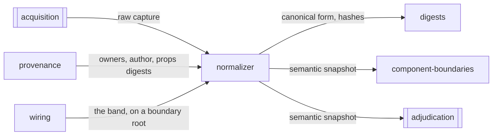

# Normalizer

«service»

## Responsibility

Applies one versioned ruleset to a raw capture and produces the **semantic
snapshot** every later question is asked of.

## Bounded context

[Observation](../../DOMAIN.md#observation)

## Inputs and outputs

A raw capture arrives as plain data: a tree, the inherited values in force at
the **subject** root, the subtrees rendered through portals, the shared root
state the subject is latently coupled to, and whatever the collector could not
do. Out comes a **semantic snapshot** — the tree with ids aliased, class
attributes dropped, inapplicable rules pruned, the cascade resolved to winning
values, inert wrappers collapsed, and every node carrying its **provenance**.
Beside the tree and outside every hash: which rule set each winning
declaration, the subtrees an operator excluded resolved against *this* tree, and
the diagnostics that must survive to the **verdict**.

There is exactly one of these and both **profiles** enter it, which is what
makes *the same rules ran* a fact of the call graph rather than a claim
maintained by discipline.

## Depends on

- [`digests`](../digests/README.md) — the canonical form and the hashes over the finished tree
- [`provenance`](../provenance/README.md) — the owner chains carried on each node
- [`wiring`](../wiring/README.md) — the framework's account of a boundary, carried on its root node

## Used by

- [`component-boundaries`](../component-boundaries/README.md) — the tree it partitions and hashes
- [`adjudication`](../../adjudication/README.md) — the snapshot a difference is
  taken between, and the tier that settles a subject before anything is painted

## Boundary

It does not decide what is a difference and it does not compare. It never
resolves an **ignore** into an absorbed change — it records where the excluded
subtrees landed and leaves the accounting to the decision. Nothing it produces
carries a status, a threshold or a tolerance. Its versioned opinions are narrow
in one direction: a rule that removes a node is the one
place a wrong answer deletes evidence, so anything carrying a role, a name, an
id, an admitted attribute, text, an exclusion mark, a held value or a
non-inherited declaration survives whatever it looks like.

Two things are carried and never hashed, for one reason: normalization discards
exactly what attribution needs. Which rule won is preserved beside the snapshot
so that moving a rule between files renames a source without invalidating a
**baseline**. The operator's exclusion sites are preserved for the same reason
pointed the other way — folding one into identity would re-baseline every
subject the first time somebody masked a clock.

Identifier values are aliased rather than masked. Masking works and erases the
difference between an id that was renumbered and an association that was
broken, and the second is a real accessibility regression: every id becomes a
positional alias and every reference is rewritten to match, so a reference that
resolves outside the subject stays visible as a diagnostic rather than becoming
a constant that agrees with everything.

The property allowlist and the ruleset carry versions, and both are folded into
the identity of every answer downstream. A rule change is a render-input change
and invalidates every stored reading rather than quietly comparing across two
sets of rules.

## Implementation coordinates

- `packages/core/src/rules/normalize/index.ts` — `normalize`, the pipeline
- `packages/core/src/rules/ruleset.ts` — the property and attribute allowlists,
  `RULESET_VERSION`, `ALLOWLIST_VERSION`
- `packages/core/src/rules/normalize/alias.ts` — structural id aliasing
- `packages/core/src/rules/normalize/cascade.ts` — cascade resolution,
  inheritance, and the token an inherited value came from
- `packages/core/src/rules/normalize/shorthand.ts`, `value.ts`, `color.ts` —
  expansion and canonicalization of a surviving value
- `packages/core/src/rules/normalize/wrapper.ts` — `isInertWrapper`
- `packages/core/src/rules/normalize/project.ts` — `structureOf`, `styleOf`,
  `sitesIn`
- `packages/core/src/format/snapshot.ts` — `SemanticSnapshot`, `SemanticNode`

## Diagram

