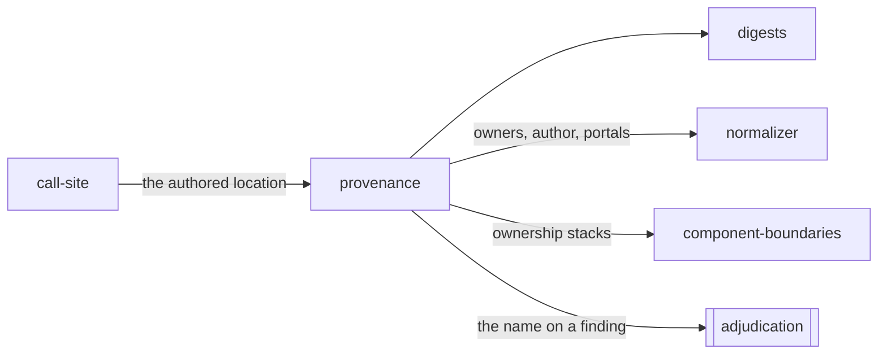

# Provenance

«adapter»

## Responsibility

Reads, from the record the framework left on a rendered node, the two upward
edges **provenance** is made of — the components enclosing the node, and the
component that wrote it.

## Bounded context

[Observation](../../DOMAIN.md#observation)

## Inputs and outputs

A rendered element goes in. Out comes the enclosure chain innermost first, with
a props digest at every boundary and the component that placed each rung; the
author of the element itself, when the runtime recorded one; the authored **call
site**, from wherever it can be had; and the subtrees the node renders through
portals, in framework traversal order rather than document order.

Where no chain can be read, the result is a named refusal and never an empty
chain, because [absent is not empty](../../DOMAIN.md#run-report): a node with no
client fiber and a node whose tree was torn down are different facts.

## Depends on

- [`digests`](../digests/README.md) — the props digest, taken where the value still exists
- [`call-site`](../call-site/README.md) — the authored location, when the build kept one

## Used by

- [`normalizer`](../normalizer/README.md) — the chain carried on every node of a snapshot
- [`component-boundaries`](../component-boundaries/README.md) — the ownership
  stack the boundary set is cut from
- [`adjudication`](../../adjudication/README.md) — the name a difference arrives already carrying

## Boundary

It reads no layout, no computed style and nothing engine-specific, which is why
the same chains come out of a browserless reader and a real browser, and why
the cheapest tier can carry the whole dimension. It requires no developer-tools
hook: the primary path is the record the renderer writes onto every host node it
creates.

Enclosure and authorship are
[two edges, neither deriving the other](../../DOMAIN.md#provenance), and this
reads both rather than collapsing them. A component passed as a prop is enclosed
by whoever rendered it and authored by whoever wrote it; attribution wants the
author, and root-versus-collateral analysis wants the enclosure.

A props digest excludes children and is therefore not a complete statement of a
component's inputs — it is what makes a container's inputs readable as held
while its content moved, and it resolves toward shape, so re-creating an
identical closure does not register. It decides who is blamed, not whether
anything happened.

A portal's *content* is read and never its container, because the container is
usually the document body and capturing it would make one subject's identity
depend on whatever else happened to be mounted. Reading a subject's boundary as
document containment instead of a component-tree question is how an opening
dialog reports as no change at all.

Nothing here waits, retries or holds anything still.

## Implementation coordinates

- `packages/core/src/format/provenance.ts` — `Provenance`, `OwnerFrame`,
  `propsDigest`, `heldDigest`, `relativizeSource`
- `packages/react/src/resolve.ts` — `resolveProvenance`, `NO_FIBER`,
  `UNMOUNTED`
- `packages/react/src/portal.ts` — `portalContentOf`
- `packages/react/src/fiber.ts`, `names.ts`, `traversal.ts` — structural access,
  display-name unwrapping, and the bounded walk every traversal carries

## Diagram

