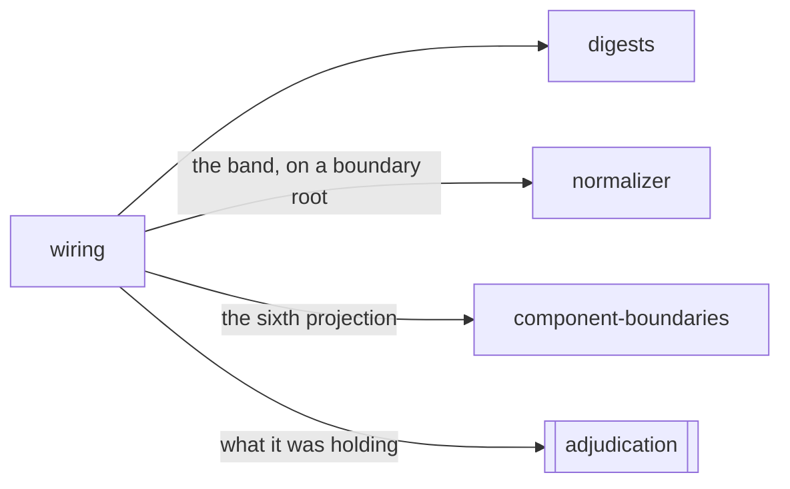

# Wiring

«adapter»

## Responsibility

Reads the framework's own account of a component — what it *is*, as a **band**,
and what it was holding, as evidence that enters no hash.

## Bounded context

[Observation](../../DOMAIN.md#observation)

## Inputs and outputs

A rendered node goes in. Out comes, for a component's root host node, the hook
names in call order as the framework itself recorded them, the wrappers the
author put around the component outermost first, the contexts the boundary
subscribes to by name and sorted, and the reconciliation key — that last on
every node that has one, because a key is a fact about the node's own
reconciliation rather than about its component.

Beside it and separately: the digests of what those hooks were holding, per
cell, aligned to their names through a measured table rather than zipped by
index, together with the prefix marker naming the hook the read stopped at.

## Depends on

- [`digests`](../digests/README.md) — every held value is reduced to a digest
  before it leaves the page

## Used by

- [`normalizer`](../normalizer/README.md) — the band, carried on a boundary's root node
- [`component-boundaries`](../component-boundaries/README.md) — the sixth
  projection a boundary is hashed along
- [`adjudication`](../../adjudication/README.md) — the answer to *why did it
  decide differently*, when a difference has already been found

## Boundary

The membership test is one-directional: read the same page twice without
changing anything, and if the value moved it is not a band, it is a finding. A
hook's value is the thing that legitimately differs between two readings of one
page — the ticker, the timestamp, the animation frame — so a band carrying one
would be a flake generator wearing a band's name. State values are therefore
absent from the band and present only as held evidence, which enters no hash of
any kind: not the render hash, not a **component hash**, not an environment key.
That keeps a **baseline** safe from a value that was always allowed to move,
and keeps the difference explainable.

Whether an instance was destroyed and rebuilt is not a band either: it is a
property of
a **reading** rather than of a revision, and by construction it differs between
two readings of one unchanged page. It is reported as a finding, with the key it
happened under, because a rebuild under a key is a decision and a rebuild
without one is a defect — and stating which it saw is not the same as deciding
for the reader.

Component-level facts attach to a component's root host node and to no node
beneath it. Repeating a hook list on forty descendants would make the band's
value depend on how many wrappers a component happens to render, which is a lie
about what wiring is.

A component that declares no hooks and one nobody could read are
indistinguishable from here, so both are absent rather than an empty list —
[absent is not empty](../../DOMAIN.md#run-report). A hook name the alignment
table does not know stops the read, because unknown arity makes every cell after
it unattributable and a full list silently misaligned from the fourth entry is
the confident wrong answer.

## Implementation coordinates

- `packages/core/src/format/wiring.ts` — `Wiring`, and the rule for what
  belongs in a band
- `packages/core/src/format/holding.ts` — `Holding`, `HeldCell`, and the
  argument for why it is evidence rather than identity
- `packages/react/src/wiring.ts` — the reader, and `componentFiberOf`
- `packages/react/src/holding.ts` — the hook name/cell alignment table
- `packages/react/src/identity.ts` — the rebuild finding, and the key it
  happened under

## Diagram

