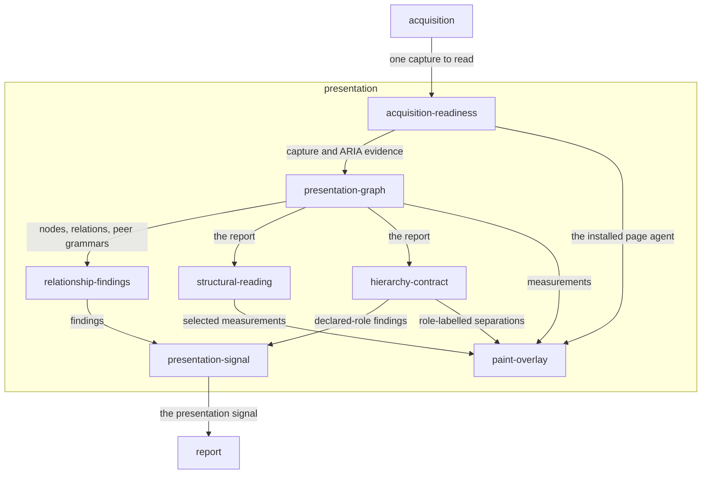

# Presentation

## Responsibility

Reads what one live interface says about itself — how information is grouped,
aligned, repeated and emphasized — with nothing to compare against.

## Logical role

This block realizes the root's single-reading instrument: every other block
answers *did it move*, and this one answers *what does this one reading say
about itself*. The relationships it derives are already true of the interface,
and it hands them on as measurements a person or an agent can argue with rather
than as a design opinion.

## Boundary

It owns no **baseline**, promotes no **candidate**, and returns no **verdict**
about a run. It never produces a global quality score, a threshold pass, a
severity, or a design recommendation, and it never proposes deleting, hiding,
collapsing or truncating information to make a finding go away.

## Technology

TypeScript on Node, published as a pure analyzer with an optional Playwright
entry. The in-page half is a self-contained agent bundle injected into the
document under test, which acquires through the shared collector and draws an
SVG overlay. The analyzer itself runs anywhere a capture can be read.

## Implementation coordinates

- `packages/presentation/src/` — the analyzer, the readings, the signal
  projection and the page agent
- `packages/presentation/skills/variance-presentation/` — the authority
  boundary packaged for a consuming agent
- `docs/presentation.md`

## Communicates with

- → [`report`](../report/README.md) — the presentation signal, whose effects are
  introduced, resolved or persisted
- → [`acquisition`](../acquisition/README.md) — a request for one capture, taken
  under the evidence boundary this block declares
- ← [`acquisition`](../acquisition/README.md) — one capture to read

## Uses

### [Acquisition](../acquisition/README.md)

#### Why

Reading how information is grouped is only honest about a page that has
finished arriving, and *which* page has finished arriving is a question this
block cannot answer generically — it is scoped to the evidence boundary the
caller chose. Rather than accept whatever capture happens to exist, this block
asks for one, substituting a subject-and-portal-scoped readiness recipe for the
document-wide default. Building a second collector to do that would mean a
second definition of *settled*, and two definitions of settled produce two
pages that both look ready and disagree.

#### What I need from it

A collector that will take a declared readiness recipe rather than its own, an
arrival check that refuses a subject still resolving, and an extraction that
leaves authored values as authored — geometry that has been rounded, inferred
or normalized cannot carry an alignment relationship.

#### What would make me leave

A collector whose readiness recipe were fixed document-wide, or one that
normalized geometry before handing it over.

### [Report](../report/README.md)

#### Why

A presentation reading that only its own caller can see is advice, not
evidence. Projecting it into the **run report** puts it in the one format a
person, a change proposal and an agent already read, and does so without giving
this block any say over the run: presentation consequence, render impact and
the regression **verdict** stay three separate axes precisely because the
signal travels beside the verdict rather than inside it.

#### What I need from it

A record shape that keeps effects and information counts distinct, that can say
*incomparable* without inventing a transition, and that distinguishes an absent
signal from an empty one. Nothing more: storing the signal applies no policy.

#### What would make me leave

A report format that folded presentation effects into a severity, a score, or
the regression verdict, or that could not represent *measured and clean* as
something other than silence.

## Components

| Component | Responsibility |
|---|---|
| [presentation-graph](./presentation-graph/README.md) | Derives the nodes, relations, clusters and repeated grammars that make one interface's relationships measurable |
| [relationship-findings](./relationship-findings/README.md) | Names the measured relationship defects, and nothing else |
| [structural-reading](./structural-reading/README.md) | Serves the graph at the structural level the caller chose, never at one it inferred |
| [hierarchy-contract](./hierarchy-contract/README.md) | Evaluates a product-declared, outside-in meaning for spacing relationships |
| [acquisition-readiness](./acquisition-readiness/README.md) | Declares the evidence boundary a presentation reading needs, and collects only what the report consumes |
| [presentation-signal](./presentation-signal/README.md) | Projects two readings into introduced, resolved and persisted effects for the run report |
| [paint-overlay](./paint-overlay/README.md) | Turns measurements into marks drawn over the live document without acquiring it again |
| `packages/presentation/src/math.ts` | L5 — numeric, colour and area helpers: medians, rounding, perceptual difference, union area |

## Diagram

