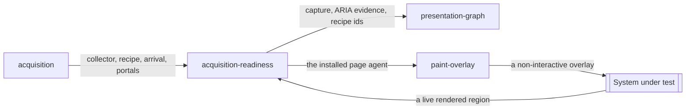

# Acquisition readiness

«adapter»

## Responsibility

Declares the evidence boundary one presentation reading needs, holds the
interface still inside it, and collects only the material the report consumes.

## Bounded context

[**Presentation**](../../DOMAIN.md#presentation)

## Inputs and outputs

Takes a live page and the region a caller named as the **subject**, with
optional font identities, an **arrival** budget and an override for the
**stabilization recipe**. Produces one capture of that region and its portal
content, the recipe identities that were applied, and the browser-computed
accessibility evidence for each root — handed to
[`presentation-graph`](../presentation-graph/README.md) as the single reading
everything downstream is derived from.

## Depends on

- [`acquisition`](../../acquisition/README.md) — the collector, the
  stabilization recipe and the arrival check

## Used by

- [`presentation-graph`](../presentation-graph/README.md) — the one capture and
  the accessibility evidence beside it
- [`paint-overlay`](../paint-overlay/README.md) — the installed page agent that
  draws into the document

## Boundary

Readiness is scoped to the evidence boundary the caller chose rather than to
the document. Images are waited for inside the subject and its portals, so an
unrelated incomplete image elsewhere on the page does not hold the reading
open; fonts are waited for document-wide, because a substitution moves every
metric inside the boundary without changing a byte of code. Only evidence the
report consumes is collected — component provenance is left out, because no
presentation report field reads it.

This component acquires; it does not adjudicate, retain or compare. It creates
no **baseline**, produces no **raster**, and holds no identity of its own. A
caller who owns a static document may replace the recipe outright; a live page
keeps the default rather than inheriting the caller's optimism. Anything it
changed in the document to read it — the markers that let portal roots be
addressed, the overlay left by an earlier inspection — is restored or removed,
so the sensed application is the application.

## Implementation coordinates

- `packages/presentation/src/playwright.ts` — `sensePresentation`; the viewport
  and engine probe, the ARIA snapshot per root, agent installation, portal
  restoration
- `packages/presentation/src/browser-agent.ts` — `acquirePresentation`,
  `presentationRecipe` and its subject-scoped image settlement
- `packages/presentation/src/browser-agent-entry.ts`,
  `packages/presentation/src/bundle.ts` — the injected in-page bundle
- `packages/presentation/src/playwright.chromium.test.ts`

## Diagram

