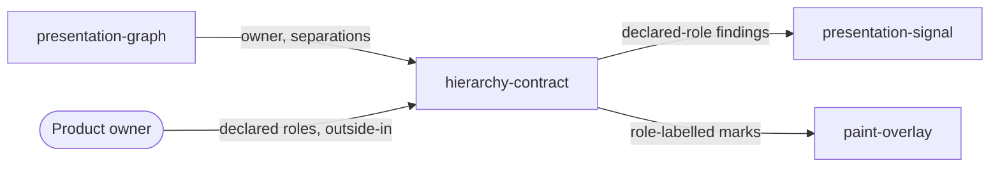

# Hierarchy contract

«policy»

## Responsibility

Evaluates a product-declared, outside-in statement of what each spacing
relationship inside one owner *means*, and reports where two adjacent meanings
have stopped being distinguishable.

## Bounded context

[**Presentation**](../../DOMAIN.md#presentation)

## Inputs and outputs

Takes one report and one **hierarchy contract**: an owner, an axis, and
relationship levels ordered from the owner boundary through leading-to-body and
body-peer to content-internal, each naming the concrete node pairs that carry
that role. Returns the measured separations per role with their distance and
boundary medians and their spacing clusters, the collisions between adjacent
roles, the **presentation findings** those collisions produce, and
role-labelled paint instructions.

## Depends on

- [`presentation-graph`](../presentation-graph/README.md) — the owner, its
  descendants and the measured separations a role is asserted on

## Used by

- [`presentation-signal`](../presentation-signal/README.md) — declared-role
  findings carried beside the automatic ones
- [`paint-overlay`](../paint-overlay/README.md) — role-labelled separation marks

## Boundary

Only product meaning may name a relationship role. A design token is
implementation evidence and can never authorize one: treating token validity as
relationship authority launders a local defect through the design system, so
token identity is neither a role nor an exemption here. This component declares
no roles of its own and infers none from the graph — it evaluates what the
product declared.

A contract is checked before it is measured, and an incomplete separation is
refused rather than defaulted. A collision is measured
evidence that two declared meanings share a spacing cluster or a calibrated
local distribution; it is not a prescribed fix, a spacing scale, or a
recommended value for either role.

## Implementation coordinates

- `packages/presentation/src/hierarchy.ts` — `inspectPresentationHierarchy`;
  `ROLE_ORDER`, the contract assertions, the adjacent-role collision test and
  the role paint
- `packages/presentation/src/model.ts` — `PresentationHierarchyRole`,
  `PresentationHierarchyContract`, `PresentationHierarchyReading`
- `packages/presentation/src/hierarchy.test.ts`

## Diagram

