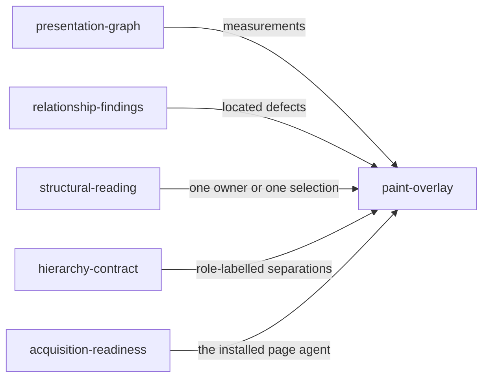

# Paint overlay

«service»

## Responsibility

Turns measurements already in a reading into located marks, and draws them over
the live document without reading it again.

## Bounded context

[**Presentation**](../../DOMAIN.md#presentation)

## Inputs and outputs

Takes the **presentation graph**, its clusters and patterns, the
**presentation findings**, or one already-selected reading — a focused owner, a
chosen alignment flow, a spacing run, a **hierarchy contract** evaluation.
Produces paint instructions, each naming its layer, its shape, its coordinates,
its label, the graph node that owns the painted relationship and the nodes it
touches, plus the finding, pattern or contract it came from. Given a page, it
draws them as one non-interactive overlay and returns how many marks it drew.

## Depends on

- [`presentation-graph`](../presentation-graph/README.md) — the nodes,
  separations, axes, baselines, surfaces and prominence clusters a mark locates
- [`relationship-findings`](../relationship-findings/README.md) — the defects
  drawn on the findings layer
- [`structural-reading`](../structural-reading/README.md) — an owner's or a
  selection's own instructions
- [`hierarchy-contract`](../hierarchy-contract/README.md) — role-labelled separations
- [`acquisition-readiness`](../acquisition-readiness/README.md) — the page agent
  that draws into the document

## Used by

- [`structural-reading`](../structural-reading/README.md) — the instructions
  carried on a focused or explicitly selected reading

## Boundary

The overlay is drawn from the same report, so painting never triggers a second
acquisition and never changes what was measured. It is a sibling SVG layer that
takes no pointer events, exposes nothing to assistive technology, and touches
none of the application's own styles; an earlier overlay is removed before a
reading and can be cleared explicitly.

Every instruction names the graph node that owns its relationship, which is
what lets a caller paint exactly one owner, one finding or one selected flow
rather than the whole document. The colours are diagnostic identities and carry
no judgement about the product's own colours — groupings and outliers are drawn
conspicuously so a person can challenge the analyzer, not so the page can be
scored. Nothing here decides what to draw: the layer selection is the caller's.

## Implementation coordinates

- `packages/presentation/src/paint.ts` — `paintInstructions`; one pass per
  layer, `commonOwner` for shared marks
- `packages/presentation/src/browser-agent.ts` — `paintPresentation`,
  `clearPresentationPaint`; the SVG overlay and its labels
- `packages/presentation/src/playwright.ts` — `paintPresentationFocus`,
  `paintPresentationAlignment`, `paintPresentationSpacing`,
  `paintPresentationHierarchy`, `clearPresentationPaint`
- `packages/presentation/src/model.ts` — `PaintLayer`, `PaintInstruction`

## Diagram

