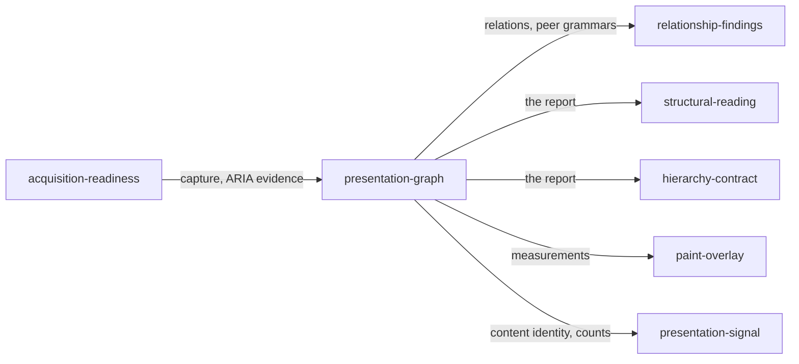

# Presentation graph

«factory»

## Responsibility

Derives from one capture the nodes, relations, clusters and repeated grammars
that make an interface's grouping, separation, alignment, repetition and
emphasis measurable.

## Bounded context

[**Presentation**](../../DOMAIN.md#presentation)

## Inputs and outputs

Takes one capture of a **subject** and, optionally, the browser-computed
accessibility evidence observed beside it. Produces the **presentation graph**
and everything derived from it in one deterministic report: rendered nodes with
geometry, typography, surface evidence, semantic class, state signature and
relative prominence; contains, separates, aligns, shares-baseline and
semantic-peer relations; spacing, alignment, baseline, prominence and surface
clusters; repeated sibling patterns with their dominant signature and their
outliers; telemetry; a content **digest** taken before any layout is read; and
the report digest over the whole body.

## Depends on

- [`acquisition-readiness`](../acquisition-readiness/README.md) — the one
  capture and the accessibility evidence beside it
- [`acquisition`](../../acquisition/README.md) — the collected raw tree, its
  applicable styling and its environment

## Used by

- [`relationship-findings`](../relationship-findings/README.md) — the relations
  and peer grammars a defect is named against
- [`structural-reading`](../structural-reading/README.md) — the report a caller
  reads at a chosen owner
- [`hierarchy-contract`](../hierarchy-contract/README.md) — the separations a
  declared role is measured on
- [`paint-overlay`](../paint-overlay/README.md) — the measurements a mark is drawn from
- [`presentation-signal`](../presentation-signal/README.md) — the content
  identity and information counts carried beside effects

## Boundary

It preserves information and exposes relationships; it derives no
recommendation, no global score and no threshold verdict. Telemetry — content
volume, region and viewport dimensions, utilization, occupied area, density —
is descriptive and can never on its own produce a **presentation finding**,
because page height, density, margin width and content volume can each be
correct at either extreme.

A reader whose **profile** declares no layout produces a report with no graph
at all rather than a graph of empty boxes, and a capture that claims layout but
carries a node without a rectangle is refused by name, because
[absent is not empty](../../DOMAIN.md#run-report). Inferred baselines are
labelled inferred, because
browser geometry plus a typographic approximation is not optical alignment.
Accessibility evidence is retained as observed — an empty or partial root is a
reading and stays byte-for-byte in the report — and is never repaired,
substituted for the DOM-correlated anchors, or omitted to make the two agree.
Font identities the caller established move geometry and so join the report
digest, and are kept out of the content digest, which is what has to survive
presentation moving.

## Implementation coordinates

- `packages/presentation/src/analyze.ts` — `analyzePresentation`, the pure
  entry; the no-layout branch, the rect assertion, the content digest and the
  font carry
- `packages/presentation/src/graph.ts` — `buildGraph`; node construction,
  semantic class, surface and prominence evidence
- `packages/presentation/src/measure.ts` — `measureGraph`; sibling separations,
  boundary strength, spacing/alignment/baseline/prominence/surface clustering
- `packages/presentation/src/patterns.ts` — `inferPatterns`; semantic shape,
  dominant signature, outliers, semantic-peer relations
- `packages/presentation/src/telemetry.ts` — `telemetryOf`
- `packages/presentation/src/model.ts` — the report, node, relation and cluster shapes

## Diagram

