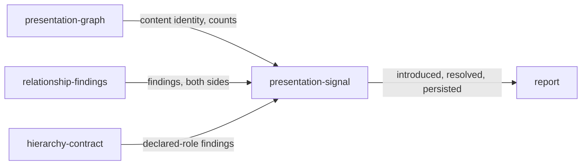

# Presentation signal

«service»

## Responsibility

Projects two readings of one **subject** into the effects that were introduced,
resolved or persisted between them, and carries that beside the information they
each held.

## Bounded context

[**Presentation**](../../DOMAIN.md#presentation)

## Inputs and outputs

Takes a before and an after report and, optionally, the product-declared
**hierarchy contract** readings evaluated against each. Produces two things: a
direct comparison — per-rule finding counts, a presentation-independent content
identity, and element, character and repeated-object counts on both sides — and
the record the **run report** carries, in which each relationship condition
appears once with the evidence side its transition requires.

## Depends on

- [`presentation-graph`](../presentation-graph/README.md) — the content identity
  and information counts of each reading
- [`relationship-findings`](../relationship-findings/README.md) — the automatic
  findings a transition is taken between
- [`hierarchy-contract`](../hierarchy-contract/README.md) — the declared-role
  findings carried alongside them

## Used by

- [`report`](../../report/README.md) — the presentation signal on an observation record

## Boundary

Presentation consequence, render impact and the regression **verdict** are
three separate axes, and this component owns only the first: storing the signal
applies no policy, changes no verdict, and decides nothing about whether a
build may pass. A finding is identified by its rule, its owner, its pattern or
contract and its nodes, so an effect is introduced, resolved or persisted with
the evidence side that transition actually has — an introduced effect carries
only the candidate's measurements, a resolved one only the baseline's.

[Absent is not empty](../../DOMAIN.md#run-report), in both directions: a missing
report, or a reading with no layout findings at all, is **incomparable** with the
reason spelled out and carries no effects, while a present but empty effect list
says both sides were measured and no relationship consequence moved. Information
identity is kept separate from the effects rather than folded into them, so equal
counts cannot hide substituted or deleted content, and a density change is never
reported as an improvement.

## Implementation coordinates

- `packages/presentation/src/compare.ts` — `comparePresentation`; per-rule
  counts and the content identity
- `packages/presentation/src/report.ts` — `presentationSignal`; the incomparable
  branches, finding identity, the transition table
- `packages/report/src/presentation-record.ts` — the record shape the run report carries

## Diagram

