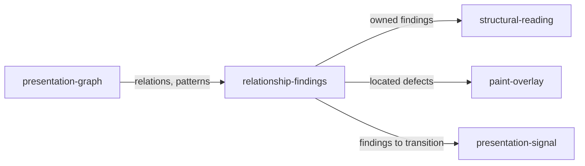

# Relationship findings

«policy»

## Responsibility

Names the measured relationship defects in one reading — a separation
collapsing, a peer drifting from the grammar its neighbours share, a prominence
hierarchy flattening — each against the graph node that owns the relationship.

## Bounded context

[**Presentation**](../../DOMAIN.md#presentation)

## Inputs and outputs

Takes the **presentation graph**, its measured relations and its repeated
patterns. Produces a deterministically ordered, stably identified set of
**presentation findings**, each carrying its rule, the owning node, the nodes
involved, the pattern or contract it came from, and the measurements that
produced it.

## Depends on

- [`presentation-graph`](../presentation-graph/README.md) — the relations,
  clusters and peer grammars a defect is measured against

## Used by

- [`structural-reading`](../structural-reading/README.md) — the findings served at a chosen owner
- [`paint-overlay`](../paint-overlay/README.md) — the located defects a mark is drawn for
- [`presentation-signal`](../presentation-signal/README.md) — the findings a
  transition is taken between

## Boundary

The rule set is small and closed: separation collision, spacing
relation collision, spacing hierarchy collision, alignment outlier, baseline
drift, prominence collapse, surface collision, repetition grammar collapse,
presentation grammar drift. A finding is a measured relationship failure and
never a severity, a regression, a score or an instruction about what to build
instead.

Every finding names the node whose immediate structural relationship produced
it, so a defect inside a nested box is never reported as a defect of every
ancestor. A drift finding requires both halves: a dominant grammar the peers
actually share, and a deviation that no observed semantic state explains — an
instance marked invalid, selected or disabled is measured and kept, and is not
called drift.

The thresholds are calibration constants pinned by paired firing and
non-firing fixtures. They decide when measured peer evidence supports one of
the named rules; they are not exposed as design targets and define no preferred
density, margin, page dimension or spacing scale. Nothing in the telemetry can
reach this component: no finding is produced from content volume, dimensions,
utilization or density.

## Implementation coordinates

- `packages/presentation/src/findings.ts` — `detectFindings`; the `CALIBRATION`
  constants and one function per rule family
- `packages/presentation/src/analyze.test.ts` — the paired firing and non-firing
  fixtures that pin those constants
- `packages/presentation/src/model.ts` — `PresentationFindingRule`, `PresentationFinding`

## Diagram

