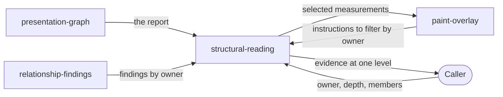

# Structural reading

«service»

## Responsibility

Serves an existing reading at the structural level the caller chose — one owner,
one folded subtree, or one explicitly selected visual flow — without acquiring
the interface again.

## Bounded context

[**Presentation**](../../DOMAIN.md#presentation)

## Inputs and outputs

Takes one report and a chosen owner. Returns that owner with its immediate
children, the patterns and **presentation findings** the owner itself owns, the
paint instructions belonging to them, and a separate count of the evidence
sitting below it. Takes instead an owner plus an explicit member list and
returns a measured reading of that selection: for an alignment flow, the median
coordinate, the spread and each member's deviation; for a spacing run, every
adjacent gap with its boundary strength and its spacing cluster, plus the
distance and boundary ranges across the run.

## Depends on

- [`presentation-graph`](../presentation-graph/README.md) — the nodes,
  containment and measured separations a selection is resolved against
- [`relationship-findings`](../relationship-findings/README.md) — the findings filtered by owner
- [`paint-overlay`](../paint-overlay/README.md) — the instructions carried on a
  focused or explicitly selected reading

## Used by

- [`paint-overlay`](../paint-overlay/README.md) — the selected measurements a mark is drawn for

## Boundary

Reading defaults to one owner and its immediate children. Folding a subtree
into one holistic reading, or selecting a flow that crosses implementation
wrappers, is an explicit caller decision and is never inferred — because
reading a broad capture as one flat peer set turns correct nesting into
findings, while one visual flow can legitimately cross wrappers and would
otherwise be invisible. A broad locator is an acquisition boundary, not a claim
that every descendant is a peer.

Nested evidence is counted, not folded: an owner reading reports how many
deeper owners, patterns and findings exist below it and leaves them there. A
selection is checked rather than trusted — a member outside the owner, a
spacing run whose members are not consecutive immediate children, an axis that
disagrees with the measured separation, or a requested finding the owner does
not own are all refused by name. The returned coordinates, spreads and
deviations are evidence; this component converts none of them into a verdict.

## Implementation coordinates

- `packages/presentation/src/focus.ts` — `focusPresentation`; owner and subtree
  depth, owned findings, layer and finding selection, the `nested` counts
- `packages/presentation/src/alignment.ts` — `inspectPresentationAlignment`
- `packages/presentation/src/spacing.ts` — `inspectPresentationSpacing`
- `packages/presentation/src/focus.test.ts`,
  `packages/presentation/src/alignment.test.ts`,
  `packages/presentation/src/spacing.test.ts`

## Diagram

