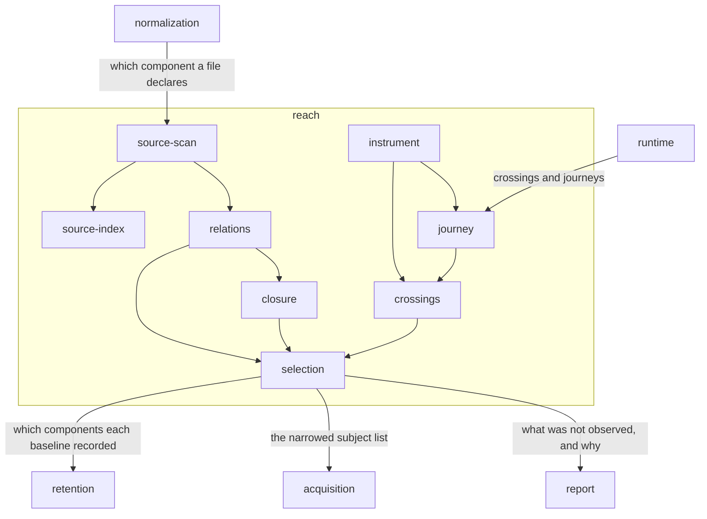

# Reach

## Responsibility

Decides which **subjects** a change could have moved, on the shape of source at
rest and on what an execution was witnessed to enter.

## Logical role

It is why a run observes the **subjects** a change could have moved rather than
all of them, and why it observes all of them when it cannot tell. It holds two
grounds that answer the same question from opposite directions — one over the
shape of source at rest, one over what an execution was witnessed to enter — and
the rules that decide when neither may narrow.

## Boundary

It observes nothing, paints nothing, compares nothing, issues no **verdict** and
computes no build graph: another tool's affected-project answer arrives as a
**seed** rather than as a selection. It does not gate — a **subject** it
excluded is stated by name for [report](../report/README.md) to carry.

## Technology

TypeScript on Node. `oxc-parser` and `oxc-resolver` for reading and resolving
source; interned typed-array structures in compressed-sparse-row form for the
graph and the execution record; Git plumbing for content digests and for the
diff; `AsyncLocalStorage` for scoping an execution inside a service process.

## Implementation coordinates

- `packages/sense/src/` — the scan, the resolver, the durable source index
- `packages/sense/src/instrument/` — the source transform that marks regions
- `packages/sense/src/test-selection/` — the execution record and its queries
- `packages/core/src/relate/` — the graph, its traversals, and the closure fold
- `packages/cli/src/commands/` — `run-select.ts`, `affected.ts`, `reach.ts`,
  `journey.ts`, `since.ts`, `changes.ts`

## Communicates with

- → [`acquisition`](../acquisition/README.md) — the narrowed subject list
- → [`retention`](../retention/README.md) — a request for which components each
  baseline recorded, read from its sidecar without touching an image
- → [`report`](../report/README.md) — which subjects were not observed, and the sentence saying why
- ← [`normalization`](../normalization/README.md) — which component a source file declares
- ← [`runtime`](../runtime/README.md) — witnessed crossings, and the journeys
  that connect an execution in one process to a subject in another

## Uses

### [acquisition](../acquisition/README.md)

#### Why

Narrowing is only worth anything if something acts on it, and the act is *not
reaching a state*. Handing over a list rather than a filter keeps the decision
here and the cost there: a **subject** excluded is a state nobody drives, which
is where the whole saving lives.

#### What I need from it

A plan naming every **subject** by id before anything is reached, so exclusion
is subtraction from a known set rather than a guess about what would have
existed; and the guarantee that what it is handed is what it observes, with no
second opinion applied downstream.

#### What would make me leave

If reaching a state became cheap enough that observing everything cost nothing,
this coupling would carry no value. It would also end if acquisition began
deciding for itself which of the handed **subjects** to skip, because two
selectors mean the sentence a run prints is not the reason it skipped.

### [retention](../retention/README.md)

#### Why

*What a subject is made of* can be predicted by a bundler graph or established
by the last run that painted it. The stored **baseline** already records the
**component hashes** the document it came from carried, so the second answer
needs no plugin, no stats file and no second build — and it is a fact rather
than a prediction.

#### What I need from it

The component names one **baseline** recorded, looked up per **subject** under
its identity, read from the sidecar beside the image and never by decoding the
image. A **subject** with no **baseline** and one whose **baseline** carries no
component list are both unknown and both observed
([absent is not empty](../DOMAIN.md#identity-and-retention)).

#### What would make me leave

If a **baseline** stopped carrying what its document said, the structural ground
would have nothing to match a reached component against and would narrow only on
declarations. If the store could not answer cheaply per **subject**, the lookup
would cost more than the collections it saves.

### [report](../report/README.md)

#### Why

A **subject** that was excluded and a **subject** that passed are the same
silence, and silence is the failure this system exists to refuse. The exclusion
is only defensible if it leaves a written trace, and the artifact that carries
traces is owned by neither its writer nor its readers.

#### What I need from it

A place for a **not observed** entry that names the **subject** and the reason;
a place for the reachability trail, so *`Button` is affected because
`src/tokens.css` → `src/button.css` → `src/Button.tsx`* survives into the
artifact; and a place for the files whose edges could not be read, each with the
sentence saying why, counted apart from what was found.

#### What would make me leave

If the artifact reduced a refusal to a count, or folded *we could not narrow*
into *nothing needed narrowing*, the trace would stop being evidence and this
block would have to print its own.

## Components

| Component | Responsibility |
|---|---|
| [source-scan](./source-scan/README.md) | Walking a checkout once and turning each file into its resolved outgoing edges, its content digest, and what it declares |
| [source-index](./source-index/README.md) | Remembering parses and resolved records across runs so a second scan costs the diff rather than the repository |
| [relations](./relations/README.md) | The typed bidirectional graph of what depends on what, and the two traversals that walk it either way |
| [closure](./closure/README.md) | Hashing a node over everything it rests on, so sameness is proven without consulting a ref |
| [selection](./selection/README.md) | Deciding which subjects to observe from both grounds, and refusing to narrow whenever either ground cannot answer |
| [instrument](./instrument/README.md) | Cutting source into arrival regions and splicing a presence probe in front of each one |
| [crossings](./crossings/README.md) | The record of which tests entered which region, and the answers taken from it |
| [journey](./journey/README.md) | Carrying a **journey** across process boundaries under one opaque identity, and joining what each participant reported into one path |
| `packages/sense/src/source-index-format.ts`, `packages/sense/src/source-index-file.ts`, `packages/sense/src/immutable-log.ts`, `packages/sense/src/ordered-map.ts` | L5 — the segmented binary codec and the ordered structures the source index is written through |
| `packages/sense/src/test-selection/format.ts`, `packages/sense/src/test-selection/format-validation.ts` | L5 — the versioned binary codec for the execution record |
| `packages/sense/src/test-selection/vitest.ts` | L5 — the runner configuration wrapper that installs the instrument and persists what it recorded |

## Diagram

