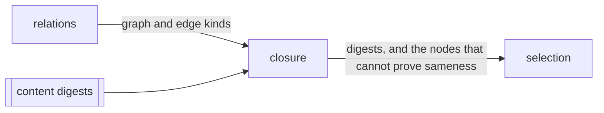

# Closure

«service»

## Responsibility

Hashes every node over its own content and the digests of everything it rests
on, so sameness is proven without consulting a ref, a merge base or a diff.

## Bounded context

[Reach](../../DOMAIN.md#reach)

## Inputs and outputs

In: the graph, a content digest per file, and optionally the edge kinds the fold
may travel. Out: one digest per node, and the set of nodes whose digest cannot
prove anything — plus, between two such digest sets, which nodes moved.

## Depends on

- [`relations`](../relations/README.md) — the structure folded over, and the
  direction the fold travels

## Used by

- [`selection`](../selection/README.md) — the proof that a subject's input
  closure, over every edge that was read, is byte-identical to the one that
  produced its **baseline**

## Boundary

**Closure** and reachability answer different questions and neither replaces the
other: the digest proves sameness and the reachability trail explains it, so a
run decides on the digest and justifies on the trail. Reachability needs a diff,
which needs a ref that exists, a checkout deep enough to hold it, and the
assumption that the ref is where this branch actually diverged — every one of
which a job can get wrong, and each failure widens or refuses a run. A digest
needs none of them.

Cycles are condensed and hashed as a unit, never broken, so every file in a
cycle carries one digest — which is the truth about a cycle, since no member can
be called unchanged while another moved.

A node whose closure cannot be proven is volatile and reports changed. A file
whose content was not supplied breaks the claim a digest makes; the mark
propagates to everything resting on it, and a volatile node is treated as
changed however its digest compares. That set is returned beside the digests
rather than folded into them, because a caller that ignores it converts a
missing input into a **subject** nobody observed. A file whose edges could not
all be read is not volatile: its bytes are hashed and the edges that were read
are folded, and the one nobody could read is left to a recorded run.

## Implementation coordinates

- `packages/core/src/relate/merkle.ts` — `closureOf`, `driftedBetween`,
  `CLOSURE_EDGES`; one pass of Tarjan's algorithm to condense and one over the
  components it emits

## Diagram

