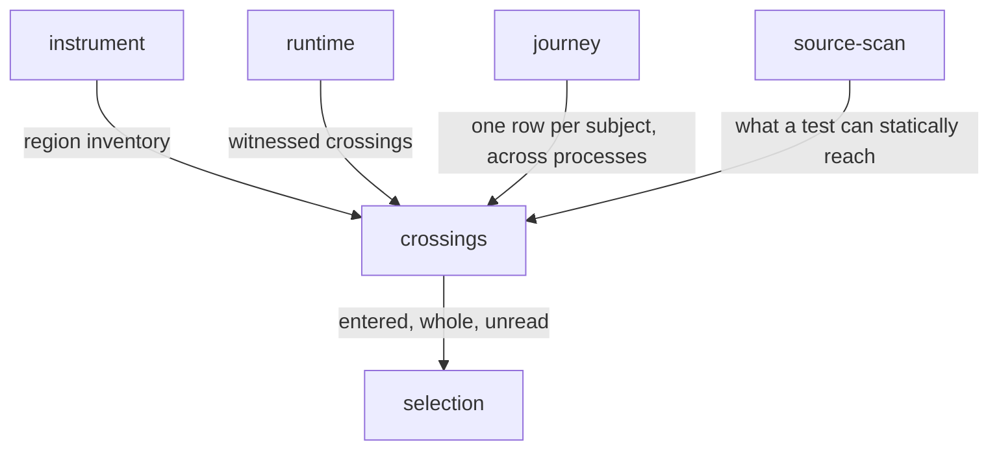

# Crossings

«repository»

## Responsibility

Keeps the record of which tests entered which region of instrumented source, and
answers the questions taken from it.

## Bounded context

[Reach](../../DOMAIN.md#reach)

## Inputs and outputs

In: the region inventory the transform produced; the ordinals each observer
entered, from a runner's task tree or from a driver draining a realm; whether
each observation was whole; the files whose identity that observation depended
on; and the commit the recording stands at. Out: the record itself, and the
answers taken from it — which observations entered a changed region, which
regions two observers parted over, which regions nobody entered at all, how much
of what a test can statically reach it actually enters, and which named tests
reached a line.

## Depends on

- [`instrument`](../instrument/README.md) — the inventory that gives an ordinal
  a name, a span and a digest
- [`journey`](../journey/README.md) — one row per **subject** where the
  execution spanned more than one process
- [`source-scan`](../source-scan/README.md) — what a test file can statically
  reach, for the deviation measure
- [`runtime`](../../runtime/README.md) — the witnessed **crossings** a driver or a runner reports

## Used by

- [`selection`](../selection/README.md) — which observations entered a changed
  region, which were whole, and which changed files the record has nothing to
  say about

## Boundary

A **crossing** is one step of a **journey**, attributed to a test file rather
than a test case, and no call-stack depth is recorded with it: attributing to cases would let a selector exclude
individual cases, which it refuses to do, and capturing a stack at every probe
would cost far more than instrumentation is kept inside. The point query that
answers named tests by depth reads an index supplied by some other collector.

An edge no execution witnessed is absent rather than impossible. A truncated
recording is dropped from the pool rather than counted as a miss, everywhere:
an incomplete observation can never justify an exclusion and never manufactures
a parting between two observers. A run recorded whole speaks for the observers
it recorded and for no others — a **subject** the record never held is unknown,
and a module the transform could not parse holds a row with no regions, which is
the one case where the record holds a path and still knows nothing about it.
Recorded evidence and unparsed silence are opposite answers and are returned
separately.

The unit of a change is the line, in the coordinates of the diff's own base
revision. A hunk header is not the change: charging the context lines printed
around an edit would select the tests that entered the lines a reader was shown.
Each changed line is answered by the narrowest recorded region containing it and
the selection is their union; a line no region covers widens to the whole module.

Evidence is retired rather than overwritten. A test file's observations are tied
to one fixed set of preconditions, and changing a precondition starts a new
generation for that file: what it inherited is retired, and a partial new
generation cannot on its own justify excluding the file. The record carries the
commit it was made at, which is the whole of its position; nothing walks lineage
or scores a distance, and a recording that cannot say where it stands has
nothing to diff against, so its holder runs everything.

## Implementation coordinates

- `packages/sense/src/test-selection/index.ts` — the logical model of the record
  and the entry points over it
- `packages/sense/src/test-selection/journal.ts` — `recordExecution`, the join
  between an inventory and the ordinals a driven realm reported
- `packages/sense/src/test-selection/merge.ts` — how two runs and two shards
  become one record, and where evidence is retired
- `packages/sense/src/test-selection/commit.ts` — where the record stands, and
  the honest absence when there is no answer
- `packages/sense/src/test-selection/divergence.ts` — `journeyDivergences`: one
  module, two observers, and not the same path through it
- `packages/sense/src/test-selection/deviation.ts` — what a test file can reach
  against what it enters
- `packages/sense/src/test-selection/reverse.ts` — `coveringTests`, the
  runner-independent point query
- `packages/sense/src/test-selection/format.ts` — interned paths and a
  compressed-sparse-row region-to-test relation

## Diagram

